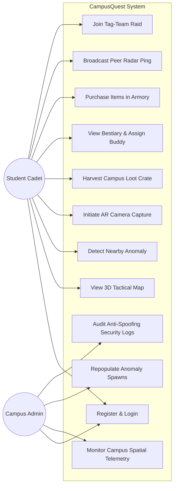
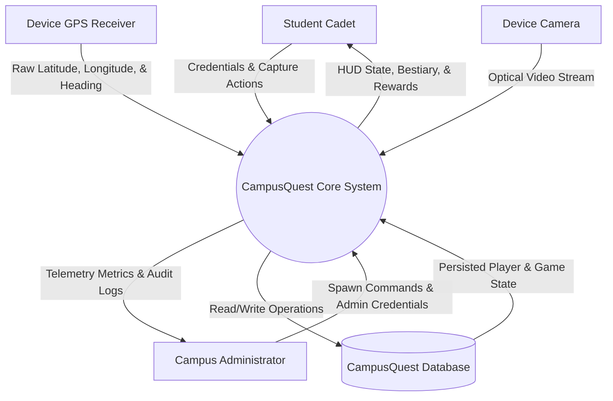
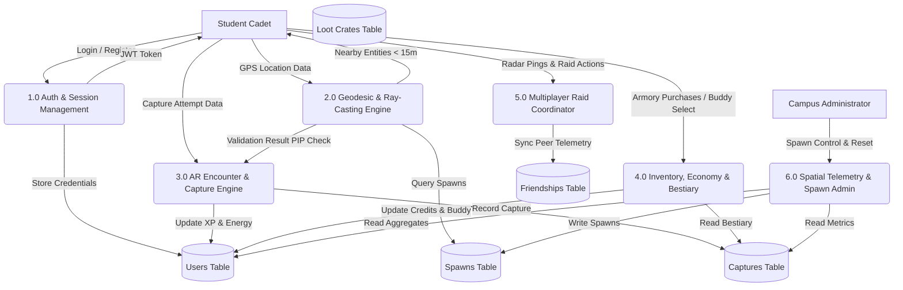
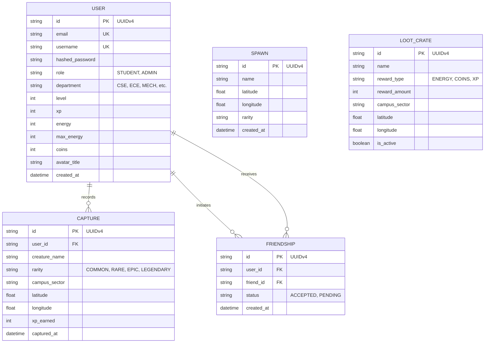
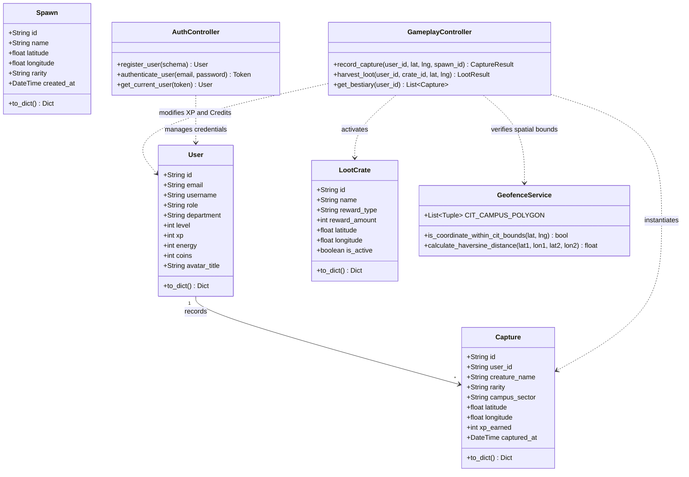
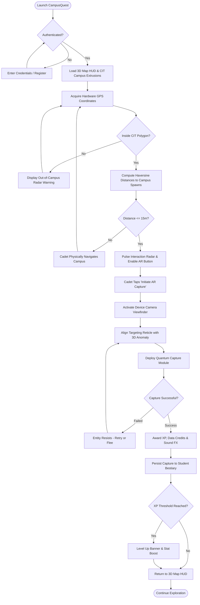
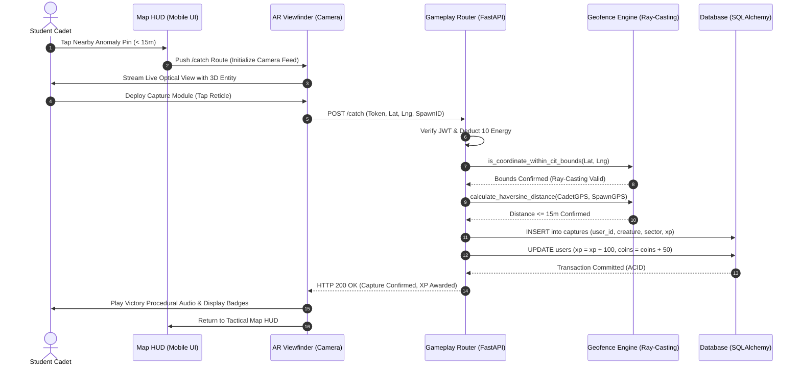
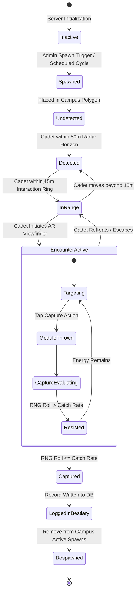
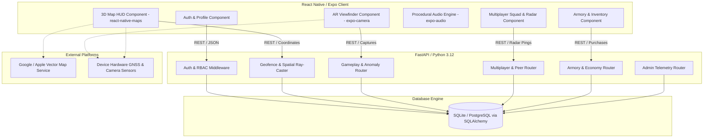

# Software Requirements Specification
## for
# CampusQuest: Location-Based Augmented Reality (AR) Campus Exploration & Gamified Engagement System

**Version 1.0 approved**

**Prepared by:** Nirmal Joshwin  
**Institution:** Coimbatore Institute of Technology  
**Date:** 25-09-2026  

*Copyright © 1999 by Karl E. Wiegers. Permission is granted to use, modify, and distribute this document.*

---

## Table of Contents
- **Table of Contents** ............................................................................................ **ii**
- **Revision History** ................................................................................................ **ii**
- **1. Introduction** .................................................................................................... **1**
  - 1.1 Purpose ........................................................................................................ 1
  - 1.2 Document Conventions ............................................................................. 1
  - 1.3 Intended Audience and Reading Suggestions ............................................. 1
  - 1.4 Product Scope .............................................................................................. 2
  - 1.5 References ................................................................................................... 2
- **2. Overall Description** ............................................................................................ **2**
  - 2.1 Product Perspective .................................................................................... 2
  - 2.2 Product Functions ....................................................................................... 3
  - 2.3 User Classes and Characteristics ................................................................. 3
  - 2.4 Operating Environment .............................................................................. 4
  - 2.5 Design and Implementation Constraints ...................................................... 4
  - 2.6 User Documentation .................................................................................. 4
  - 2.7 Assumptions and Dependencies ................................................................. 4
- **3. External Interface Requirements** ........................................................................ **5**
  - 3.1 User Interfaces ............................................................................................ 5
  - 3.2 Hardware Interfaces ..................................................................................... 6
  - 3.3 Software Interfaces ...................................................................................... 6
  - 3.4 Communications Interfaces ........................................................................ 7
- **4. System Features** ................................................................................................ **7**
  - 4.1 Cadet Registration and Authentication Management ................................. 7
  - 4.2 Geospatial 3D Map and Real-Time Radar HUD ............................................ 8
  - 4.3 Anomaly Encounter and Camera-Based AR Capture ................................... 9
  - 4.4 Geofenced Anti-Spoofing and Ray-Casting Boundary Validation .............. 10
  - 4.5 Bestiary Inventory and Companion Buddy System ..................................... 11
  - 4.6 Armory Shop, Economy, and Campus Loot Drops ...................................... 12
  - 4.7 Multiplayer Peer Discovery, Radar Pings, and Tag-Team Raids ................ 13
  - 4.8 Administrator Spatial Telemetry and Anomaly Spawning ............................ 14
- **5. Other Nonfunctional Requirements** ................................................................... **15**
  - 5.1 Performance Requirements ........................................................................ 15
  - 5.2 Safety Requirements ................................................................................... 16
  - 5.3 Security Requirements ................................................................................ 16
  - 5.4 Software Quality Attributes ........................................................................ 17
  - 5.5 Business Rules ............................................................................................ 18
- **6. Other Requirements** ........................................................................................... **19**
  - 6.1 Database Requirements ............................................................................. 19
  - 6.2 Backup and Recovery Requirements ........................................................... 20
  - 6.3 Legal and Privacy Requirements ................................................................. 20
  - 6.4 Future Enhancements ................................................................................. 20
- **Appendix A: Glossary** ............................................................................................. **21**
- **Appendix B: Analysis Models** ................................................................................. **22**
  - Model 1: Use Case Diagram ............................................................................ 22
  - Model 2: Data Flow Diagram (Level 0 and Level 1 DFD) .................................... 23
  - Model 3: Entity Relationship (ER) Diagram ...................................................... 24
  - Model 4: Class Diagram ................................................................................... 25
  - Model 5: Activity Diagram ................................................................................ 26
  - Model 6: Sequence Diagram ............................................................................ 27
  - Model 7: State Chart Diagram .......................................................................... 28
  - Model 8: Component Diagram ......................................................................... 29
  - Model 9: Deployment Diagram ........................................................................ 30
- **Appendix C: To Be Determined (TBD) List** ............................................................. **31**

---

## Revision History

| Name | Date | Reason For Changes | Version |
| :--- | :--- | :--- | :--- |
| Nirmal Joshwin | 29-08-2026 | Initial draft of SRS for CampusQuest core location services and bestiary | 0.1 |
| Nirmal Joshwin | 04-09-2026 | Added 23-point ray-casting geofence, loot crates, and multiplayer tag-team raids | 0.5 |
| Nirmal Joshwin | 22-09-2026 | Integrated 3D isometric map, Expo SDK 57, and safe area context refactoring | 0.9 |
| Nirmal Joshwin | 25-09-2026 | Finalized IEEE 830-compliant SRS with complete analysis models for approval | 1.0 approved |

---

# 1. Introduction

### 1.1 Purpose
This Software Requirements Specification (SRS) document details the complete functional and non-functional requirements for Version 1.0 of **CampusQuest: Location-Based Augmented Reality (AR) Campus Exploration & Gamified Engagement System**. The purpose of this document is to define the architectural baseline, external interfaces, gameplay mechanisms, anti-cheat spatial algorithms, and database design for developers, testers, project evaluators, and institutional administrators at **Coimbatore Institute of Technology (CIT)**.

### 1.2 Document Conventions
The following standard abbreviations and naming conventions are utilized throughout this specification:

| Convention | Description |
| :--- | :--- |
| **CQ / CampusQuest** | CampusQuest Augmented Reality Geolocation Gaming System |
| **SRS** | Software Requirements Specification (IEEE Std 830-1998 / IEEE 29148-2018) |
| **AR** | Augmented Reality (optical camera overlay with interactive spatial entities) |
| **HUD** | Heads-Up Display (overlay interface on mobile display showing game stats) |
| **GPS** | Global Positioning System |
| **CIT** | Coimbatore Institute of Technology, Coimbatore, Tamil Nadu, India |
| **JWT** | JSON Web Token (RFC 7519) |
| **REST** | Representational State Transfer |
| **API** | Application Programming Interface |
| **CRUD** | Create, Read, Update, Delete database operations |
| **Haversine** | Geodesic distance formula calculating spherical surface separation in meters |
| **PIP** | Point-in-Polygon ray-casting algorithm used for campus geofence validation |
| **RBAC** | Role-Based Access Control (Student Cadet vs. Administrator) |
| **XP** | Experience Points earned through exploration and anomaly captures |

### 1.3 Intended Audience and Reading Suggestions
This document is prepared for:
1. **Academic Project Supervisors and Evaluators:** To verify alignment with software engineering methodologies, functional completeness, and rigorous spatial verification.
2. **Full-Stack Software Developers:** To implement REST endpoints, mobile UI screens, 3D Mapbox camera transformations, and state persistence.
3. **Quality Assurance and Security Auditors:** To establish test cases for GPS anti-spoofing, ray-casting perimeter confinement, JWT authorization boundaries, and concurrent peer synchronization.
4. **Campus Administrators:** To understand student engagement metrics, telemetry capabilities, and campus spatial boundary configurations.

Readers are advised to review **Section 2** for system architecture context, proceed to **Section 4** for granular feature requirements (REQ-001 to REQ-040), consult **Section 5** for security and performance benchmarks, and refer to **Appendix B** for complete visual UML analysis models.

### 1.4 Product Scope
CampusQuest is a mobile multiplayer location-based MMORPG and campus discovery platform engineered specifically for the Coimbatore Institute of Technology campus. The application transforms the physical 25-acre CIT campus into an interactive digital augmented reality realm. Students physically navigate the campus grounds to detect cybernetic anomalies, uncover historical and academic lore at canonical landmarks, collect quantum loot caches, participate in collaborative multiplayer tag-team raids, and compete on department leaderboards. 

By tying gameplay mechanics directly to physical movement within validated geographic boundaries, CampusQuest fosters active student wellness, peer collaboration, campus spatial orientation, and inter-departmental community engagement.

### 1.5 References
1. IEEE Std 29148-2018, *Systems and Software Engineering — Life Cycle Processes — Requirements Engineering*, IEEE Computer Society, 2018.
2. IEEE Std 830-1998, *IEEE Recommended Practice for Software Requirements Specifications*, IEEE Computer Society, 1998.
3. Sommerville, Ian, *Software Engineering*, 10th Edition, Pearson Education, 2015.
4. Pressman, Roger S. and Maxim, Bruce R., *Software Engineering: A Practitioner's Approach*, 9th Edition, McGraw-Hill Education, 2019.
5. Wiegers, Karl E. and Beatty, Joy, *Software Requirements*, 3rd Edition, Microsoft Press, 2013.
6. Haversine Formula for Great-Circle Distances on Spherical Geoids, *Journal of Navigation*, Cambridge University Press.

---

# 2. Overall Description

### 2.1 Product Perspective
CampusQuest operates as a distributed client-server ecosystem comprising a cross-platform mobile client (React Native / Expo SDK 57) communicating via authenticated REST APIs with a high-performance backend (Python FastAPI and SQLAlchemy).

```
   +-------------------------------------------------------------------------+
   |                       CAMPUSQUEST SYSTEM CONTEXT                        |
   +-------------------------------------------------------------------------+
                                        |
       +--------------------+           |           +--------------------+
       |   STUDENT CADET    |           |           |  CAMPUS ADMIN / GM |
       |  (Mobile Device)   |           |           |  (Web / Telemetry) |
       +--------------------+           |           +--------------------+
                 |                      |                      |
                 | HTTPS / Bearer JWT   |                      | HTTPS / Admin JWT
                 v                      |                      v
   +-------------------------------------------------------------------------+
   |                 FASTAPI BACKEND APIS & VALIDATION LAYER                 |
   |   - Auth & RBAC Middleware          - 23-Point Polygon Ray-Caster       |
   |   - Geodesic Haversine Engine       - Spawns & Loot Cache Manager       |
   |   - Multiplayer Raid Synchronizer   - Dynamic Armory & Economy Engine   |
   +-------------------------------------------------------------------------+
                 |                                      |
                 v                                      v
   +---------------------------+          +----------------------------------+
   |    SQLITE / POSTGRESQL    |          |    EXTERNAL SENSORS & SERVICES   |
   |  - users, captures        |          |  - Device GPS / Hardware Compass |
   |  - spawns, loot_crates    |          |  - Device Camera Viewfinder      |
   |  - friendships, turf      |          |  - Hybrid Vector Map Tiles       |
   +---------------------------+          +----------------------------------+
```

### 2.2 Product Functions
The core capabilities of CampusQuest include:
- **Biometric / Credential Authentication:** Secure student registration with institutional department tagging (CSE, ECE, MECH, CIVIL, IT, AI&DS) and JWT issuance.
- **3D Isometric Campus Map:** Interactive 3D vector map featuring street-level $55^\circ$ isometric tilt, $380$m camera altitude, and volumetric building extrusion rendering.
- **Geodesic Anomaly Detection:** Real-time distance evaluation using the spherical Haversine metric triggering encounters when within $15$ meters.
- **Ray-Casting Perimeter Defense:** Server-side 23-point polygon confinement verifying that all encounters, captures, and loot collections originate inside the physical CIT perimeter.
- **AR Camera Viewfinder & Mini-Game:** Live device camera feed rendering floating anomalies with animated circular targeting reticles, capture physics, and procedural SFX.
- **Bestiary & Buddy Companion:** Persistent digital ledger cataloging captured entities with rarity tiers (Common, Rare, Epic, Legendary) and equipable active companions.
- **Armory & Campus Economy:** In-game store trading earned Campus Data Credits for EMP disruptors, capture modules, and title customizations.
- **Multiplayer Tag-Team Raids & Radar:** Peer cadet discovery displaying active players within proximity, radar ping broadcasts, and joint boss challenges.
- **Administrator Command Center:** Spatial telemetry dashboard permitting faculty and admins to monitor player concentrations, trigger server-wide anomaly spawns, and audit security logs.

### 2.3 User Classes and Characteristics
1. **Student Cadet (Primary User):** Undergraduate or postgraduate students possessing iOS or Android smartphones. Users navigate the physical campus to discover anomalies, complete quests, form squads, and earn experience points.
2. **Administrator / Campus Gamemaster (Privileged User):** Authorized institutional coordinators or event administrators possessing elevated credentials (`role="ADMIN"`). Administrators oversee spawn densities, orchestrate campus-wide raid events, review cheating telemetry, and adjust boundary coordinates.
3. **Peer Cadet / Squad Member:** Concurrent players discovered dynamically via peer-to-peer radar scanning for multiplayer tag-team raids and mutual radar beaconing.

### 2.4 Operating Environment
| Component | Specification |
| :--- | :--- |
| **Mobile Client OS** | Android 10.0+ / iOS 15.0+ running Expo Go SDK 57 or standalone native binary |
| **Mobile Client Engine** | React Native 0.86.3, Expo 57.0.26, React 19.2.3, TypeScript 5.x |
| **Map Rendering Provider** | `react-native-maps` (Google Maps Android SDK / Apple MapKit iOS) with 3D Hybrid Extrusions |
| **Hardware Sensors** | A-GPS / GLONASS receiver, rear optical camera ($1080\text{p}@30\text{fps}$), 3-axis accelerometer & gyroscope |
| **Backend Application Server** | Python 3.12 LTS, FastAPI 0.115+, Uvicorn ASGI Server |
| **Persistence Layer** | SQLite 3 (Development/Staging) / PostgreSQL 16 (Enterprise Production) via SQLAlchemy ORM |
| **Network Protocol** | HTTP/1.1 over TLS 1.3 (HTTPS) with JSON payloads and WebSocket telemetry channels |

### 2.5 Design and Implementation Constraints
- **Geographic Perimeter Constraint:** Gameplay is strictly confined to the digitized 23-point boundary of Coimbatore Institute of Technology ($11.0254^\circ\text{N} - 11.0305^\circ\text{N}$, $77.0259^\circ\text{E} - 77.0291^\circ\text{E}$).
- **GPS Jitter Accommodation:** A calibrated 15-meter buffer margin is enforced along boundary vertices to prevent false-positive rejections due to satellite multipath interference in multi-story academic buildings.
- **Low-Power Mobile Footprint:** Battery conservation algorithms dynamically reduce GPS polling frequency when stationary and sleep the camera sensor when not in active AR encounters.
- **Safe Area Inset Standard:** All mobile screens strictly implement `react-native-safe-area-context` to maintain interface layout integrity across notched displays and home indicator gestures.

### 2.6 User Documentation
1. **Cadet Field Guide (User Manual):** In-app onboarding tutorial explaining HUD navigation, radar rings, capture mechanics, and safety advisories.
2. **Administrator Spatial Operations Manual:** Comprehensive guide detailing admin endpoint usage, spawn density controls, and server health monitoring.
3. **Developer Setup & API Documentation:** Interactive OpenAPI/Swagger documentation hosted natively at `/docs` detailing all request/response schemas.

### 2.7 Assumptions and Dependencies
- Mobile devices have active GPS location services enabled with "High Accuracy" mode.
- Mobile devices have granted optical camera permissions for AR viewfinder rendering.
- Campus Wi-Fi (CIT-Student) or cellular 4G/5G data connectivity is operational during gameplay.
- Backend server is reachable over IPv4/IPv6 on the local campus network or reverse-proxied domain.

---

# 3. External Interface Requirements

### 3.1 User Interfaces
The user interface follows a futuristic "Cyber-Glass" aesthetic with high-contrast semi-transparent panels (`#070D1E`, `#00FFCC`, `#FF0055`) optimized for outdoor sunlight visibility:
1. **Authentication Screen ([`login.tsx`](file:///c:/Users/Joshwin/Documents/CampusQuest/frontend/app/login.tsx)):** Single-page tabbed authentication permitting credential sign-in and new cadet registration with department selection.
2. **3D Tactical Map HUD ([`index.tsx`](file:///c:/Users/Joshwin/Documents/CampusQuest/frontend/app/index.tsx)):** Full-screen vector map rendered at $55^\circ$ pitch featuring the Cadet avatar marker, pulse circles for $15$m interaction radiuses, animated pins for anomalies and loot caches, compass bearing indicator, quick-center buttons, and top HUD displaying level, energy, and coins.
3. **AR Viewfinder & Catch Arena ([`catch.tsx`](file:///c:/Users/Joshwin/Documents/CampusQuest/frontend/app/catch.tsx)):** Live camera feed rendering the target entity with glowing rarity aura, directional radar indicator, multi-tier capture power slider, and procedural sound feedback.
4. **Bestiary & Inventory Hub ([`inventory.tsx`](file:///c:/Users/Joshwin/Documents/CampusQuest/frontend/app/inventory.tsx)):** Tabbed interface cataloging captured anomalies with stats, lore, and "Set as Active Buddy" toggle.
5. **Squad & Cadet Radar ([`friends.tsx`](file:///c:/Users/Joshwin/Documents/CampusQuest/frontend/app/friends.tsx)):** Cadet search, accepted friends list, one-tap radar ping transmission, and proximity indicator.
6. **Campus Armory ([`shop.tsx`](file:///c:/Users/Joshwin/Documents/CampusQuest/frontend/app/shop.tsx)):** Categorized catalog offering capture gear, energy boosters, and avatar honor titles.
7. **Cadet Identity Profile ([`profile.tsx`](file:///c:/Users/Joshwin/Documents/CampusQuest/frontend/app/profile.tsx)):** Profile statistics, capture badges, title selector, and secure sign-out.
8. **Gamemaster Command Center ([`admin.tsx`](file:///c:/Users/Joshwin/Documents/CampusQuest/frontend/app/admin.tsx)):** Administrative overview with real-time player tallies, anomaly re-population triggers, and campus reset controls.

### 3.2 Hardware Interfaces
- **GPS / GNSS Chipset:** Periodically sampled via `expo-location` to deliver latitude, longitude, altitude, accuracy, and heading.
- **Rear Optical Camera:** Accessed via `expo-camera` at 30 frames per second to render real-world background video during AR encounters.
- **Haptic Actuator:** Utilized via `expo-haptics` to deliver tactile feedback on button presses, capture impacts, and warning thresholds.
- **Audio Output:** Utilized via `expo-audio` to synthesize procedural sound effects for radar chirps, capture swooshes, and coin rewards.

### 3.3 Software Interfaces
- **Operating System Services:** iOS CoreLocation / Android Location Services for geographic positioning.
- **Mapbox / Google Maps SDK:** Provides satellite and hybrid vector tiles with extruded 3D building geometry.
- **FastAPI / Uvicorn Server:** Delivers sub-millisecond serialization of game states and spatial verification queries.
- **SQLAlchemy ORM:** Maps Python entity definitions to relational SQLite/PostgreSQL schemas with foreign-key constraints.

### 3.4 Communications Interfaces
- **Transport Protocol:** HTTP/1.1 and HTTP/2 over TLS 1.3 for secure encrypted client-server exchanges.
- **Authentication Scheme:** HTTP `Authorization: Bearer <token>` transmitting HMAC-SHA256 signed JSON Web Tokens.
- **Data Exchange Format:** UTF-8 encoded JSON conforming to strict Pydantic schemas.
- **Cross-Origin Resource Sharing (CORS):** Managed dynamically in `backend/app/main.py` allowing registered local development and institutional host origins.

---

# 4. System Features

### 4.1 Cadet Registration and Authentication Management
#### 4.1.1 Description and Priority
**Priority:** High  
Allows students to register an account using their institutional credentials, choose their engineering department, securely sign in, and obtain an encrypted session token.

#### 4.1.2 Stimulus/Response Sequences
- **Stimulus:** Cadet enters email, username, department, and password on the Registration interface.
- **Response:** Backend validates input against regex constraints, verifies email and username uniqueness, hashes password using BCrypt, creates user record, and returns HTTP 201 with JWT.
- **Stimulus:** Cadet submits credentials on Login interface.
- **Response:** Backend validates password hash, constructs JWT payload containing `user_id`, `role`, and expiration timestamp, and redirects cadet to the 3D Tactical Map HUD.

#### 4.1.3 Functional Requirements
| Requirement ID | Requirement Description |
| :--- | :--- |
| **REQ-001** | The system shall allow new cadets to register with email, username, department, and password. |
| **REQ-002** | The system shall validate username formats against the pattern `^[a-zA-Z0-9_.-]+$` to prevent injection attacks. |
| **REQ-003** | The system shall reject duplicate email addresses or usernames with HTTP 400 Bad Request. |
| **REQ-004** | The system shall authenticate user credentials using BCrypt hashing and issue signed JWT bearer tokens. |
| **REQ-005** | The system shall persist student session state and automatically redirect authenticated users to the Map HUD. |

---

### 4.2 Geospatial 3D Map and Real-Time Radar HUD
#### 4.2.1 Description and Priority
**Priority:** High  
Renders an interactive 3D perspective of Coimbatore Institute of Technology displaying extruded academic buildings, player location, proximity radar circles, and nearby interactive entities.

#### 4.2.2 Stimulus/Response Sequences
- **Stimulus:** Cadet opens the map HUD or changes physical location on campus.
- **Response:** GPS coordinates update; map re-centers cadet marker; camera tilts to $55^\circ$ with $380$m altitude; radar circles pulse; nearby spawns within $15$m become actionable.
- **Stimulus:** Cadet taps the "Center on Me" (GPS) button.
- **Response:** Camera smoothly animates to cadet coordinates with calibrated heading bearing and pitch.
- **Stimulus:** Cadet taps the "CIT Overview" button.
- **Response:** Camera pans to academic quad center ($11.0278^\circ\text{N}, 77.0275^\circ\text{E}$) with $50^\circ$ pitch and $650$m altitude.

#### 4.2.3 Functional Requirements
| Requirement ID | Requirement Description |
| :--- | :--- |
| **REQ-006** | The system shall render an isometric 3D map with forward pitch of $55^\circ$ and altitude of $380$m. |
| **REQ-007** | The system shall automatically extrude volumetric 3D building footprints using vector tile map layers. |
| **REQ-008** | The system shall display the player's position using a custom Cadet marker and interaction radar circle. |
| **REQ-009** | The system shall render canonical story spawns and dynamic loot crates within the CIT campus perimeter. |
| **REQ-010** | The system shall compute real-time geodesic distances using the Haversine formula and update UI indicators. |

---

### 4.3 Anomaly Encounter and Camera-Based AR Capture
#### 4.3.1 Description and Priority
**Priority:** High  
Enables cadets within $15$ meters of an anomaly pin to initiate an AR encounter, viewing the creature projected onto their live camera feed and executing a skill-based capture mini-game.

#### 4.3.2 Stimulus/Response Sequences
- **Stimulus:** Cadet taps an anomaly pin within $15$m and presses "Initiate AR Capture".
- **Response:** Navigation router pushes `/catch` screen; rear camera feed activates; 3D holographic entity appears with rarity aura.
- **Stimulus:** Cadet aligns capture reticle with entity and taps "Deploy Quantum Capture".
- **Response:** Reticle pulses; capture odds calculate based on creature rarity; procedural SFX plays; success screen awards XP and coins and writes capture to Bestiary.

#### 4.3.3 Functional Requirements
| Requirement ID | Requirement Description |
| :--- | :--- |
| **REQ-011** | The system shall restrict AR encounter initiation to instances where cadet-anomaly distance is $\le 15$m. |
| **REQ-012** | The system shall stream live camera frames at $30\text{fps}$ as the background canvas for AR encounters. |
| **REQ-013** | The system shall render animated targeting reticles and interactive capture controls over the optical feed. |
| **REQ-014** | The system shall compute capture success probabilities determined by creature rarity tier and cadet level. |
| **REQ-015** | The system shall award experience points ($100$ to $500$ XP) and Data Credits upon successful capture. |

---

### 4.4 Geofenced Anti-Spoofing and Ray-Casting Boundary Validation
#### 4.4.1 Description and Priority
**Priority:** High  
Enforces strict spatial security rules preventing unauthorized captures from outside CIT campus boundaries or via GPS spoofing utilities.

#### 4.4.2 Stimulus/Response Sequences
- **Stimulus:** Client submits `/catch` request with latitude and longitude payload.
- **Response (Valid):** Coordinates fall within the 23-point CIT campus polygon; capture is recorded; HTTP 200 returned.
- **Stimulus:** Client submits coordinates located outside Coimbatore city ($11.0^\circ - 11.1^\circ\text{N}$, $77.0^\circ - 77.1^\circ\text{E}$).
- **Response (Out-of-Bounds):** Schema validation fails immediately with HTTP 422 Unprocessable Entity.
- **Stimulus:** Client submits coordinates outside the 23-point campus perimeter.
- **Response (Spoofed):** Ray-casting algorithm rejects request with HTTP 400 Bad Request ("GPS coordinates rejected: Anomaly capture requires physical presence within the CIT Campus perimeter").

#### 4.4.3 Functional Requirements
| Requirement ID | Requirement Description |
| :--- | :--- |
| **REQ-016** | The system shall maintain an immutable 23-vertex polygon perimeter defining the Coimbatore Institute of Technology campus. |
| **REQ-017** | The system shall evaluate capture coordinates using an algebraic Ray-Casting Point-in-Polygon (PIP) algorithm. |
| **REQ-018** | The system shall incorporate a calibrated 15-meter buffer margin along boundary edges to mitigate urban GPS multipath jitter. |
| **REQ-019** | The system shall reject any capture, loot collection, or stronghold claim occurring outside campus boundaries with HTTP 400. |
| **REQ-020** | The system shall validate coordinates at the Pydantic schema level to block out-of-region spoofing attempts with HTTP 422. |

---

### 4.5 Bestiary Inventory and Companion Buddy System
#### 4.5.1 Description and Priority
**Priority:** Medium  
Provides a comprehensive personal catalog of all anomalies discovered and captured by the student, with detailed lore, capture timestamps, and active companion designation.

#### 4.5.2 Stimulus/Response Sequences
- **Stimulus:** Cadet selects the Bestiary tab in Inventory.
- **Response:** Backend returns list of captured creatures; UI displays discovery count, rarity badges, and sectors.
- **Stimulus:** Cadet taps a captured creature and presses "Assign as Active Buddy".
- **Response:** Buddy status saves to local storage and backend; companion creature icon renders alongside cadet avatar on 3D map.

#### 4.5.3 Functional Requirements
| Requirement ID | Requirement Description |
| :--- | :--- |
| **REQ-021** | The system shall record captured anomaly records linked to the student's unique user ID. |
| **REQ-022** | The system shall display total unique discoveries versus total available campus species. |
| **REQ-023** | The system shall categorize Bestiary entries into Common, Rare, Epic, and Legendary rarity tiers. |
| **REQ-024** | The system shall permit students to equip any captured creature as their active roaming buddy companion. |
| **REQ-025** | The system shall render the active buddy companion alongside the cadet marker on the 3D map HUD. |

---

### 4.6 Armory Shop, Economy, and Campus Loot Drops
#### 4.6.1 Description and Priority
**Priority:** Medium  
Maintains in-game currency balances ("Campus Data Credits") and permits cadets to forage for quantum loot crates or purchase items in the armory.

#### 4.6.2 Stimulus/Response Sequences
- **Stimulus:** Cadet approaches a physical loot crate location ($\le 15$m) and taps "Harvest Cache".
- **Response:** Backend validates location; rewards cadet with $+25$ Energy or $+50$ Data Credits; updates player record.
- **Stimulus:** Cadet navigates to Armory Shop and purchases an EMP Disruptor.
- **Response:** Backend verifies sufficient coin balance; deducts item price; deposits item into inventory; returns HTTP 200.

#### 4.6.3 Functional Requirements
| Requirement ID | Requirement Description |
| :--- | :--- |
| **REQ-026** | The system shall spawn collectible quantum loot crates at designated campus sectors (e.g., Sports Ground, Quad). |
| **REQ-027** | The system shall reward cadets with Energy recharge cells or Data Credits upon opening loot crates within $15$m. |
| **REQ-028** | The system shall maintain an Armory catalog with configurable item categories (Supplies, Buffs, Honor Titles). |
| **REQ-029** | The system shall verify adequate credit balances prior to authorizing armory transactions. |
| **REQ-030** | The system shall atomically deduct currency and credit inventory items upon confirmed purchase. |

---

### 4.7 Multiplayer Peer Discovery, Radar Pings, and Tag-Team Raids
#### 4.7.1 Description and Priority
**Priority:** High  
Facilitates collaborative campus gameplay by discovering active cadets in physical proximity, broadcasting radar beacons, and enabling joint boss encounters.

#### 4.7.2 Stimulus/Response Sequences
- **Stimulus:** Cadet opens the Friends / Squad screen.
- **Response:** Backend queries active cadet telemetry and returns peers within proximity with department tags.
- **Stimulus:** Cadet taps "Broadcast Radar Ping" for a peer cadet.
- **Response:** Peer receives alert notification with transmitting cadet's sector; procedural radar chirp executes.
- **Stimulus:** Multiple cadets initiate a Tag-Team Raid against a Legendary boss anomaly.
- **Response:** Raid lobby synchronizes cadet attack contributions and splits shared rewards upon boss defeat.

#### 4.7.3 Functional Requirements
| Requirement ID | Requirement Description |
| :--- | :--- |
| **REQ-031** | The system shall compute real-time proximity to discover active peer cadets across campus sectors. |
| **REQ-032** | The system shall allow cadets to search for other students by username and manage friendship links. |
| **REQ-033** | The system shall enable cadets to dispatch instant radar pings alerting friends to nearby rare spawns. |
| **REQ-034** | The system shall support multi-user Tag-Team Raid lobbies for synchronized Legendary anomaly battles. |
| **REQ-035** | The system shall distribute bonus XP and exclusive titles to all participants in successful group raids. |

---

### 4.8 Administrator Spatial Telemetry and Anomaly Spawning
#### 4.8.1 Description and Priority
**Priority:** High  
Equips institutional faculty and event coordinators with a command dashboard to monitor player density, manage spawn distributions, and trigger campus events.

#### 4.8.2 Stimulus/Response Sequences
- **Stimulus:** Administrator logs in with admin credentials (`role="ADMIN"`).
- **Response:** System authenticates role and presents the Command Telemetry dashboard.
- **Stimulus:** Administrator presses "Repopulate Campus Spawns".
- **Response:** Backend clears stale spawns and generates fresh canonical story anomalies across CIT quad sectors.
- **Stimulus:** Student attempts to access admin endpoint.
- **Response:** RBAC middleware intercepts request and responds with HTTP 403 Forbidden.

#### 4.8.3 Functional Requirements
| Requirement ID | Requirement Description |
| :--- | :--- |
| **REQ-036** | The system shall provide an Administrator Telemetry Console restricted to users with `role="ADMIN"`. |
| **REQ-037** | The system shall display aggregate metrics including total registered cadets, total captures, and active spawns. |
| **REQ-038** | The system shall permit administrators to trigger automated spawn generation across calibrated campus sectors. |
| **REQ-039** | The system shall provide an administrative reset mechanism to purge test captures and restore pristine campus state. |
| **REQ-040** | The system shall strictly enforce role-based access control, rejecting non-admin attempts with HTTP 403 Forbidden. |

---

# 5. Other Nonfunctional Requirements

### 5.1 Performance Requirements
The system shall deliver smooth real-time performance to sustain immersive gameplay without distracting lag or sluggish map updates.

| Requirement ID | Requirement Statement |
| :--- | :--- |
| **NFR-001** | The system shall authenticate user credentials and issue a JWT within $1.5$ seconds under normal network conditions. |
| **NFR-002** | The 3D Tactical Map HUD shall load and render extruded buildings within $3.0$ seconds on initial application launch. |
| **NFR-003** | The geodesic distance calculation to nearby spawns shall execute in less than $50$ milliseconds on mobile hardware. |
| **NFR-004** | The server-side ray-casting Point-in-Polygon validation shall execute in less than $10$ milliseconds per capture request. |
| **NFR-005** | The backend server shall support at least $500$ concurrent active student connections with average latency $< 200$ms. |
| **NFR-006** | The AR camera viewfinder shall maintain a stable rendering frame rate of at least $30$ frames per second. |

#### Expected Performance Goals
- **Instant Map Centering:** Smooth $60\text{fps}$ camera transitions during zoom and tilt actions.
- **Low Memory Footprint:** Mobile client memory consumption shall remain below $250\text{MB}$ during active AR gameplay.
- **Optimized Network Payloads:** Spatial spawn responses shall be compact ($< 15\text{KB}$) for rapid retrieval over cellular links.

---

### 5.2 Safety Requirements
Because CampusQuest involves physical movement across active campus grounds, safety requirements are paramount to safeguard student well-being.

| Requirement ID | Requirement Statement |
| :--- | :--- |
| **NFR-007** | The system shall display a mandatory pedestrian safety warning banner on launch reminding cadets to remain alert. |
| **NFR-008** | The system shall strictly prohibit the placement of anomaly spawns on active roadways or hazardous construction zones. |
| **NFR-009** | The system shall disengage camera AR mini-games if rapid vehicular transit speed ($> 25\text{km/h}$) is detected. |
| **NFR-010** | The system shall enforce a $15$-meter interaction radius so cadets can interact with landmarks without entering restricted zones. |
| **NFR-011** | The mobile client shall throttle GPS sampling when battery charge falls below $15\%$ to avoid sudden device shutdown. |

#### Safety Measures
- Clear in-game advisories urging students never to look at the screen while crossing streets or negotiating stairs.
- Static placement of canonical story anomalies solely within open pedestrian quads, courtyards, and library plazas.

---

### 5.3 Security Requirements
The system implements defense-in-depth security principles across authentication, transport, data sanitation, and spatial verification.

| Requirement ID | Requirement Statement |
| :--- | :--- |
| **NFR-012** | Passwords shall be hashed using BCrypt with a work factor $\ge 12$ prior to database persistence. |
| **NFR-013** | All client-server exchanges shall be encrypted using TLS 1.3 to prevent man-in-the-middle eavesdropping. |
| **NFR-014** | API endpoints shall require a valid JWT Bearer token signed with HMAC-SHA256 and an environment-driven secret key. |
| **NFR-015** | Role-Based Access Control (RBAC) shall enforce complete separation between Student Cadets and Campus Administrators. |
| **NFR-016** | All incoming text payloads shall be sanitized against regular expressions to prevent SQL injection and XSS exploits. |
| **NFR-017** | Spatial coordinates shall undergo dual validation: Pydantic schema bounds followed by ray-casting perimeter verification. |

#### Security Mechanisms
- **Environment Isolation:** Zero hardcoded secrets; tokens, keys, and database URIs loaded from secured `.env` configuration.
- **CORS Protection:** Dynamic origin filtering rejecting requests from unapproved domains.
- **Token Expiration:** JWT access tokens configured with 7-day lifespans requiring periodic re-authentication.

---

### 5.4 Software Quality Attributes
- **Reliability:** The system shall maintain an uptime of $99.5\%$ during academic operating hours ($07:00$ to $21:00$ IST).
- **Usability:** High-contrast Cyber-Glass UI with intuitive iconography allowing cadets to perform core actions in $\le 2$ taps.
- **Availability:** Offline graceful degradation where cached bestiary records and map tiles remain viewable during transient connectivity drops.
- **Maintainability:** Modular architecture separating routing logic, spatial algorithms, database models, and React Native UI components.
- **Scalability:** Stateless REST API design enabling horizontal scaling behind an Nginx reverse proxy or cloud container cluster.
- **Portability:** Cross-platform React Native codebase delivering identical visual fidelity and mechanics on both Android and iOS devices.

| Requirement ID | Requirement Statement |
| :--- | :--- |
| **NFR-018** | The system shall provide a uniform responsive graphical interface across varied mobile screen resolutions. |
| **NFR-019** | The database layer shall preserve ACID transactional guarantees across capture recordings and credit transfers. |
| **NFR-020** | The frontend architecture shall follow clean component segregation supporting effortless addition of new mini-games. |
| **NFR-021** | The backend shall return structured, machine-readable JSON error responses for all HTTP $4\text{xx}$ and $5\text{xx}$ conditions. |
| **NFR-022** | The codebase shall maintain zero TypeScript compilation errors and pass all automated security test suites. |

---

### 5.5 Business Rules
The following operational policies govern the CampusQuest gamified ecosystem:

| Rule ID | Business Rule Statement |
| :--- | :--- |
| **BR-001** | Only students and faculty with valid institutional registrations may participate in campus anomaly hunts. |
| **BR-002** | An anomaly capture is valid if and only if the cadet's GPS coordinates fall within the CIT polygon and within $15$m of the spawn. |
| **BR-003** | Each anomaly spawn may only be captured once per student per spawn cycle to prevent XP farming. |
| **BR-004** | A student's Energy gauge decreases by $10$ units per capture attempt and automatically regenerates at $1$ unit per minute. |
| **BR-005** | Campus loot crates refresh at $06:00$ and $18:00$ daily across designated open campus sectors. |
| **BR-006** | Student Cadets cannot access administrative telemetry or invoke spawn manipulation endpoints under any circumstance. |
| **BR-007** | Active roaming buddy companions grant a passive $+10\%$ bonus to experience points earned within the companion's home sector. |
| **BR-008** | In-game Data Credits cannot be purchased with real fiat currency and are strictly earned through campus exploration. |
| **BR-009** | Tag-Team Raids require a minimum squad size of $2$ cadets located within $30$ meters of the raid beacon. |
| **BR-010** | Leaderboards compute cumulative student XP and department rankings, updating every $15$ minutes. |

---

# 6. Other Requirements

### 6.1 Database Requirements
The CampusQuest persistence layer utilizes SQLite (development) and PostgreSQL (production) managed via SQLAlchemy ORM.

#### Database Entities & Schema Mapping
1. **`users` Table:** Stores cadet identity, credentials, department, level, XP, energy, coin balances, and equipped avatar title.
2. **`captures` Table:** Historical record of every anomaly captured, recording user foreign key, creature details, rarity, sector, coordinates, and timestamp.
3. **`spawns` Table:** Active and canonical anomaly locations on campus, defining entity name, GPS coordinates, and rarity tier.
4. **`loot_crates` Table:** Campus cache nodes defining sector, reward type (ENERGY, COINS, XP), coordinates, and active status.
5. **`friendships` Table:** Bi-directional friendship links linking two cadet IDs with acceptance status (`ACCEPTED`, `PENDING`).

| Requirement ID | Requirement Statement |
| :--- | :--- |
| **DB-001** | The database shall enforce unique constraints on `email` and `username` columns in the `users` table. |
| **DB-002** | Foreign key constraints shall link `captures.user_id` to `users.id` with cascading integrity. |
| **DB-003** | Primary keys across all tables shall utilize UUIDv4 36-character string identifiers. |
| **DB-004** | The database shall store GPS coordinates using double-precision floating-point format (`Float`). |
| **DB-005** | Timestamps across all tables shall be stored in UTC format using ISO 8601 representation. |
| **DB-006** | Database queries for nearby spawns shall utilize indexing on coordinate and sector columns for fast spatial retrieval. |

---

### 6.2 Backup and Recovery Requirements
- **Automated Daily Snapshot:** The production database shall undergo automated daily snapshots stored in an isolated, encrypted backup repository.
- **Point-in-Time Recovery:** In the event of data corruption, recovery mechanisms shall restore the database to any state within the preceding 7 days.
- **Failover Resilience:** The application server shall reconnect automatically to the database upon service resumption without process restart.

---

### 6.3 Legal and Privacy Requirements
- **Location Privacy:** Student GPS coordinates are evaluated in memory for boundary and distance verification and are never stored as historical tracking tracks.
- **Institutional Compliance:** Complies with Coimbatore Institute of Technology IT acceptable use policies and student data protection standards.
- **Password Obfuscation:** Raw passwords are never transmitted in logs, returned in API payloads, or saved in plaintext.
- **Session Revocation:** Cadets maintain full autonomy to log out at any time, instantly invalidating stored mobile session tokens.

---

### 6.4 Future Enhancements
- **Bluetooth Low Energy (BLE) Peer Battles:** Direct device-to-device PvP turn-based combat over BLE without cellular latency.
- **Occlusion-Aware AR Viewfinder:** Upgraded AR pipeline using ARKit / ARCore depth APIs allowing anomalies to hide realistically behind physical campus trees and pillars.
- **Dynamic AI Quest Narrator:** Generative quest storylines tailored to a student's engineering department and academic schedule.
- **Inter-Collegiate Tournament Mode:** Seasonal esports competitions between engineering institutions across Coimbatore.

---

# Appendix A: Glossary

| Term | Description |
| :--- | :--- |
| **CampusQuest** | Location-based augmented reality mobile game developed for Coimbatore Institute of Technology. |
| **Cadet** | An enrolled student player navigating the campus environment. |
| **Anomaly** | A virtual cybernetic creature spawned at a campus coordinate that can be captured in AR mode. |
| **Bestiary** | The digital compendium cataloging all captured anomalies, their lore, stats, and capture locations. |
| **Geofence** | A digital boundary enclosing physical geographical coordinates (the 23-point CIT campus polygon). |
| **Ray-Casting Algorithm** | A computational geometry algorithm casting an imaginary horizontal ray to test whether a point lies within a polygon. |
| **Haversine Formula** | Mathematical equation calculating the shortest spherical surface distance between two latitude/longitude coordinates. |
| **Loot Crate** | A virtual supply cache scattered across campus yielding Energy refills, Data Credits, or bonus XP. |
| **Buddy Companion** | A captured creature equipped by the cadet to accompany their digital avatar across the map HUD. |
| **Tag-Team Raid** | A cooperative multiplayer encounter where nearby cadets jointly battle an Epic or Legendary anomaly. |
| **Data Credits** | The in-game currency earned by completing quests, capturing anomalies, and opening loot crates. |
| **Armory** | The in-game merchant interface where cadets acquire capture boosters, energy packs, and prestige titles. |

---

# Appendix B: Analysis Models

### Model 1: Use Case Diagram
Visualizes the interactions between the primary actors (Student Cadet and Campus Administrator) and core system capabilities.



---

### Model 2: Data Flow Diagrams

#### Level 0 DFD (Context Diagram)
Depicts the high-level information flow between external entities and the CampusQuest application core.



#### Level 1 DFD (Decomposed System Components)
Illustrates data processing across authentication, spatial validation, gameplay mechanics, and persistence.



---

### Model 3: Entity Relationship (ER) Diagram
Illustrates database entities, attributes, primary/foreign keys, and cardinality relationships.



---

### Model 4: Class Diagram
Details the object-oriented structure of models, controllers, and services in the application backend.



---

### Model 5: Activity Diagram
Maps the operational workflow of a student cadet embarking on an anomaly hunt and executing a capture.



---

### Model 6: Sequence Diagram
Depicts the chronological invocation of services during an AR anomaly capture.



---

### Model 7: State Chart Diagram
Details the lifecycle states of an Anomaly Entity within the CampusQuest runtime environment.



---

### Model 8: Component Diagram
Illustrates the modular packaging and dependencies of frontend, backend, and external systems.



---

### Model 9: Deployment Diagram
Demonstrates physical execution nodes, networking channels, and operational container boundaries.

```mermaid
deploymentDiagram
flowchart TD
    subgraph ClientDevice [Student Smartphone Android / iOS]
        nodeClient["Mobile App Sandbox\n(React Native 0.86 / Expo SDK 57)\n- Native 3D Map View\n- Camera AR Layer\n- Local Storage (SecureStore)"]
    end

    subgraph Gateway [Campus Network / Edge Gateway]
        nodeProxy["Reverse Proxy / SSL Termination\n(Nginx / Uvicorn ASGI)\n- Port 443 HTTPS\n- TLS 1.3 / CORS Validation"]
    end

    subgraph AppServer [Application Server Node]
        nodeBackend["FastAPI Backend Container (Python 3.12)\n- 23-Point PIP Ray-Caster\n- Haversine Geodesic Engine\n- RBAC JWT Validator\n- Gameplay Controller"]
    end

    subgraph DatabaseNode [Database Host Node]
        nodeDB[("Relational Database\n(SQLite 3 / PostgreSQL 16)\n- ACID Storage\n- users, captures, spawns")]
    end

    ClientDevice -->|HTTPS / WSS Port 443| Gateway
    Gateway -->|ASGI TCP Socket Port 8000| AppServer
    AppServer -->|Unix Socket / SQL Protocol Port 5432| DatabaseNode
```

---

# Appendix C: To Be Determined (TBD) List

The following capabilities and enhancements have been cataloged for upcoming development phases:

| TBD ID | Feature Description | Target Phase | Status |
| :--- | :--- | :--- | :--- |
| **TBD-001** | Integration with Campus Institutional Single Sign-On (CIT Google OAuth / SAML). | Phase 2.1 | Scheduled |
| **TBD-002** | Bluetooth Low Energy (BLE) direct peer-to-peer battle arena for real-time duels. | Phase 2.2 | In Discovery |
| **TBD-003** | ARKit / ARCore volumetric depth mesh occlusion behind physical campus structures. | Phase 2.3 | Researching |
| **TBD-004** | AI-generated dynamic campus quest lines based on student curriculum milestones. | Phase 3.0 | Proposed |
| **TBD-005** | Campus Guild Territories with seasonal department battle flags and leaderboard trophies. | Phase 3.1 | Proposed |
| **TBD-006** | Haptic-guided spatial navigation audio for visually impaired students on campus grounds. | Phase 3.2 | In Review |
| **TBD-007** | Cross-campus tournament mode between premier engineering colleges in the regional zone. | Phase 4.0 | Conceptual |

---
*End of Software Requirements Specification for CampusQuest v1.0*
