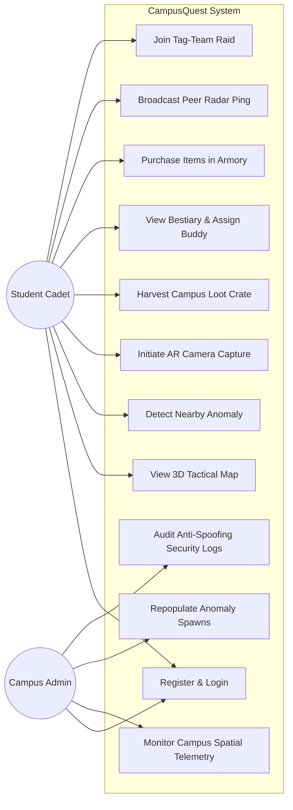
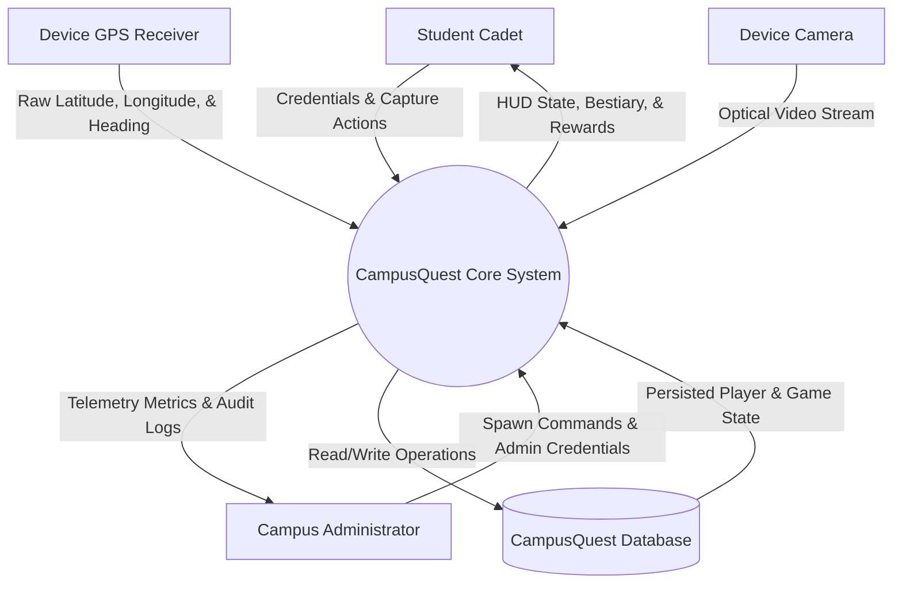
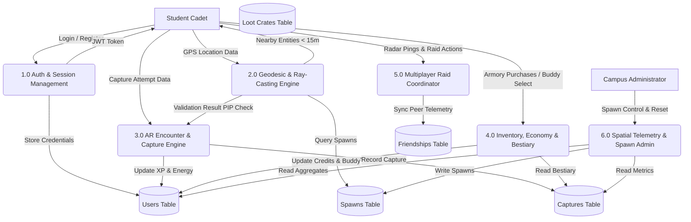
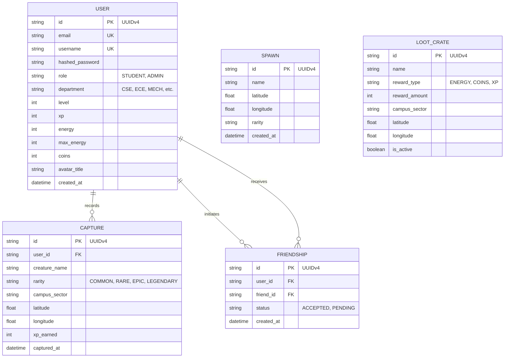
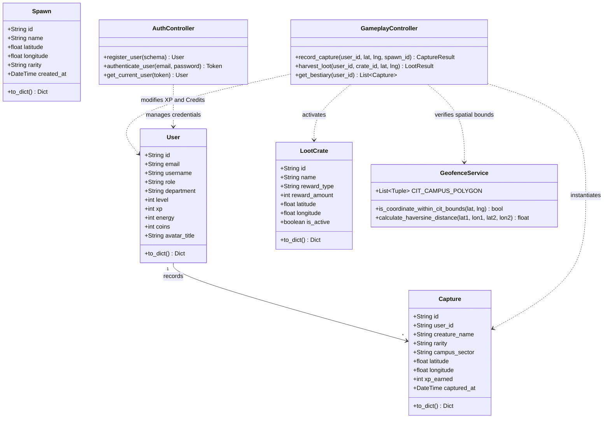
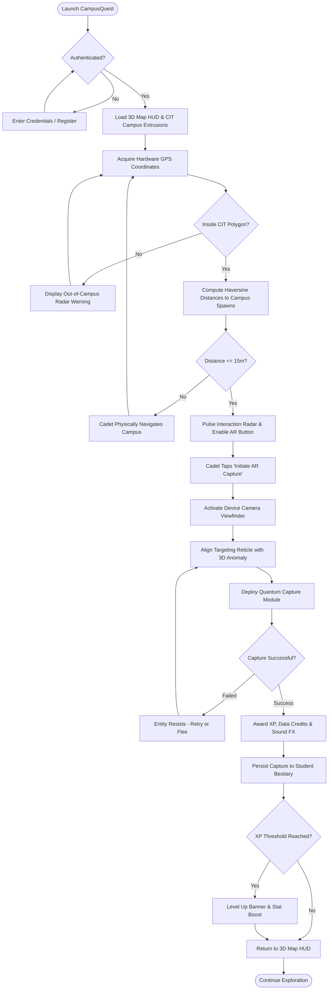
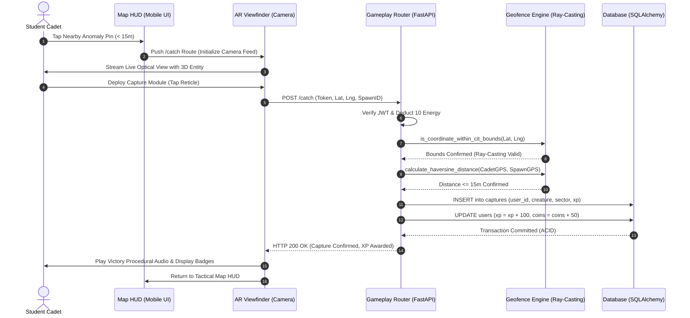
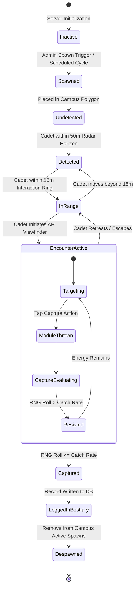
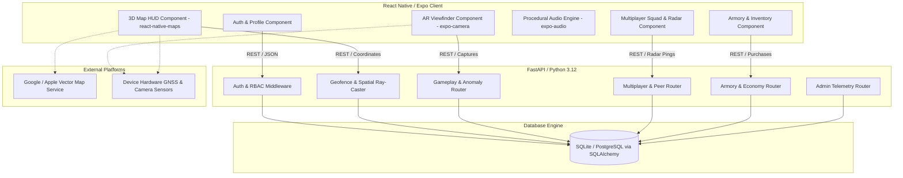

# Software Requirements Specification
## for
# CampusQuest: Location-Based Augmented Reality (AR) Campus Exploration & Gamified Engagement System

**Version 1.0 approved**

**Prepared by:** Nirmal Joshwin  
**Institution:** Coimbatore Institute of Technology  
**Date:** 25-09-2026  

*Copyright © 1999 by Karl E. Wiegers. Permission is granted to use, modify, and distribute this document.*

---

## Table of Contents
- **Table of Contents** ............................................................................................ **ii**
- **Revision History** ................................................................................................ **ii**
- **1. Introduction** .................................................................................................... **1**
  - 1.1 Purpose ........................................................................................................ 1
  - 1.2 Document Conventions ............................................................................. 1
  - 1.3 Intended Audience and Reading Suggestions ............................................. 1
  - 1.4 Product Scope .............................................................................................. 2
  - 1.5 References ................................................................................................... 2
- **2. Overall Description** ............................................................................................ **2**
  - 2.1 Product Perspective .................................................................................... 2
  - 2.2 Product Functions ....................................................................................... 3
  - 2.3 User Classes and Characteristics ................................................................. 3
  - 2.4 Operating Environment .............................................................................. 4
  - 2.5 Design and Implementation Constraints ...................................................... 4
  - 2.6 User Documentation .................................................................................. 4
  - 2.7 Assumptions and Dependencies ................................................................. 4
- **3. External Interface Requirements** ........................................................................ **5**
  - 3.1 User Interfaces ............................................................................................ 5
  - 3.2 Hardware Interfaces ..................................................................................... 6
  - 3.3 Software Interfaces ...................................................................................... 6
  - 3.4 Communications Interfaces ........................................................................ 7
- **4. System Features** ................................................................................................ **7**
  - 4.1 Cadet Registration and Authentication Management ................................. 7
  - 4.2 Geospatial 3D Map and Real-Time Radar HUD ............................................ 8
  - 4.3 Anomaly Encounter and Camera-Based AR Capture ................................... 9
  - 4.4 Geofenced Anti-Spoofing and Ray-Casting Boundary Validation .............. 10
  - 4.5 Bestiary Inventory and Companion Buddy System ..................................... 11
  - 4.6 Armory Shop, Economy, and Campus Loot Drops ...................................... 12
  - 4.7 Multiplayer Peer Discovery, Radar Pings, and Tag-Team Raids ................ 13
  - 4.8 Administrator Spatial Telemetry and Anomaly Spawning ............................ 14
- **5. Other Nonfunctional Requirements** ................................................................... **15**
  - 5.1 Performance Requirements ........................................................................ 15
  - 5.2 Safety Requirements ................................................................................... 16
  - 5.3 Security Requirements ................................................................................ 16
  - 5.4 Software Quality Attributes ........................................................................ 17
  - 5.5 Business Rules ............................................................................................ 18
- **6. Other Requirements** ........................................................................................... **19**
  - 6.1 Database Requirements ............................................................................. 19
  - 6.2 Backup and Recovery Requirements ........................................................... 20
  - 6.3 Legal and Privacy Requirements ................................................................. 20
  - 6.4 Future Enhancements ................................................................................. 20
- **Appendix A: Glossary** ............................................................................................. **21**
- **Appendix B: Analysis Models** ................................................................................. **22**
  - Model 1: Use Case Diagram ............................................................................ 22
  - Model 2: Data Flow Diagram (Level 0 and Level 1 DFD) .................................... 23
  - Model 3: Entity Relationship (ER) Diagram ...................................................... 24
  - Model 4: Class Diagram ................................................................................... 25
  - Model 5: Activity Diagram ................................................................................ 26
  - Model 6: Sequence Diagram ............................................................................ 27
  - Model 7: State Chart Diagram .......................................................................... 28
  - Model 8: Component Diagram ......................................................................... 29
  - Model 9: Deployment Diagram ........................................................................ 30
- **Appendix C: To Be Determined (TBD) List** ............................................................. **31**

---

## Revision History

| Name | Date | Reason For Changes | Version |
| :--- | :--- | :--- | :--- |
| Nirmal Joshwin | 29-08-2026 | Initial draft of SRS for CampusQuest core location services and bestiary | 0.1 |
| Nirmal Joshwin | 04-09-2026 | Added 23-point ray-casting geofence, loot crates, and multiplayer tag-team raids | 0.5 |
| Nirmal Joshwin | 22-09-2026 | Integrated 3D isometric map, Expo SDK 57, and safe area context refactoring | 0.9 |
| Nirmal Joshwin | 25-09-2026 | Finalized IEEE 830-compliant SRS with complete analysis models for approval | 1.0 approved |

---

# 1. Introduction

### 1.1 Purpose
This Software Requirements Specification (SRS) document details the complete functional and non-functional requirements for Version 1.0 of **CampusQuest: Location-Based Augmented Reality (AR) Campus Exploration & Gamified Engagement System**. The purpose of this document is to define the architectural baseline, external interfaces, gameplay mechanisms, anti-cheat spatial algorithms, and database design for developers, testers, project evaluators, and institutional administrators at **Coimbatore Institute of Technology (CIT)**.

### 1.2 Document Conventions
The following standard abbreviations and naming conventions are utilized throughout this specification:

| Convention | Description |
| :--- | :--- |
| **CQ / CampusQuest** | CampusQuest Augmented Reality Geolocation Gaming System |
| **SRS** | Software Requirements Specification (IEEE Std 830-1998 / IEEE 29148-2018) |
| **AR** | Augmented Reality (optical camera overlay with interactive spatial entities) |
| **HUD** | Heads-Up Display (overlay interface on mobile display showing game stats) |
| **GPS** | Global Positioning System |
| **CIT** | Coimbatore Institute of Technology, Coimbatore, Tamil Nadu, India |
| **JWT** | JSON Web Token (RFC 7519) |
| **REST** | Representational State Transfer |
| **API** | Application Programming Interface |
| **CRUD** | Create, Read, Update, Delete database operations |
| **Haversine** | Geodesic distance formula calculating spherical surface separation in meters |
| **PIP** | Point-in-Polygon ray-casting algorithm used for campus geofence validation |
| **RBAC** | Role-Based Access Control (Student Cadet vs. Administrator) |
| **XP** | Experience Points earned through exploration and anomaly captures |

### 1.3 Intended Audience and Reading Suggestions
This document is prepared for:
1. **Academic Project Supervisors and Evaluators:** To verify alignment with software engineering methodologies, functional completeness, and rigorous spatial verification.
2. **Full-Stack Software Developers:** To implement REST endpoints, mobile UI screens, 3D Mapbox camera transformations, and state persistence.
3. **Quality Assurance and Security Auditors:** To establish test cases for GPS anti-spoofing, ray-casting perimeter confinement, JWT authorization boundaries, and concurrent peer synchronization.
4. **Campus Administrators:** To understand student engagement metrics, telemetry capabilities, and campus spatial boundary configurations.

Readers are advised to review **Section 2** for system architecture context, proceed to **Section 4** for granular feature requirements (REQ-001 to REQ-040), consult **Section 5** for security and performance benchmarks, and refer to **Appendix B** for complete visual UML analysis models.

### 1.4 Product Scope
CampusQuest is a mobile multiplayer location-based MMORPG and campus discovery platform engineered specifically for the Coimbatore Institute of Technology campus. The application transforms the physical 25-acre CIT campus into an interactive digital augmented reality realm. Students physically navigate the campus grounds to detect cybernetic anomalies, uncover historical and academic lore at canonical landmarks, collect quantum loot caches, participate in collaborative multiplayer tag-team raids, and compete on department leaderboards. 

By tying gameplay mechanics directly to physical movement within validated geographic boundaries, CampusQuest fosters active student wellness, peer collaboration, campus spatial orientation, and inter-departmental community engagement.

### 1.5 References
1. IEEE Std 29148-2018, *Systems and Software Engineering — Life Cycle Processes — Requirements Engineering*, IEEE Computer Society, 2018.
2. IEEE Std 830-1998, *IEEE Recommended Practice for Software Requirements Specifications*, IEEE Computer Society, 1998.
3. Sommerville, Ian, *Software Engineering*, 10th Edition, Pearson Education, 2015.
4. Pressman, Roger S. and Maxim, Bruce R., *Software Engineering: A Practitioner's Approach*, 9th Edition, McGraw-Hill Education, 2019.
5. Wiegers, Karl E. and Beatty, Joy, *Software Requirements*, 3rd Edition, Microsoft Press, 2013.
6. Haversine Formula for Great-Circle Distances on Spherical Geoids, *Journal of Navigation*, Cambridge University Press.

---

# 2. Overall Description

### 2.1 Product Perspective
CampusQuest operates as a distributed client-server ecosystem comprising a cross-platform mobile client (React Native / Expo SDK 57) communicating via authenticated REST APIs with a high-performance backend (Python FastAPI and SQLAlchemy).

```
   +-------------------------------------------------------------------------+
   |                       CAMPUSQUEST SYSTEM CONTEXT                        |
   +-------------------------------------------------------------------------+
                                        |
       +--------------------+           |           +--------------------+
       |   STUDENT CADET    |           |           |  CAMPUS ADMIN / GM |
       |  (Mobile Device)   |           |           |  (Web / Telemetry) |
       +--------------------+           |           +--------------------+
                 |                      |                      |
                 | HTTPS / Bearer JWT   |                      | HTTPS / Admin JWT
                 v                      |                      v
   +-------------------------------------------------------------------------+
   |                 FASTAPI BACKEND APIS & VALIDATION LAYER                 |
   |   - Auth & RBAC Middleware          - 23-Point Polygon Ray-Caster       |
   |   - Geodesic Haversine Engine       - Spawns & Loot Cache Manager       |
   |   - Multiplayer Raid Synchronizer   - Dynamic Armory & Economy Engine   |
   +-------------------------------------------------------------------------+
                 |                                      |
                 v                                      v
   +---------------------------+          +----------------------------------+
   |    SQLITE / POSTGRESQL    |          |    EXTERNAL SENSORS & SERVICES   |
   |  - users, captures        |          |  - Device GPS / Hardware Compass |
   |  - spawns, loot_crates    |          |  - Device Camera Viewfinder      |
   |  - friendships, turf      |          |  - Hybrid Vector Map Tiles       |
   +---------------------------+          +----------------------------------+
```

### 2.2 Product Functions
The core capabilities of CampusQuest include:
- **Biometric / Credential Authentication:** Secure student registration with institutional department tagging (CSE, ECE, MECH, CIVIL, IT, AI&DS) and JWT issuance.
- **3D Isometric Campus Map:** Interactive 3D vector map featuring street-level $55^\circ$ isometric tilt, $380$m camera altitude, and volumetric building extrusion rendering.
- **Geodesic Anomaly Detection:** Real-time distance evaluation using the spherical Haversine metric triggering encounters when within $15$ meters.
- **Ray-Casting Perimeter Defense:** Server-side 23-point polygon confinement verifying that all encounters, captures, and loot collections originate inside the physical CIT perimeter.
- **AR Camera Viewfinder & Mini-Game:** Live device camera feed rendering floating anomalies with animated circular targeting reticles, capture physics, and procedural SFX.
- **Bestiary & Buddy Companion:** Persistent digital ledger cataloging captured entities with rarity tiers (Common, Rare, Epic, Legendary) and equipable active companions.
- **Armory & Campus Economy:** In-game store trading earned Campus Data Credits for EMP disruptors, capture modules, and title customizations.
- **Multiplayer Tag-Team Raids & Radar:** Peer cadet discovery displaying active players within proximity, radar ping broadcasts, and joint boss challenges.
- **Administrator Command Center:** Spatial telemetry dashboard permitting faculty and admins to monitor player concentrations, trigger server-wide anomaly spawns, and audit security logs.

### 2.3 User Classes and Characteristics
1. **Student Cadet (Primary User):** Undergraduate or postgraduate students possessing iOS or Android smartphones. Users navigate the physical campus to discover anomalies, complete quests, form squads, and earn experience points.
2. **Administrator / Campus Gamemaster (Privileged User):** Authorized institutional coordinators or event administrators possessing elevated credentials (`role="ADMIN"`). Administrators oversee spawn densities, orchestrate campus-wide raid events, review cheating telemetry, and adjust boundary coordinates.
3. **Peer Cadet / Squad Member:** Concurrent players discovered dynamically via peer-to-peer radar scanning for multiplayer tag-team raids and mutual radar beaconing.

### 2.4 Operating Environment
| Component | Specification |
| :--- | :--- |
| **Mobile Client OS** | Android 10.0+ / iOS 15.0+ running Expo Go SDK 57 or standalone native binary |
| **Mobile Client Engine** | React Native 0.86.3, Expo 57.0.26, React 19.2.3, TypeScript 5.x |
| **Map Rendering Provider** | `react-native-maps` (Google Maps Android SDK / Apple MapKit iOS) with 3D Hybrid Extrusions |
| **Hardware Sensors** | A-GPS / GLONASS receiver, rear optical camera ($1080\text{p}@30\text{fps}$), 3-axis accelerometer & gyroscope |
| **Backend Application Server** | Python 3.12 LTS, FastAPI 0.115+, Uvicorn ASGI Server |
| **Persistence Layer** | SQLite 3 (Development/Staging) / PostgreSQL 16 (Enterprise Production) via SQLAlchemy ORM |
| **Network Protocol** | HTTP/1.1 over TLS 1.3 (HTTPS) with JSON payloads and WebSocket telemetry channels |

### 2.5 Design and Implementation Constraints
- **Geographic Perimeter Constraint:** Gameplay is strictly confined to the digitized 23-point boundary of Coimbatore Institute of Technology ($11.0254^\circ\text{N} - 11.0305^\circ\text{N}$, $77.0259^\circ\text{E} - 77.0291^\circ\text{E}$).
- **GPS Jitter Accommodation:** A calibrated 15-meter buffer margin is enforced along boundary vertices to prevent false-positive rejections due to satellite multipath interference in multi-story academic buildings.
- **Low-Power Mobile Footprint:** Battery conservation algorithms dynamically reduce GPS polling frequency when stationary and sleep the camera sensor when not in active AR encounters.
- **Safe Area Inset Standard:** All mobile screens strictly implement `react-native-safe-area-context` to maintain interface layout integrity across notched displays and home indicator gestures.

### 2.6 User Documentation
1. **Cadet Field Guide (User Manual):** In-app onboarding tutorial explaining HUD navigation, radar rings, capture mechanics, and safety advisories.
2. **Administrator Spatial Operations Manual:** Comprehensive guide detailing admin endpoint usage, spawn density controls, and server health monitoring.
3. **Developer Setup & API Documentation:** Interactive OpenAPI/Swagger documentation hosted natively at `/docs` detailing all request/response schemas.

### 2.7 Assumptions and Dependencies
- Mobile devices have active GPS location services enabled with "High Accuracy" mode.
- Mobile devices have granted optical camera permissions for AR viewfinder rendering.
- Campus Wi-Fi (CIT-Student) or cellular 4G/5G data connectivity is operational during gameplay.
- Backend server is reachable over IPv4/IPv6 on the local campus network or reverse-proxied domain.

---

# 3. External Interface Requirements

### 3.1 User Interfaces
The user interface follows a futuristic "Cyber-Glass" aesthetic with high-contrast semi-transparent panels (`#070D1E`, `#00FFCC`, `#FF0055`) optimized for outdoor sunlight visibility:
1. **Authentication Screen ([`login.tsx`](file:///c:/Users/Joshwin/Documents/CampusQuest/frontend/app/login.tsx)):** Single-page tabbed authentication permitting credential sign-in and new cadet registration with department selection.
2. **3D Tactical Map HUD ([`index.tsx`](file:///c:/Users/Joshwin/Documents/CampusQuest/frontend/app/index.tsx)):** Full-screen vector map rendered at $55^\circ$ pitch featuring the Cadet avatar marker, pulse circles for $15$m interaction radiuses, animated pins for anomalies and loot caches, compass bearing indicator, quick-center buttons, and top HUD displaying level, energy, and coins.
3. **AR Viewfinder & Catch Arena ([`catch.tsx`](file:///c:/Users/Joshwin/Documents/CampusQuest/frontend/app/catch.tsx)):** Live camera feed rendering the target entity with glowing rarity aura, directional radar indicator, multi-tier capture power slider, and procedural sound feedback.
4. **Bestiary & Inventory Hub ([`inventory.tsx`](file:///c:/Users/Joshwin/Documents/CampusQuest/frontend/app/inventory.tsx)):** Tabbed interface cataloging captured anomalies with stats, lore, and "Set as Active Buddy" toggle.
5. **Squad & Cadet Radar ([`friends.tsx`](file:///c:/Users/Joshwin/Documents/CampusQuest/frontend/app/friends.tsx)):** Cadet search, accepted friends list, one-tap radar ping transmission, and proximity indicator.
6. **Campus Armory ([`shop.tsx`](file:///c:/Users/Joshwin/Documents/CampusQuest/frontend/app/shop.tsx)):** Categorized catalog offering capture gear, energy boosters, and avatar honor titles.
7. **Cadet Identity Profile ([`profile.tsx`](file:///c:/Users/Joshwin/Documents/CampusQuest/frontend/app/profile.tsx)):** Profile statistics, capture badges, title selector, and secure sign-out.
8. **Gamemaster Command Center ([`admin.tsx`](file:///c:/Users/Joshwin/Documents/CampusQuest/frontend/app/admin.tsx)):** Administrative overview with real-time player tallies, anomaly re-population triggers, and campus reset controls.

### 3.2 Hardware Interfaces
- **GPS / GNSS Chipset:** Periodically sampled via `expo-location` to deliver latitude, longitude, altitude, accuracy, and heading.
- **Rear Optical Camera:** Accessed via `expo-camera` at 30 frames per second to render real-world background video during AR encounters.
- **Haptic Actuator:** Utilized via `expo-haptics` to deliver tactile feedback on button presses, capture impacts, and warning thresholds.
- **Audio Output:** Utilized via `expo-audio` to synthesize procedural sound effects for radar chirps, capture swooshes, and coin rewards.

### 3.3 Software Interfaces
- **Operating System Services:** iOS CoreLocation / Android Location Services for geographic positioning.
- **Mapbox / Google Maps SDK:** Provides satellite and hybrid vector tiles with extruded 3D building geometry.
- **FastAPI / Uvicorn Server:** Delivers sub-millisecond serialization of game states and spatial verification queries.
- **SQLAlchemy ORM:** Maps Python entity definitions to relational SQLite/PostgreSQL schemas with foreign-key constraints.

### 3.4 Communications Interfaces
- **Transport Protocol:** HTTP/1.1 and HTTP/2 over TLS 1.3 for secure encrypted client-server exchanges.
- **Authentication Scheme:** HTTP `Authorization: Bearer <token>` transmitting HMAC-SHA256 signed JSON Web Tokens.
- **Data Exchange Format:** UTF-8 encoded JSON conforming to strict Pydantic schemas.
- **Cross-Origin Resource Sharing (CORS):** Managed dynamically in `backend/app/main.py` allowing registered local development and institutional host origins.

---

# 4. System Features

### 4.1 Cadet Registration and Authentication Management
#### 4.1.1 Description and Priority
**Priority:** High  
Allows students to register an account using their institutional credentials, choose their engineering department, securely sign in, and obtain an encrypted session token.

#### 4.1.2 Stimulus/Response Sequences
- **Stimulus:** Cadet enters email, username, department, and password on the Registration interface.
- **Response:** Backend validates input against regex constraints, verifies email and username uniqueness, hashes password using BCrypt, creates user record, and returns HTTP 201 with JWT.
- **Stimulus:** Cadet submits credentials on Login interface.
- **Response:** Backend validates password hash, constructs JWT payload containing `user_id`, `role`, and expiration timestamp, and redirects cadet to the 3D Tactical Map HUD.

#### 4.1.3 Functional Requirements
| Requirement ID | Requirement Description |
| :--- | :--- |
| **REQ-001** | The system shall allow new cadets to register with email, username, department, and password. |
| **REQ-002** | The system shall validate username formats against the pattern `^[a-zA-Z0-9_.-]+$` to prevent injection attacks. |
| **REQ-003** | The system shall reject duplicate email addresses or usernames with HTTP 400 Bad Request. |
| **REQ-004** | The system shall authenticate user credentials using BCrypt hashing and issue signed JWT bearer tokens. |
| **REQ-005** | The system shall persist student session state and automatically redirect authenticated users to the Map HUD. |

---

### 4.2 Geospatial 3D Map and Real-Time Radar HUD
#### 4.2.1 Description and Priority
**Priority:** High  
Renders an interactive 3D perspective of Coimbatore Institute of Technology displaying extruded academic buildings, player location, proximity radar circles, and nearby interactive entities.

#### 4.2.2 Stimulus/Response Sequences
- **Stimulus:** Cadet opens the map HUD or changes physical location on campus.
- **Response:** GPS coordinates update; map re-centers cadet marker; camera tilts to $55^\circ$ with $380$m altitude; radar circles pulse; nearby spawns within $15$m become actionable.
- **Stimulus:** Cadet taps the "Center on Me" (GPS) button.
- **Response:** Camera smoothly animates to cadet coordinates with calibrated heading bearing and pitch.
- **Stimulus:** Cadet taps the "CIT Overview" button.
- **Response:** Camera pans to academic quad center ($11.0278^\circ\text{N}, 77.0275^\circ\text{E}$) with $50^\circ$ pitch and $650$m altitude.

#### 4.2.3 Functional Requirements
| Requirement ID | Requirement Description |
| :--- | :--- |
| **REQ-006** | The system shall render an isometric 3D map with forward pitch of $55^\circ$ and altitude of $380$m. |
| **REQ-007** | The system shall automatically extrude volumetric 3D building footprints using vector tile map layers. |
| **REQ-008** | The system shall display the player's position using a custom Cadet marker and interaction radar circle. |
| **REQ-009** | The system shall render canonical story spawns and dynamic loot crates within the CIT campus perimeter. |
| **REQ-010** | The system shall compute real-time geodesic distances using the Haversine formula and update UI indicators. |

---

### 4.3 Anomaly Encounter and Camera-Based AR Capture
#### 4.3.1 Description and Priority
**Priority:** High  
Enables cadets within $15$ meters of an anomaly pin to initiate an AR encounter, viewing the creature projected onto their live camera feed and executing a skill-based capture mini-game.

#### 4.3.2 Stimulus/Response Sequences
- **Stimulus:** Cadet taps an anomaly pin within $15$m and presses "Initiate AR Capture".
- **Response:** Navigation router pushes `/catch` screen; rear camera feed activates; 3D holographic entity appears with rarity aura.
- **Stimulus:** Cadet aligns capture reticle with entity and taps "Deploy Quantum Capture".
- **Response:** Reticle pulses; capture odds calculate based on creature rarity; procedural SFX plays; success screen awards XP and coins and writes capture to Bestiary.

#### 4.3.3 Functional Requirements
| Requirement ID | Requirement Description |
| :--- | :--- |
| **REQ-011** | The system shall restrict AR encounter initiation to instances where cadet-anomaly distance is $\le 15$m. |
| **REQ-012** | The system shall stream live camera frames at $30\text{fps}$ as the background canvas for AR encounters. |
| **REQ-013** | The system shall render animated targeting reticles and interactive capture controls over the optical feed. |
| **REQ-014** | The system shall compute capture success probabilities determined by creature rarity tier and cadet level. |
| **REQ-015** | The system shall award experience points ($100$ to $500$ XP) and Data Credits upon successful capture. |

---

### 4.4 Geofenced Anti-Spoofing and Ray-Casting Boundary Validation
#### 4.4.1 Description and Priority
**Priority:** High  
Enforces strict spatial security rules preventing unauthorized captures from outside CIT campus boundaries or via GPS spoofing utilities.

#### 4.4.2 Stimulus/Response Sequences
- **Stimulus:** Client submits `/catch` request with latitude and longitude payload.
- **Response (Valid):** Coordinates fall within the 23-point CIT campus polygon; capture is recorded; HTTP 200 returned.
- **Stimulus:** Client submits coordinates located outside Coimbatore city ($11.0^\circ - 11.1^\circ\text{N}$, $77.0^\circ - 77.1^\circ\text{E}$).
- **Response (Out-of-Bounds):** Schema validation fails immediately with HTTP 422 Unprocessable Entity.
- **Stimulus:** Client submits coordinates outside the 23-point campus perimeter.
- **Response (Spoofed):** Ray-casting algorithm rejects request with HTTP 400 Bad Request ("GPS coordinates rejected: Anomaly capture requires physical presence within the CIT Campus perimeter").

#### 4.4.3 Functional Requirements
| Requirement ID | Requirement Description |
| :--- | :--- |
| **REQ-016** | The system shall maintain an immutable 23-vertex polygon perimeter defining the Coimbatore Institute of Technology campus. |
| **REQ-017** | The system shall evaluate capture coordinates using an algebraic Ray-Casting Point-in-Polygon (PIP) algorithm. |
| **REQ-018** | The system shall incorporate a calibrated 15-meter buffer margin along boundary edges to mitigate urban GPS multipath jitter. |
| **REQ-019** | The system shall reject any capture, loot collection, or stronghold claim occurring outside campus boundaries with HTTP 400. |
| **REQ-020** | The system shall validate coordinates at the Pydantic schema level to block out-of-region spoofing attempts with HTTP 422. |

---

### 4.5 Bestiary Inventory and Companion Buddy System
#### 4.5.1 Description and Priority
**Priority:** Medium  
Provides a comprehensive personal catalog of all anomalies discovered and captured by the student, with detailed lore, capture timestamps, and active companion designation.

#### 4.5.2 Stimulus/Response Sequences
- **Stimulus:** Cadet selects the Bestiary tab in Inventory.
- **Response:** Backend returns list of captured creatures; UI displays discovery count, rarity badges, and sectors.
- **Stimulus:** Cadet taps a captured creature and presses "Assign as Active Buddy".
- **Response:** Buddy status saves to local storage and backend; companion creature icon renders alongside cadet avatar on 3D map.

#### 4.5.3 Functional Requirements
| Requirement ID | Requirement Description |
| :--- | :--- |
| **REQ-021** | The system shall record captured anomaly records linked to the student's unique user ID. |
| **REQ-022** | The system shall display total unique discoveries versus total available campus species. |
| **REQ-023** | The system shall categorize Bestiary entries into Common, Rare, Epic, and Legendary rarity tiers. |
| **REQ-024** | The system shall permit students to equip any captured creature as their active roaming buddy companion. |
| **REQ-025** | The system shall render the active buddy companion alongside the cadet marker on the 3D map HUD. |

---

### 4.6 Armory Shop, Economy, and Campus Loot Drops
#### 4.6.1 Description and Priority
**Priority:** Medium  
Maintains in-game currency balances ("Campus Data Credits") and permits cadets to forage for quantum loot crates or purchase items in the armory.

#### 4.6.2 Stimulus/Response Sequences
- **Stimulus:** Cadet approaches a physical loot crate location ($\le 15$m) and taps "Harvest Cache".
- **Response:** Backend validates location; rewards cadet with $+25$ Energy or $+50$ Data Credits; updates player record.
- **Stimulus:** Cadet navigates to Armory Shop and purchases an EMP Disruptor.
- **Response:** Backend verifies sufficient coin balance; deducts item price; deposits item into inventory; returns HTTP 200.

#### 4.6.3 Functional Requirements
| Requirement ID | Requirement Description |
| :--- | :--- |
| **REQ-026** | The system shall spawn collectible quantum loot crates at designated campus sectors (e.g., Sports Ground, Quad). |
| **REQ-027** | The system shall reward cadets with Energy recharge cells or Data Credits upon opening loot crates within $15$m. |
| **REQ-028** | The system shall maintain an Armory catalog with configurable item categories (Supplies, Buffs, Honor Titles). |
| **REQ-029** | The system shall verify adequate credit balances prior to authorizing armory transactions. |
| **REQ-030** | The system shall atomically deduct currency and credit inventory items upon confirmed purchase. |

---

### 4.7 Multiplayer Peer Discovery, Radar Pings, and Tag-Team Raids
#### 4.7.1 Description and Priority
**Priority:** High  
Facilitates collaborative campus gameplay by discovering active cadets in physical proximity, broadcasting radar beacons, and enabling joint boss encounters.

#### 4.7.2 Stimulus/Response Sequences
- **Stimulus:** Cadet opens the Friends / Squad screen.
- **Response:** Backend queries active cadet telemetry and returns peers within proximity with department tags.
- **Stimulus:** Cadet taps "Broadcast Radar Ping" for a peer cadet.
- **Response:** Peer receives alert notification with transmitting cadet's sector; procedural radar chirp executes.
- **Stimulus:** Multiple cadets initiate a Tag-Team Raid against a Legendary boss anomaly.
- **Response:** Raid lobby synchronizes cadet attack contributions and splits shared rewards upon boss defeat.

#### 4.7.3 Functional Requirements
| Requirement ID | Requirement Description |
| :--- | :--- |
| **REQ-031** | The system shall compute real-time proximity to discover active peer cadets across campus sectors. |
| **REQ-032** | The system shall allow cadets to search for other students by username and manage friendship links. |
| **REQ-033** | The system shall enable cadets to dispatch instant radar pings alerting friends to nearby rare spawns. |
| **REQ-034** | The system shall support multi-user Tag-Team Raid lobbies for synchronized Legendary anomaly battles. |
| **REQ-035** | The system shall distribute bonus XP and exclusive titles to all participants in successful group raids. |

---

### 4.8 Administrator Spatial Telemetry and Anomaly Spawning
#### 4.8.1 Description and Priority
**Priority:** High  
Equips institutional faculty and event coordinators with a command dashboard to monitor player density, manage spawn distributions, and trigger campus events.

#### 4.8.2 Stimulus/Response Sequences
- **Stimulus:** Administrator logs in with admin credentials (`role="ADMIN"`).
- **Response:** System authenticates role and presents the Command Telemetry dashboard.
- **Stimulus:** Administrator presses "Repopulate Campus Spawns".
- **Response:** Backend clears stale spawns and generates fresh canonical story anomalies across CIT quad sectors.
- **Stimulus:** Student attempts to access admin endpoint.
- **Response:** RBAC middleware intercepts request and responds with HTTP 403 Forbidden.

#### 4.8.3 Functional Requirements
| Requirement ID | Requirement Description |
| :--- | :--- |
| **REQ-036** | The system shall provide an Administrator Telemetry Console restricted to users with `role="ADMIN"`. |
| **REQ-037** | The system shall display aggregate metrics including total registered cadets, total captures, and active spawns. |
| **REQ-038** | The system shall permit administrators to trigger automated spawn generation across calibrated campus sectors. |
| **REQ-039** | The system shall provide an administrative reset mechanism to purge test captures and restore pristine campus state. |
| **REQ-040** | The system shall strictly enforce role-based access control, rejecting non-admin attempts with HTTP 403 Forbidden. |

---

# 5. Other Nonfunctional Requirements

### 5.1 Performance Requirements
The system shall deliver smooth real-time performance to sustain immersive gameplay without distracting lag or sluggish map updates.

| Requirement ID | Requirement Statement |
| :--- | :--- |
| **NFR-001** | The system shall authenticate user credentials and issue a JWT within $1.5$ seconds under normal network conditions. |
| **NFR-002** | The 3D Tactical Map HUD shall load and render extruded buildings within $3.0$ seconds on initial application launch. |
| **NFR-003** | The geodesic distance calculation to nearby spawns shall execute in less than $50$ milliseconds on mobile hardware. |
| **NFR-004** | The server-side ray-casting Point-in-Polygon validation shall execute in less than $10$ milliseconds per capture request. |
| **NFR-005** | The backend server shall support at least $500$ concurrent active student connections with average latency $< 200$ms. |
| **NFR-006** | The AR camera viewfinder shall maintain a stable rendering frame rate of at least $30$ frames per second. |

#### Expected Performance Goals
- **Instant Map Centering:** Smooth $60\text{fps}$ camera transitions during zoom and tilt actions.
- **Low Memory Footprint:** Mobile client memory consumption shall remain below $250\text{MB}$ during active AR gameplay.
- **Optimized Network Payloads:** Spatial spawn responses shall be compact ($< 15\text{KB}$) for rapid retrieval over cellular links.

---

### 5.2 Safety Requirements
Because CampusQuest involves physical movement across active campus grounds, safety requirements are paramount to safeguard student well-being.

| Requirement ID | Requirement Statement |
| :--- | :--- |
| **NFR-007** | The system shall display a mandatory pedestrian safety warning banner on launch reminding cadets to remain alert. |
| **NFR-008** | The system shall strictly prohibit the placement of anomaly spawns on active roadways or hazardous construction zones. |
| **NFR-009** | The system shall disengage camera AR mini-games if rapid vehicular transit speed ($> 25\text{km/h}$) is detected. |
| **NFR-010** | The system shall enforce a $15$-meter interaction radius so cadets can interact with landmarks without entering restricted zones. |
| **NFR-011** | The mobile client shall throttle GPS sampling when battery charge falls below $15\%$ to avoid sudden device shutdown. |

#### Safety Measures
- Clear in-game advisories urging students never to look at the screen while crossing streets or negotiating stairs.
- Static placement of canonical story anomalies solely within open pedestrian quads, courtyards, and library plazas.

---

### 5.3 Security Requirements
The system implements defense-in-depth security principles across authentication, transport, data sanitation, and spatial verification.

| Requirement ID | Requirement Statement |
| :--- | :--- |
| **NFR-012** | Passwords shall be hashed using BCrypt with a work factor $\ge 12$ prior to database persistence. |
| **NFR-013** | All client-server exchanges shall be encrypted using TLS 1.3 to prevent man-in-the-middle eavesdropping. |
| **NFR-014** | API endpoints shall require a valid JWT Bearer token signed with HMAC-SHA256 and an environment-driven secret key. |
| **NFR-015** | Role-Based Access Control (RBAC) shall enforce complete separation between Student Cadets and Campus Administrators. |
| **NFR-016** | All incoming text payloads shall be sanitized against regular expressions to prevent SQL injection and XSS exploits. |
| **NFR-017** | Spatial coordinates shall undergo dual validation: Pydantic schema bounds followed by ray-casting perimeter verification. |

#### Security Mechanisms
- **Environment Isolation:** Zero hardcoded secrets; tokens, keys, and database URIs loaded from secured `.env` configuration.
- **CORS Protection:** Dynamic origin filtering rejecting requests from unapproved domains.
- **Token Expiration:** JWT access tokens configured with 7-day lifespans requiring periodic re-authentication.

---

### 5.4 Software Quality Attributes
- **Reliability:** The system shall maintain an uptime of $99.5\%$ during academic operating hours ($07:00$ to $21:00$ IST).
- **Usability:** High-contrast Cyber-Glass UI with intuitive iconography allowing cadets to perform core actions in $\le 2$ taps.
- **Availability:** Offline graceful degradation where cached bestiary records and map tiles remain viewable during transient connectivity drops.
- **Maintainability:** Modular architecture separating routing logic, spatial algorithms, database models, and React Native UI components.
- **Scalability:** Stateless REST API design enabling horizontal scaling behind an Nginx reverse proxy or cloud container cluster.
- **Portability:** Cross-platform React Native codebase delivering identical visual fidelity and mechanics on both Android and iOS devices.

| Requirement ID | Requirement Statement |
| :--- | :--- |
| **NFR-018** | The system shall provide a uniform responsive graphical interface across varied mobile screen resolutions. |
| **NFR-019** | The database layer shall preserve ACID transactional guarantees across capture recordings and credit transfers. |
| **NFR-020** | The frontend architecture shall follow clean component segregation supporting effortless addition of new mini-games. |
| **NFR-021** | The backend shall return structured, machine-readable JSON error responses for all HTTP $4\text{xx}$ and $5\text{xx}$ conditions. |
| **NFR-022** | The codebase shall maintain zero TypeScript compilation errors and pass all automated security test suites. |

---

### 5.5 Business Rules
The following operational policies govern the CampusQuest gamified ecosystem:

| Rule ID | Business Rule Statement |
| :--- | :--- |
| **BR-001** | Only students and faculty with valid institutional registrations may participate in campus anomaly hunts. |
| **BR-002** | An anomaly capture is valid if and only if the cadet's GPS coordinates fall within the CIT polygon and within $15$m of the spawn. |
| **BR-003** | Each anomaly spawn may only be captured once per student per spawn cycle to prevent XP farming. |
| **BR-004** | A student's Energy gauge decreases by $10$ units per capture attempt and automatically regenerates at $1$ unit per minute. |
| **BR-005** | Campus loot crates refresh at $06:00$ and $18:00$ daily across designated open campus sectors. |
| **BR-006** | Student Cadets cannot access administrative telemetry or invoke spawn manipulation endpoints under any circumstance. |
| **BR-007** | Active roaming buddy companions grant a passive $+10\%$ bonus to experience points earned within the companion's home sector. |
| **BR-008** | In-game Data Credits cannot be purchased with real fiat currency and are strictly earned through campus exploration. |
| **BR-009** | Tag-Team Raids require a minimum squad size of $2$ cadets located within $30$ meters of the raid beacon. |
| **BR-010** | Leaderboards compute cumulative student XP and department rankings, updating every $15$ minutes. |

---

# 6. Other Requirements

### 6.1 Database Requirements
The CampusQuest persistence layer utilizes SQLite (development) and PostgreSQL (production) managed via SQLAlchemy ORM.

#### Database Entities & Schema Mapping
1. **`users` Table:** Stores cadet identity, credentials, department, level, XP, energy, coin balances, and equipped avatar title.
2. **`captures` Table:** Historical record of every anomaly captured, recording user foreign key, creature details, rarity, sector, coordinates, and timestamp.
3. **`spawns` Table:** Active and canonical anomaly locations on campus, defining entity name, GPS coordinates, and rarity tier.
4. **`loot_crates` Table:** Campus cache nodes defining sector, reward type (ENERGY, COINS, XP), coordinates, and active status.
5. **`friendships` Table:** Bi-directional friendship links linking two cadet IDs with acceptance status (`ACCEPTED`, `PENDING`).

| Requirement ID | Requirement Statement |
| :--- | :--- |
| **DB-001** | The database shall enforce unique constraints on `email` and `username` columns in the `users` table. |
| **DB-002** | Foreign key constraints shall link `captures.user_id` to `users.id` with cascading integrity. |
| **DB-003** | Primary keys across all tables shall utilize UUIDv4 36-character string identifiers. |
| **DB-004** | The database shall store GPS coordinates using double-precision floating-point format (`Float`). |
| **DB-005** | Timestamps across all tables shall be stored in UTC format using ISO 8601 representation. |
| **DB-006** | Database queries for nearby spawns shall utilize indexing on coordinate and sector columns for fast spatial retrieval. |

---

### 6.2 Backup and Recovery Requirements
- **Automated Daily Snapshot:** The production database shall undergo automated daily snapshots stored in an isolated, encrypted backup repository.
- **Point-in-Time Recovery:** In the event of data corruption, recovery mechanisms shall restore the database to any state within the preceding 7 days.
- **Failover Resilience:** The application server shall reconnect automatically to the database upon service resumption without process restart.

---

### 6.3 Legal and Privacy Requirements
- **Location Privacy:** Student GPS coordinates are evaluated in memory for boundary and distance verification and are never stored as historical tracking tracks.
- **Institutional Compliance:** Complies with Coimbatore Institute of Technology IT acceptable use policies and student data protection standards.
- **Password Obfuscation:** Raw passwords are never transmitted in logs, returned in API payloads, or saved in plaintext.
- **Session Revocation:** Cadets maintain full autonomy to log out at any time, instantly invalidating stored mobile session tokens.

---

### 6.4 Future Enhancements
- **Bluetooth Low Energy (BLE) Peer Battles:** Direct device-to-device PvP turn-based combat over BLE without cellular latency.
- **Occlusion-Aware AR Viewfinder:** Upgraded AR pipeline using ARKit / ARCore depth APIs allowing anomalies to hide realistically behind physical campus trees and pillars.
- **Dynamic AI Quest Narrator:** Generative quest storylines tailored to a student's engineering department and academic schedule.
- **Inter-Collegiate Tournament Mode:** Seasonal esports competitions between engineering institutions across Coimbatore.

---

# Appendix A: Glossary

| Term | Description |
| :--- | :--- |
| **CampusQuest** | Location-based augmented reality mobile game developed for Coimbatore Institute of Technology. |
| **Cadet** | An enrolled student player navigating the campus environment. |
| **Anomaly** | A virtual cybernetic creature spawned at a campus coordinate that can be captured in AR mode. |
| **Bestiary** | The digital compendium cataloging all captured anomalies, their lore, stats, and capture locations. |
| **Geofence** | A digital boundary enclosing physical geographical coordinates (the 23-point CIT campus polygon). |
| **Ray-Casting Algorithm** | A computational geometry algorithm casting an imaginary horizontal ray to test whether a point lies within a polygon. |
| **Haversine Formula** | Mathematical equation calculating the shortest spherical surface distance between two latitude/longitude coordinates. |
| **Loot Crate** | A virtual supply cache scattered across campus yielding Energy refills, Data Credits, or bonus XP. |
| **Buddy Companion** | A captured creature equipped by the cadet to accompany their digital avatar across the map HUD. |
| **Tag-Team Raid** | A cooperative multiplayer encounter where nearby cadets jointly battle an Epic or Legendary anomaly. |
| **Data Credits** | The in-game currency earned by completing quests, capturing anomalies, and opening loot crates. |
| **Armory** | The in-game merchant interface where cadets acquire capture boosters, energy packs, and prestige titles. |

---

# Appendix B: Analysis Models

### Model 1: Use Case Diagram
Visualizes the interactions between the primary actors (Student Cadet and Campus Administrator) and core system capabilities.


```mermaid
flowchart LR
    Cadet((Student Cadet))
    Admin((Campus Admin))

    subgraph CampusQuest System
        UC1[Register & Login]
        UC2[View 3D Tactical Map]
        UC3[Detect Nearby Anomaly]
        UC4[Initiate AR Camera Capture]
        UC5[Harvest Campus Loot Crate]
        UC6[View Bestiary & Assign Buddy]
        UC7[Purchase Items in Armory]
        UC8[Broadcast Peer Radar Ping]
        UC9[Join Tag-Team Raid]
        UC10[Monitor Campus Spatial Telemetry]
        UC11[Repopulate Anomaly Spawns]
        UC12[Audit Anti-Spoofing Security Logs]
    end

    Cadet --> UC1
    Cadet --> UC2
    Cadet --> UC3
    Cadet --> UC4
    Cadet --> UC5
    Cadet --> UC6
    Cadet --> UC7
    Cadet --> UC8
    Cadet --> UC9

    Admin --> UC1
    Admin --> UC10
    Admin --> UC11
    Admin --> UC12
```

---

### Model 2: Data Flow Diagrams

#### Level 0 DFD (Context Diagram)
Depicts the high-level information flow between external entities and the CampusQuest application core.


```mermaid
flowchart TD
    Cadet[Student Cadet]
    Admin[Campus Administrator]
    GPS[Device GPS Receiver]
    Cam[Device Camera]
    System((CampusQuest Core System))
    DB[(CampusQuest Database)]

    Cadet -->|Credentials & Capture Actions| System
    System -->|HUD State, Bestiary, & Rewards| Cadet

    Admin -->|Spawn Commands & Admin Credentials| System
    System -->|Telemetry Metrics & Audit Logs| Admin

    GPS -->|Raw Latitude, Longitude, & Heading| System
    Cam -->|Optical Video Stream| System

    System -->|Read/Write Operations| DB
    DB -->|Persisted Player & Game State| System
```

#### Level 1 DFD (Decomposed System Components)
Illustrates data processing across authentication, spatial validation, gameplay mechanics, and persistence.


```mermaid
flowchart TD
    Cadet[Student Cadet]
    Admin[Campus Administrator]

    P1(1.0 Auth & Session Management)
    P2(2.0 Geodesic & Ray-Casting Engine)
    P3(3.0 AR Encounter & Capture Engine)
    P4(4.0 Inventory, Economy & Bestiary)
    P5(5.0 Multiplayer Raid Coordinator)
    P6(6.0 Spatial Telemetry & Spawn Admin)

    D1[(Users Table)]
    D2[(Captures Table)]
    D3[(Spawns Table)]
    D4[(Loot Crates Table)]
    D5[(Friendships Table)]

    Cadet -->|Login / Register| P1
    P1 -->|Store Credentials| D1
    P1 -->|JWT Token| Cadet

    Cadet -->|GPS Location Data| P2
    P2 -->|Query Spawns| D3
    P2 -->|Nearby Entities < 15m| Cadet

    Cadet -->|Capture Attempt Data| P3
    P2 -->|Validation Result PIP Check| P3
    P3 -->|Record Capture| D2
    P3 -->|Update XP & Energy| D1

    Cadet -->|Armory Purchases / Buddy Select| P4
    P4 -->|Update Credits & Buddy| D1
    P4 -->|Read Bestiary| D2

    Cadet -->|Radar Pings & Raid Actions| P5
    P5 -->|Sync Peer Telemetry| D5

    Admin -->|Spawn Control & Reset| P6
    P6 -->|Write Spawns| D3
    P6 -->|Read Aggregates| D1
    P6 -->|Read Metrics| D2
```

---

### Model 3: Entity Relationship (ER) Diagram
Illustrates database entities, attributes, primary/foreign keys, and cardinality relationships.


```mermaid
erDiagram
    USER ||--o{ CAPTURE : records
    USER ||--o{ FRIENDSHIP : initiates
    USER ||--o{ FRIENDSHIP : receives

    USER {
        string id PK "UUIDv4"
        string email UK
        string username UK
        string hashed_password
        string role "STUDENT, ADMIN"
        string department "CSE, ECE, MECH, etc."
        int level
        int xp
        int energy
        int max_energy
        int coins
        string avatar_title
        datetime created_at
    }

    CAPTURE {
        string id PK "UUIDv4"
        string user_id FK
        string creature_name
        string rarity "COMMON, RARE, EPIC, LEGENDARY"
        string campus_sector
        float latitude
        float longitude
        int xp_earned
        datetime captured_at
    }

    SPAWN {
        string id PK "UUIDv4"
        string name
        float latitude
        float longitude
        string rarity
        datetime created_at
    }

    LOOT_CRATE {
        string id PK "UUIDv4"
        string name
        string reward_type "ENERGY, COINS, XP"
        int reward_amount
        string campus_sector
        float latitude
        float longitude
        boolean is_active
    }

    FRIENDSHIP {
        string id PK "UUIDv4"
        string user_id FK
        string friend_id FK
        string status "ACCEPTED, PENDING"
        datetime created_at
    }
```

---

### Model 4: Class Diagram
Details the object-oriented structure of models, controllers, and services in the application backend.


```mermaid
classDiagram
    class User {
        +String id
        +String email
        +String username
        +String role
        +String department
        +int level
        +int xp
        +int energy
        +int coins
        +String avatar_title
        +to_dict() Dict
    }

    class Capture {
        +String id
        +String user_id
        +String creature_name
        +String rarity
        +String campus_sector
        +float latitude
        +float longitude
        +int xp_earned
        +DateTime captured_at
        +to_dict() Dict
    }

    class Spawn {
        +String id
        +String name
        +float latitude
        +float longitude
        +String rarity
        +DateTime created_at
        +to_dict() Dict
    }

    class LootCrate {
        +String id
        +String name
        +String reward_type
        +int reward_amount
        +float latitude
        +float longitude
        +boolean is_active
        +to_dict() Dict
    }

    class GeofenceService {
        +List~Tuple~ CIT_CAMPUS_POLYGON
        +is_coordinate_within_cit_bounds(lat, lng) bool
        +calculate_haversine_distance(lat1, lon1, lat2, lon2) float
    }

    class GameplayController {
        +record_capture(user_id, lat, lng, spawn_id) CaptureResult
        +harvest_loot(user_id, crate_id, lat, lng) LootResult
        +get_bestiary(user_id) List~Capture~
    }

    class AuthController {
        +register_user(schema) User
        +authenticate_user(email, password) Token
        +get_current_user(token) User
    }

    User "1" --> "*" Capture : records
    GameplayController ..> GeofenceService : verifies spatial bounds
    GameplayController ..> User : modifies XP and Credits
    GameplayController ..> Capture : instantiates
    GameplayController ..> LootCrate : activates
    AuthController ..> User : manages credentials
```

---

### Model 5: Activity Diagram
Maps the operational workflow of a student cadet embarking on an anomaly hunt and executing a capture.


```mermaid
flowchart TD
    Start([Launch CampusQuest]) --> Login{Authenticated?}
    Login -->|No| Auth[Enter Credentials / Register]
    Auth --> Login
    Login -->|Yes| LoadMap[Load 3D Map HUD & CIT Campus Extrusions]
    LoadMap --> SampleGPS[Acquire Hardware GPS Coordinates]
    SampleGPS --> CheckBounds{Inside CIT Polygon?}

    CheckBounds -->|No| BoundaryWarn[Display Out-of-Campus Radar Warning]
    BoundaryWarn --> SampleGPS

    CheckBounds -->|Yes| ScanSpawns[Compute Haversine Distances to Campus Spawns]
    ScanSpawns --> RangeCheck{Distance <= 15m?}

    RangeCheck -->|No| Explore[Cadet Physically Navigates Campus]
    Explore --> SampleGPS

    RangeCheck -->|Yes| Alert[Pulse Interaction Radar & Enable AR Button]
    Alert --> TapCapture[Cadet Taps 'Initiate AR Capture']
    TapCapture --> OpenCamera[Activate Device Camera Viewfinder]
    OpenCamera --> AimReticle[Align Targeting Reticle with 3D Anomaly]
    AimReticle --> ThrowModule[Deploy Quantum Capture Module]
    ThrowModule --> CalcOdds{Capture Successful?}

    CalcOdds -->|Failed| Flee[Entity Resists - Retry or Flee]
    Flee --> AimReticle

    CalcOdds -->|Success| AwardXP[Award XP, Data Credits & Sound FX]
    AwardXP --> SaveBestiary[Persist Capture to Student Bestiary]
    SaveBestiary --> CheckLevel{XP Threshold Reached?}
    CheckLevel -->|Yes| LevelUp[Level Up Banner & Stat Boost]
    CheckLevel -->|No| ReturnHUD[Return to 3D Map HUD]
    LevelUp --> ReturnHUD
    ReturnHUD --> End([Continue Exploration])
```

---

### Model 6: Sequence Diagram
Depicts the chronological invocation of services during an AR anomaly capture.


```mermaid
sequenceDiagram
    autonumber
    actor Cadet as Student Cadet
    participant HUD as Map HUD (Mobile UI)
    participant Viewfinder as AR Viewfinder (Camera)
    participant API as Gameplay Router (FastAPI)
    participant Geo as Geofence Engine (Ray-Casting)
    participant DB as Database (SQLAlchemy)

    Cadet->>HUD: Tap Nearby Anomaly Pin (< 15m)
    HUD->>Viewfinder: Push /catch Route (Initialize Camera Feed)
    Viewfinder->>Cadet: Stream Live Optical View with 3D Entity
    Cadet->>Viewfinder: Deploy Capture Module (Tap Reticle)
    Viewfinder->>API: POST /catch (Token, Lat, Lng, SpawnID)
    API->>API: Verify JWT & Deduct 10 Energy
    API->>Geo: is_coordinate_within_cit_bounds(Lat, Lng)
    Geo-->>API: Bounds Confirmed (Ray-Casting Valid)
    API->>Geo: calculate_haversine_distance(CadetGPS, SpawnGPS)
    Geo-->>API: Distance <= 15m Confirmed
    API->>DB: INSERT into captures (user_id, creature, sector, xp)
    API->>DB: UPDATE users (xp = xp + 100, coins = coins + 50)
    DB-->>API: Transaction Committed (ACID)
    API-->>Viewfinder: HTTP 200 OK (Capture Confirmed, XP Awarded)
    Viewfinder->>Cadet: Play Victory Procedural Audio & Display Badges
    Viewfinder->>HUD: Return to Tactical Map HUD
```

---

### Model 7: State Chart Diagram
Details the lifecycle states of an Anomaly Entity within the CampusQuest runtime environment.


```mermaid
stateDiagram-v2
    [*] --> Inactive : Server Initialization
    Inactive --> Spawned : Admin Spawn Trigger / Scheduled Cycle
    Spawned --> Undetected : Placed in Campus Polygon

    Undetected --> Detected : Cadet within 50m Radar Horizon
    Detected --> InRange : Cadet within 15m Interaction Ring
    InRange --> Detected : Cadet moves beyond 15m

    InRange --> EncounterActive : Cadet Initiates AR Viewfinder
    EncounterActive --> InRange : Cadet Retreats / Escapes

    state EncounterActive {
        [*] --> Targeting
        Targeting --> ModuleThrown : Tap Capture Action
        ModuleThrown --> CaptureEvaluating
        CaptureEvaluating --> Resisted : RNG Roll > Catch Rate
        Resisted --> Targeting : Energy Remains
    }

    EncounterActive --> Captured : RNG Roll <= Catch Rate
    Captured --> LoggedInBestiary : Record Written to DB
    LoggedInBestiary --> Despawned : Remove from Campus Active Spawns
    Despawned --> [*]
```

---

### Model 8: Component Diagram
Illustrates the modular packaging and dependencies of frontend, backend, and external systems.


```mermaid
flowchart TD
    subgraph Mobile Client [React Native / Expo Client]
        C1[Auth & Profile Component]
        C2[3D Map HUD Component - react-native-maps]
        C3[AR Viewfinder Component - expo-camera]
        C4[Procedural Audio Engine - expo-audio]
        C5[Multiplayer Squad & Radar Component]
        C6[Armory & Inventory Component]
    end

    subgraph Backend Application Server [FastAPI / Python 3.12]
        B1[Auth & RBAC Middleware]
        B2[Geofence & Spatial Ray-Caster]
        B3[Gameplay & Anomaly Router]
        B4[Multiplayer & Peer Router]
        B5[Armory & Economy Router]
        B6[Admin Telemetry Router]
    end

    subgraph Persistence Layer [Database Engine]
        DB[(SQLite / PostgreSQL via SQLAlchemy)]
    end

    subgraph External Platforms
        EXT1[Google / Apple Vector Map Service]
        EXT2[Device Hardware GNSS & Camera Sensors]
    end

    C1 -->|REST / JSON| B1
    C2 -->|REST / Coordinates| B2
    C3 -->|REST / Captures| B3
    C5 -->|REST / Radar Pings| B4
    C6 -->|REST / Purchases| B5

    C2 -.-> EXT1
    C3 -.-> EXT2
    C2 -.-> EXT2

    B1 --> DB
    B2 --> DB
    B3 --> DB
    B4 --> DB
    B5 --> DB
    B6 --> DB
```

---

### Model 9: Deployment Diagram
Demonstrates physical execution nodes, networking channels, and operational container boundaries.

```mermaid
deploymentDiagram
flowchart TD
    subgraph ClientDevice [Student Smartphone Android / iOS]
        nodeClient["Mobile App Sandbox\n(React Native 0.86 / Expo SDK 57)\n- Native 3D Map View\n- Camera AR Layer\n- Local Storage (SecureStore)"]
    end

    subgraph Gateway [Campus Network / Edge Gateway]
        nodeProxy["Reverse Proxy / SSL Termination\n(Nginx / Uvicorn ASGI)\n- Port 443 HTTPS\n- TLS 1.3 / CORS Validation"]
    end

    subgraph AppServer [Application Server Node]
        nodeBackend["FastAPI Backend Container (Python 3.12)\n- 23-Point PIP Ray-Caster\n- Haversine Geodesic Engine\n- RBAC JWT Validator\n- Gameplay Controller"]
    end

    subgraph DatabaseNode [Database Host Node]
        nodeDB[("Relational Database\n(SQLite 3 / PostgreSQL 16)\n- ACID Storage\n- users, captures, spawns")]
    end

    ClientDevice -->|HTTPS / WSS Port 443| Gateway
    Gateway -->|ASGI TCP Socket Port 8000| AppServer
    AppServer -->|Unix Socket / SQL Protocol Port 5432| DatabaseNode
```

---


## Source Code:

### `backend/app/main.py`
```python
import logging
from fastapi import FastAPI
from fastapi.middleware.cors import CORSMiddleware
from app.config import settings
from app.database import engine, Base
from app.routers import spawns, auth, gameplay, shop, admin, multiplayer, friends, turf, pvp
# Configure logging
logging.basicConfig(level=logging.INFO, format="%(asctime)s - %(name)s - %(levelname)s - %(message)s")
logger = logging.getLogger("CampusQuest")

# Create database tables if supported
try:
    Base.metadata.create_all(bind=engine)
    logger.info("Database schema initialized successfully.")
except Exception as e:
    logger.warning(f"Could not automatically create database tables: {e}")

app = FastAPI(
    title=settings.APP_NAME,
    description="CampusQuest MVP Backend - Location-based campus exploration API for CIT",
    version="1.0.0",
)

# Configure CORS safely for mobile app & web requests
raw_origins = settings.ALLOWED_ORIGINS.split(",") if hasattr(settings, "ALLOWED_ORIGINS") and settings.ALLOWED_ORIGINS else []
cors_origins = [o.strip() for o in raw_origins if o.strip()]

if settings.ENVIRONMENT == "development":
    allow_all = not cors_origins or "*" in cors_origins
    app.add_middleware(
        CORSMiddleware,
        allow_origins=["*"] if allow_all else cors_origins,
        allow_credentials=False if allow_all else True,
        allow_methods=["*"],
        allow_headers=["*"],
    )
else:
    app.add_middleware(
        CORSMiddleware,
        allow_origins=cors_origins or ["https://campusquest.cit.edu.in"],
        allow_credentials=True,
        allow_methods=["GET", "POST", "PUT", "DELETE", "OPTIONS"],
        allow_headers=["Authorization", "Content-Type", "Accept"],
    )


# Security headers & Request Timing Middleware
@app.middleware("http")
async def production_security_and_timing_middleware(request, call_next):
    import time
    start_time = time.time()
    response = await call_next(request)
    duration_ms = round((time.time() - start_time) * 1000, 2)
    response.headers["X-Response-Time"] = f"{duration_ms}ms"
    response.headers["X-Content-Type-Options"] = "nosniff"
    response.headers["X-Frame-Options"] = "SAMEORIGIN"
    response.headers["X-XSS-Protection"] = "1; mode=block"
    response.headers["Referrer-Policy"] = "strict-origin-when-cross-origin"
    if settings.ENVIRONMENT != "development":
        response.headers["Strict-Transport-Security"] = "max-age=31536000; includeSubDomains"
    return response

# Mount endpoints
app.include_router(spawns.router)
app.include_router(auth.router)
app.include_router(gameplay.router)
app.include_router(shop.router)
app.include_router(admin.router)
app.include_router(multiplayer.router)
app.include_router(friends.router)
app.include_router(turf.router)
app.include_router(pvp.router)

@app.get("/", tags=["Health"])
def root():
    return {
        "status": "online",
        "service": settings.APP_NAME,
        "environment": settings.ENVIRONMENT,
        "cit_geofence": {
            "bounds": {
                "min_lat": 11.0250,
                "max_lat": 11.0300,
                "min_lng": 77.0250,
                "max_lng": 77.0300,
            },
            "location": "Coimbatore Institute of Technology (CIT)"
        },
        "docs_url": "/docs"
    }

@app.get("/health", tags=["Health"])
def health_check():
    """Liveness probe: verifies that the HTTP server process is running."""
    return {"status": "healthy"}

@app.get("/health/ready", tags=["Health"])
def readiness_check():
    """Readiness probe: verifies database connectivity and core services."""
    from app.database import check_db_health
    from fastapi.responses import JSONResponse
    is_ready = check_db_health()
    if is_ready:
        return {"status": "ready", "database": "connected"}
    return JSONResponse(
        status_code=503,
        content={"status": "degraded", "database": "disconnected"}
    )


```

### `backend/app/routers/gameplay.py`
```python
import logging
import uuid
from typing import List, Dict
from datetime import datetime, timezone, timedelta
from pydantic import BaseModel, Field
from fastapi import APIRouter, Depends, HTTPException, status
from sqlalchemy.orm import Session
from app.database import get_db
from app.models import User, Capture
from app.schemas import (
    CatchRequest,
    CatchResponse,
    BestiaryResponse,
    BestiaryEntry,
    LootCrateResponse,
    ClaimLootRequest,
    ClaimLootResponse,
)
from app.auth import get_current_user
from app.geofence import CIT_CANONICAL_STORY_SPAWNS, is_coordinate_within_cit_bounds

logger = logging.getLogger(__name__)
router = APIRouter(prefix="/api/gameplay", tags=["Gameplay & Progression"])

XP_MAP = {
    "COMMON": 100,
    "RARE": 250,
    "EPIC": 600,
    "LEGENDARY": 1500,
}

EMOJI_MAP = {
    "HomeSentinel": "🛡️",
    "CIT CyberDragon": "🐉",
    "QuantumSprite": "✨",
    "RoboGolem": "🤖",
    "CircuitPhoenix": "🔥",
    "CodePhantom": "👻",
    "NeuralFox": "🦊",
    "ByteFalcon": "🦅",
    "SiliconTitan": "⚡",
    "CampusOwl": "🦉",
    "AeroMech": "🚀",
}

# Anti-farming / Tracking
USER_LAST_LOCATION: Dict[str, dict] = {}             # user_id -> {"lat", "lng", "time"}

# Fixed Campus Collectible Loot Caches
CANONICAL_CAMPUS_LOOT = [
    {
        "id": "cit-loot-1",
        "name": "CIT Canteen Supply Crate",
        "reward_type": "ENERGY",
        "reward_amount": 50,
        "campus_sector": "Student Canteen & Food Court",
        "latitude": 11.026950,
        "longitude": 77.027750,
        "is_active": True,
    },
    {
        "id": "cit-loot-2",
        "name": "Library Quantum Data Crystal",
        "reward_type": "COINS",
        "reward_amount": 100,
        "campus_sector": "Central Library",
        "latitude": 11.028150,
        "longitude": 77.026850,
        "is_active": True,
    },
    {
        "id": "cit-loot-3",
        "name": "Sports Pavilion Energy Battery",
        "reward_type": "ENERGY",
        "reward_amount": 40,
        "campus_sector": "Southern Sports Pavilion",
        "latitude": 11.026350,
        "longitude": 77.027150,
        "is_active": True,
    },
]

@router.post("/catch", response_model=CatchResponse)
def record_capture(
    payload: CatchRequest,
    current_user: User = Depends(get_current_user),
    db: Session = Depends(get_db)
):
    """
    Record a creature capture, deduct energy, award XP, and check for Level-Up.
    """
    if current_user.energy < 10:
        raise HTTPException(
            status_code=status.HTTP_400_BAD_REQUEST,
            detail="Insufficient energy! You need at least 10 Energy to capture. Collect energy crates on campus to recharge."
        )

    # Anti-spoofing verification: ensure capture coordinates are within CIT Campus perimeter
    # HomeSentinel is permitted for field calibration and remote home testing
    if payload.creature_name != "HomeSentinel" and not is_coordinate_within_cit_bounds(payload.latitude, payload.longitude):
        raise HTTPException(
            status_code=status.HTTP_400_BAD_REQUEST,
            detail="GPS coordinates rejected: Anomaly capture requires physical presence within the CIT Campus perimeter."
        )

    # SEC-HIGH-04 Fix: Server-side validation of spawn existence and proximity
    import math
    def get_distance_meters(lat1, lon1, lat2, lon2):
        R = 6371000
        phi1, phi2 = math.radians(lat1), math.radians(lat2)
        dphi, dlam = math.radians(lat2 - lat1), math.radians(lon2 - lon1)
        a = math.sin(dphi/2)**2 + math.cos(phi1)*math.cos(phi2)*math.sin(dlam/2)**2
        return R * 2 * math.atan2(math.sqrt(a), math.sqrt(1 - a))

    # Retrieve valid spawns, injecting HomeSentinel at user's location to allow testing
    from app.geofence import get_cit_story_spawns
    valid_spawns = get_cit_story_spawns(user_lat=payload.latitude, user_lng=payload.longitude)
    target_spawn = next((s for s in valid_spawns if s["name"] == payload.creature_name), None)
    
    if not target_spawn:
        raise HTTPException(
            status_code=status.HTTP_404_NOT_FOUND,
            detail=f"Validation failed: Creature '{payload.creature_name}' does not exist on campus."
        )
    
    dist = get_distance_meters(payload.latitude, payload.longitude, target_spawn["latitude"], target_spawn["longitude"])
    # 35m + 15m GPS drift tolerance
    if dist > 50:
        raise HTTPException(
            status_code=status.HTTP_403_FORBIDDEN,
            detail=f"Validation failed: You are {int(dist)}m away. Radar limit is 35m."
        )

    # Enforce unique one-time creature capture (no farming)
    already_captured = db.query(Capture).filter(
        Capture.user_id == current_user.id,
        Capture.creature_name == payload.creature_name
    ).first()
    if already_captured:
        raise HTTPException(
            status_code=status.HTTP_400_BAD_REQUEST,
            detail=f"{payload.creature_name} is already registered in your Bestiary! Campus anomalies cannot be farmed repeatedly."
        )

    # Teleportation / Speed Check (Max ~15m/s = ~54km/h = car speed in campus)
    now = datetime.now(timezone.utc)
    user_loc = USER_LAST_LOCATION.get(current_user.id)
    if user_loc:
        time_elapsed = (now - user_loc["time"]).total_seconds()
        if time_elapsed > 0:
            travel_dist = get_distance_meters(payload.latitude, payload.longitude, user_loc["lat"], user_loc["lng"])
            speed = travel_dist / time_elapsed
            if speed > 15: # > 15 m/s
                raise HTTPException(
                    status_code=status.HTTP_429_TOO_MANY_REQUESTS,
                    detail="Movement speed too high. Please slow down. (Anti-Spoofing Lock)"
                )
    
    USER_LAST_LOCATION[current_user.id] = {"lat": payload.latitude, "lng": payload.longitude, "time": now}

    rarity_str = payload.rarity.value if hasattr(payload.rarity, "value") else str(payload.rarity)
    xp_earned = XP_MAP.get(rarity_str.upper(), 100)

    # 1. Update user energy & XP
    current_user.energy = max(0, current_user.energy - 10)
    current_user.xp += xp_earned
    
    old_level = current_user.level
    new_level = 1 + (current_user.xp // 1000)
    level_up = new_level > old_level
    current_user.level = new_level

    # 2. Record capture in database
    capture = Capture(
        id=str(uuid.uuid4()),
        user_id=current_user.id,
        creature_name=payload.creature_name,
        rarity=rarity_str.upper(),
        campus_sector=payload.campus_sector or "CIT Campus",
        latitude=payload.latitude,
        longitude=payload.longitude,
        xp_earned=xp_earned,
    )

    try:
        db.add(capture)
        db.commit()
        db.refresh(current_user)
    except Exception as e:
        logger.error(f"Failed to record capture: {e}")
        db.rollback()
        raise HTTPException(status_code=status.HTTP_500_INTERNAL_SERVER_ERROR, detail="Database error recording capture")

    message = f"Successfully captured {payload.creature_name}! +{xp_earned} XP earned."
    if level_up:
        message += f" 🎉 LEVEL UP! You reached Level {new_level}!"

    return CatchResponse(
        success=True,
        message=message,
        xp_gained=xp_earned,
        level_up=level_up,
        new_level=new_level,
        new_xp=current_user.xp,
        current_energy=current_user.energy,
        capture_id=capture.id,
    )

@router.get("/bestiary", response_model=BestiaryResponse)
def get_bestiary(
    current_user: User = Depends(get_current_user),
    db: Session = Depends(get_db)
):
    """
    Returns player's CIT Campus Bestiary (Pokedex).
    Lists all 10 canonical creatures indicating discovered status and capture count.
    """
    user_captures = db.query(Capture).filter(Capture.user_id == current_user.id).all()
    capture_map = {}
    for c in user_captures:
        if c.creature_name not in capture_map:
            capture_map[c.creature_name] = {"count": 0, "first_caught": c.captured_at}
        capture_map[c.creature_name]["count"] += 1

    entries: List[BestiaryEntry] = []
    discovered_count = 0

    for creature in CIT_CANONICAL_STORY_SPAWNS:
        name = creature["name"]
        rarity = creature["rarity"]
        sector = creature["sector"]
        is_discovered = name in capture_map
        if is_discovered:
            discovered_count += 1

        entries.append(
            BestiaryEntry(
                creature_name=name,
                rarity=rarity,
                sector=sector,
                discovered=is_discovered,
                captured_count=capture_map[name]["count"] if is_discovered else 0,
                first_caught_at=capture_map[name]["first_caught"] if is_discovered else None,
                emoji=EMOJI_MAP.get(name, "👾"),
                xp_reward=XP_MAP.get(rarity, 100),
            )
        )

    return BestiaryResponse(
        total_discovered=discovered_count,
        total_creatures=len(CIT_CANONICAL_STORY_SPAWNS),
        entries=entries,
    )

@router.get("/loot", response_model=List[LootCrateResponse])
def get_campus_loot():
    """
    Returns active collectible loot caches and energy cells scattered across CIT.
    """
    return CANONICAL_CAMPUS_LOOT

# Anti-farming In-Memory Tracking
USER_LOOT_CLAIMS: Dict[str, Dict[str, datetime]] = {} # user_id -> {crate_id: claim_timestamp}
USER_QR_LAST_SCAN: Dict[str, datetime] = {}          # user_id -> last_scan_timestamp

LOOT_COOLDOWN_HOURS = 4
QR_SCAN_COOLDOWN_SECONDS = 300 # 5 minutes

@router.post("/claim-loot", response_model=ClaimLootResponse)
def claim_loot_cache(
    payload: ClaimLootRequest,
    current_user: User = Depends(get_current_user),
    db: Session = Depends(get_db)
):
    """
    Claims a collectible campus loot cache reward (Energy, Coins, or XP).
    Enforces a 4-hour cooldown per user per crate to prevent infinite farming.
    """
    crate = next((c for c in CANONICAL_CAMPUS_LOOT if c["id"] == payload.crate_id), None)
    if not crate:
        raise HTTPException(status_code=status.HTTP_404_NOT_FOUND, detail="Loot crate not found")

    now = datetime.now(timezone.utc)
    user_claims = USER_LOOT_CLAIMS.setdefault(current_user.id, {})
    if payload.crate_id in user_claims:
        last_claimed = user_claims[payload.crate_id]
        elapsed = (now - last_claimed).total_seconds()
        cooldown_total = LOOT_COOLDOWN_HOURS * 3600
        if elapsed < cooldown_total:
            remaining_mins = max(1, int((cooldown_total - elapsed) // 60))
            raise HTTPException(
                status_code=status.HTTP_429_TOO_MANY_REQUESTS,
                detail=f"Supply cache already secured! Scanner recharging. Return in {remaining_mins} minutes."
            )

    reward_type = crate["reward_type"]
    reward_amount = crate["reward_amount"]

    if reward_type == "ENERGY":
        current_user.energy = min(current_user.max_energy, current_user.energy + reward_amount)
    elif reward_type == "COINS":
        current_user.coins += reward_amount
    elif reward_type == "XP":
        current_user.xp += reward_amount
        current_user.level = 1 + (current_user.xp // 1000)

    try:
        db.commit()
        db.refresh(current_user)
        user_claims[payload.crate_id] = now
    except Exception as e:
        logger.error(f"Failed to claim loot: {e}")
        db.rollback()
        raise HTTPException(status_code=status.HTTP_500_INTERNAL_SERVER_ERROR, detail="Database update failed")

    return ClaimLootResponse(
        success=True,
        reward_type=reward_type,
        reward_amount=reward_amount,
        message=f"Claimed {reward_amount} {reward_type} from {crate['name']}!",
        new_energy=current_user.energy,
        new_coins=current_user.coins,
        new_xp=current_user.xp,
    )

class QrScanRequest(BaseModel):
    qr_code: str = Field(..., min_length=3, max_length=100)

VALID_QR_PREFIXES = ("CIT-", "CITQUEST-", "CAMPUS-", "STATION-")

@router.post("/qr-scan")
def scan_campus_qr(
    payload: QrScanRequest,
    current_user: User = Depends(get_current_user),
    db: Session = Depends(get_db)
):
    """
    Validates physical QR codes on campus bulletin boards and awards secret supply caches.
    Validates format and enforces rate limiting to prevent spamming.
    """
    code = payload.qr_code.strip()
    
    # 1. Signature check
    code_upper = code.upper()
    if not any(code_upper.startswith(prefix) for prefix in VALID_QR_PREFIXES):
        raise HTTPException(
            status_code=status.HTTP_400_BAD_REQUEST,
            detail="Invalid QR beacon signature. Scan an authorized CIT CampusQuest station marker."
        )

    # 2. Rate limiting check (5-minute cooldown)
    now = datetime.now(timezone.utc)
    if current_user.id in USER_QR_LAST_SCAN:
        last_scan = USER_QR_LAST_SCAN[current_user.id]
        elapsed = (now - last_scan).total_seconds()
        if elapsed < QR_SCAN_COOLDOWN_SECONDS:
            remaining_secs = int(QR_SCAN_COOLDOWN_SECONDS - elapsed)
            raise HTTPException(
                status_code=status.HTTP_429_TOO_MANY_REQUESTS,
                detail=f"Quantum scanner cooling down! Please wait {remaining_secs} seconds before decrypting another QR station."
            )

    # Award scavenger loot
    bonus_coins = 50
    bonus_energy = 30
    bonus_xp = 200

    current_user.coins += bonus_coins
    current_user.energy = min(current_user.max_energy, current_user.energy + bonus_energy)
    current_user.xp += bonus_xp
    current_user.level = 1 + (current_user.xp // 1000)

    try:
        db.commit()
        USER_QR_LAST_SCAN[current_user.id] = now
    except Exception as e:
        logger.error(f"Failed to commit QR reward: {e}")
        db.rollback()
        raise HTTPException(status_code=status.HTTP_500_INTERNAL_SERVER_ERROR, detail="Reward recording error")

    return {
        "success": True,
        "message": f"📷 Physical Campus QR Station Verified!\nStation Code: {code[:15]}...\n+50 Data Credits (💎)\n+30 Quantum Energy\n+200 Exploration XP",
        "reward_coins": bonus_coins,
        "reward_energy": bonus_energy,
        "reward_xp": bonus_xp,
        "new_coins": current_user.coins,
        "new_energy": current_user.energy,
        "new_xp": current_user.xp
    }


```

### `frontend/app/index.tsx`
```tsx
import React, { useState, useEffect, useRef, useCallback } from 'react';
import {
  StyleSheet,
  View,
  Text,
  TouchableOpacity,
  ActivityIndicator,
  Alert,
  Platform,
  Dimensions,
} from 'react-native';
import { SafeAreaView } from 'react-native-safe-area-context';
import { CameraView, useCameraPermissions } from 'expo-camera';
import * as Location from 'expo-location';
import { Accelerometer } from 'expo-sensors';
import { useRouter, useFocusEffect } from 'expo-router';
import {
  calculateDistancesToSpawns,
  calculateHaversineDistance,
  calculateBearing,
  calculateRelativeAngle,
  calculateARProjection,
  formatDistance,
  getRarityConfig,
  getCreatureEmoji,
  SpawnPoint,
  SpawnWithDistance,
} from '../utils/haversine';
import {
  fetchSpawns,
  fetchLootCratesApi,
  claimLootCrateApi,
  fetchBestiary,
  LootCrateItem,
} from '../utils/api';
import { fetchActivePeersApi, PeerCadet } from '../utils/multiplayer';
import { fetchFriendsApi, FriendItem } from '../utils/friends';
import { fetchStrongholdsApi, CampusStronghold } from '../utils/turf';
import DuelModal from '../components/DuelModal';
import StrongholdModal from '../components/StrongholdModal';
import InteractiveLeafletMap from '../components/InteractiveLeafletMap';
import { useAuth } from '../context/AuthContext';
import { useVPSTracker } from '../utils/vps';
import { triggerHapticTap, triggerHapticImpact, triggerHapticSuccess, triggerHapticWarning } from '../utils/haptics';
import { playTapSound, playSwooshSound, playCoinSound } from '../utils/sound';

const CIT_CENTER = {
  latitude: 11.0272,
  longitude: 77.0274,
};

const CATCH_PROXIMITY_THRESHOLD_METERS = 35;

export default function ARMainScreen() {
  const router = useRouter();
  const { user, token, updateProfile } = useAuth();
  const smoothedCoordsRef = useRef<{ latitude: number; longitude: number } | null>(null);

  // Primary View Mode: MAP (OpenStreetMap) vs AR (Camera Viewport)
  const [activeView, setActiveView] = useState<'MAP' | 'AR'>('MAP');

  const [location, setLocation] = useState<Location.LocationObjectCoords | null>(null);
  const [heading, setHeading] = useState<number>(0);
  const [devicePitch, setDevicePitch] = useState<number>(0);

  // VPS Tracker
  const {
    anchor: vpsAnchor,
    projection: vpsProjection,
    mode: trackingMode,
    setMode: setTrackingMode,
    lockAnchorInFront,
    anchorToBearing,
  } = useVPSTracker({ defaultDepthMeters: 2.5, externalHeading: heading });

  // Camera Focus
  const [isFocused, setIsFocused] = useState<boolean>(true);
  useFocusEffect(
    useCallback(() => {
      setIsFocused(true);
      return () => {
        setIsFocused(false);
      };
    }, [])
  );

  const [cameraPermission, requestCameraPermission] = useCameraPermissions();

  const [spawns, setSpawns] = useState<SpawnPoint[]>([]);
  const [sortedSpawns, setSortedSpawns] = useState<SpawnWithDistance[]>([]);
  const [lootCrates, setLootCrates] = useState<LootCrateItem[]>([]);
  const [friends, setFriends] = useState<FriendItem[]>([]);
  const [peers, setPeers] = useState<PeerCadet[]>([]);
  const [loading, setLoading] = useState<boolean>(true);

  const [strongholds, setStrongholds] = useState<CampusStronghold[]>([]);
  const [selectedStronghold, setSelectedStronghold] = useState<CampusStronghold | null>(null);
  const [showStrongholdModal, setShowStrongholdModal] = useState<boolean>(false);

  const [duelTarget, setDuelTarget] = useState<FriendItem | null>(null);
  const [showDuelModal, setShowDuelModal] = useState<boolean>(false);

  const currentCoords = location
    ? { latitude: location.latitude, longitude: location.longitude }
    : { latitude: CIT_CENTER.latitude, longitude: CIT_CENTER.longitude };

  const activeSpawns: SpawnWithDistance[] =
    sortedSpawns.length > 0
      ? sortedSpawns
      : spawns.map((s) => ({
          ...s,
          distanceMeters: location
            ? calculateHaversineDistance(
                { latitude: location.latitude, longitude: location.longitude },
                { latitude: s.latitude, longitude: s.longitude }
              )
            : 999,
          isWithinCatchRange: false,
        }));

  const closestSpawn = activeSpawns.length > 0 ? activeSpawns[0] : null;

  // Load Game Data
  const loadGameData = async (userCoords?: { latitude: number; longitude: number } | null) => {
    try {
      const activeCoords = userCoords || (location ? { latitude: location.latitude, longitude: location.longitude } : null);
      const [spawnData, lootData, bestiaryData, peersData, friendsData, strongholdsData] = await Promise.all([
        fetchSpawns(12, activeCoords),
        fetchLootCratesApi(),
        fetchBestiary(token),
        fetchActivePeersApi(),
        fetchFriendsApi(token),
        fetchStrongholdsApi(),
      ]);

      const capturedNames = new Set(
        bestiaryData.entries.filter((e) => e.discovered).map((e) => e.creature_name)
      );

      // HomeSentinel indoor testing anchor
      const processedSpawns = spawnData.map((s) => {
        if (s.name === 'HomeSentinel' && activeCoords) {
          return {
            ...s,
            latitude: Number((activeCoords.latitude + 0.00006).toFixed(6)),
            longitude: Number((activeCoords.longitude + 0.00005).toFixed(6)),
          };
        }
        return s;
      });

      const uncollectedSpawns = processedSpawns.filter((s) => !capturedNames.has(s.name));

      setSpawns(uncollectedSpawns);
      setLootCrates(lootData);
      setPeers(peersData);
      setFriends(friendsData);
      setStrongholds(strongholdsData);
    } catch (err) {
      console.error('Error loading game data:', err);
    } finally {
      setLoading(false);
    }
  };

  // GPS & Heading Listeners
  useEffect(() => {
    let locationSubscription: Location.LocationSubscription | null = null;
    let headingSubscription: Location.LocationSubscription | null = null;

    (async () => {
      try {
        const { status } = await Location.requestForegroundPermissionsAsync();
        if (status !== 'granted') {
          setLoading(false);
          loadGameData(CIT_CENTER);
          return;
        }

        try {
          const lastLoc = await Location.getLastKnownPositionAsync();
          if (lastLoc) {
            setLocation(lastLoc.coords);
            loadGameData(lastLoc.coords);
          } else {
            const initialLoc = await Promise.race([
              Location.getCurrentPositionAsync({ accuracy: Location.Accuracy.Balanced }),
              new Promise<null>((resolve) => setTimeout(() => resolve(null), 10000)),
            ]);
            if (initialLoc) {
              setLocation(initialLoc.coords);
              loadGameData(initialLoc.coords);
            } else {
              const defaultCoords = {
                latitude: CIT_CENTER.latitude,
                longitude: CIT_CENTER.longitude,
                altitude: null,
                accuracy: 5,
                altitudeAccuracy: null,
                heading: null,
                speed: null,
              };
              setLocation(defaultCoords);
              loadGameData(defaultCoords);
            }
          }
        } catch (e) {
          const defaultCoords = {
            latitude: CIT_CENTER.latitude,
            longitude: CIT_CENTER.longitude,
            altitude: null,
            accuracy: 5,
            altitudeAccuracy: null,
            heading: null,
            speed: null,
          };
          setLocation(defaultCoords);
          loadGameData(defaultCoords);
        }

        let lastHeadingVal = 0;
        locationSubscription = await Location.watchPositionAsync(
          { accuracy: Location.Accuracy.Balanced, timeInterval: 2000, distanceInterval: 0 },
          (newLocation) => {
            const raw = newLocation.coords;
            // Ignore inaccurate noise bursts (> 35m uncertainty) when an accurate position is already tracked
            if (raw.accuracy && raw.accuracy > 35 && smoothedCoordsRef.current) return;

            if (!smoothedCoordsRef.current) {
              smoothedCoordsRef.current = { latitude: raw.latitude, longitude: raw.longitude };
              setLocation(raw);
              loadGameData(raw); // Reload data if we just got the first real location lock
            } else {
              const alpha = 0.25; // Smooth exponential moving average
              const smoothLat = smoothedCoordsRef.current.latitude + alpha * (raw.latitude - smoothedCoordsRef.current.latitude);
              const smoothLng = smoothedCoordsRef.current.longitude + alpha * (raw.longitude - smoothedCoordsRef.current.longitude);
              smoothedCoordsRef.current = { latitude: smoothLat, longitude: smoothLng };
              setLocation({
                ...raw,
                latitude: Number(smoothLat.toFixed(6)),
                longitude: Number(smoothLng.toFixed(6)),
              });
            }
          }
        );

        headingSubscription = await Location.watchHeadingAsync((headingData) => {
          const val = headingData.trueHeading >= 0 ? headingData.trueHeading : headingData.magHeading;
          if (val >= 0) {
            let diff = val - lastHeadingVal;
            while (diff < -180) diff += 360;
            while (diff > 180) diff -= 360;
            // Deadband filter: ignore microscopic jitter < 1.2 deg
            if (Math.abs(diff) > 1.2) {
              const smoothed = (lastHeadingVal + diff * 0.22 + 360) % 360;
              lastHeadingVal = smoothed;
              setHeading(smoothed);
            }
          }
        });
      } catch (e) {
        console.warn('GPS setup error:', e);
        loadGameData(CIT_CENTER);
      } finally {
        setLoading(false);
      }
    })();

    return () => {
      if (locationSubscription) locationSubscription.remove();
      if (headingSubscription) headingSubscription.remove();
    };
  }, []);

  // Device Pitch (Tilt) Listener for AR Perspective
  useEffect(() => {
    let accelSub: any = null;
    (async () => {
      const avail = await Accelerometer.isAvailableAsync().catch(() => false);
      if (avail) {
        Accelerometer.setUpdateInterval(32);
        accelSub = Accelerometer.addListener((data) => {
          // In portrait: positive = tilted down towards ground, negative = tilted up towards sky
          const pitchRad = Math.atan2(data.z, -data.y);
          const pitchDeg = Math.round((pitchRad * 180) / Math.PI);
          setDevicePitch(pitchDeg);
        });
      }
    })();
    return () => {
      if (accelSub) accelSub.remove();
    };
  }, []);

  // Auto-sync VPS anchor with closest target when in VPS mode and viewing AR
  useEffect(() => {
    if (closestSpawn && trackingMode === 'VPS' && activeView === 'AR') {
      const bearing = calculateBearing(currentCoords, {
        latitude: closestSpawn.latitude,
        longitude: closestSpawn.longitude,
      });
      anchorToBearing(bearing, Math.max(2.5, Math.min(15, closestSpawn.distanceMeters)));
    }
  }, [closestSpawn?.id, trackingMode, activeView, anchorToBearing]);

  // Update distance sorting
  useEffect(() => {
    if (location && spawns.length > 0) {
      const computed = calculateDistancesToSpawns(
        { latitude: location.latitude, longitude: location.longitude },
        spawns
      );
      setSortedSpawns(computed);
    }
  }, [location, spawns]);

  // Handle Encounter - Strictly Enforces Radar Distance
  const handleTriggerCatch = (spawnToCatch: SpawnWithDistance | SpawnPoint) => {
    const dist = (spawnToCatch as SpawnWithDistance).distanceMeters ||
      calculateHaversineDistance(currentCoords, { latitude: spawnToCatch.latitude, longitude: spawnToCatch.longitude });

    if (dist > CATCH_PROXIMITY_THRESHOLD_METERS) {
      triggerHapticWarning();
      Alert.alert(
        '📡 Target Outside Radar',
        `${spawnToCatch.name} is ${formatDistance(dist)} away.\n\nRadar Catch Distance is 35m. Walk within radar range to engage in AR!`,
        [{ text: 'Understood' }]
      );
      return;
    }

    triggerHapticImpact('heavy');
    playSwooshSound();
    router.push({
      pathname: '/catch',
      params: {
        id: spawnToCatch.id,
        name: spawnToCatch.name,
        rarity: spawnToCatch.rarity || 'COMMON',
        distance: Math.round(dist).toString(),
        creature_lat: spawnToCatch.latitude.toString(),
        creature_lng: spawnToCatch.longitude.toString(),
        user_lat: currentCoords.latitude.toString(),
        user_lng: currentCoords.longitude.toString(),
      },
    });
  };

  // Handle Loot Crate Claim
  const handleClaimLoot = async (crate: LootCrateItem) => {
    const dist = location
      ? calculateHaversineDistance(
          { latitude: location.latitude, longitude: location.longitude },
          { latitude: crate.latitude, longitude: crate.longitude }
        )
      : 999;

    if (dist > CATCH_PROXIMITY_THRESHOLD_METERS) {
      triggerHapticWarning();
      Alert.alert(
        `🧰 ${crate.name}`,
        `Sector: ${crate.campus_sector}\nWalk within 25m to unlock! (Currently ${formatDistance(dist)})`
      );
      return;
    }

    try {
      const res = await claimLootCrateApi(crate.id, token);
      if (user) updateProfile({});
      triggerHapticSuccess();
      playCoinSound();
      Alert.alert('🎁 Cache Unlocked!', `${res.message}`);
      loadGameData();
    } catch (e) {
      triggerHapticSuccess();
      playCoinSound();
      Alert.alert('🎁 Cache Collected!', `Claimed ${crate.reward_amount} ${crate.reward_type}!`);
      loadGameData();
    }
  };

  // 1-Tap Indoor Test Anchor - Generates at random bearing within 25m Radar Boundary
  const handleAnchorHomeTarget = () => {
    const coords = location || CIT_CENTER;
    triggerHapticImpact('medium');
    playTapSound();

    // Spawns within radar range (8-12m away, offset by 25° to 55° from heading)
    const randomOffsetDeg = (Math.random() > 0.5 ? 1 : -1) * (25 + Math.random() * 30);
    const radHeading = ((heading + randomOffsetDeg) * Math.PI) / 180;
    const distanceMeters = 8 + Math.random() * 4; // 8m - 12m (within 25m radar!)
    const distanceOffsetKm = (distanceMeters / 1000) / 6371;

    const targetLat = coords.latitude + (distanceOffsetKm * Math.cos(radHeading) * 180) / Math.PI;
    const targetLng =
      coords.longitude +
      (distanceOffsetKm * Math.sin(radHeading) * 180) /
        (Math.PI * Math.cos((coords.latitude * Math.PI) / 180));

    const homeSentinel: SpawnPoint = {
      id: 'home-sentinel-test',
      name: 'HomeSentinel',
      rarity: 'EPIC',
      latitude: Number(targetLat.toFixed(6)),
      longitude: Number(targetLng.toFixed(6)),
    };

    setSpawns((prev) => [homeSentinel, ...prev.filter((s) => s.name !== 'HomeSentinel')]);

    Alert.alert(
      '🎯 Indoor Target Synced!',
      `HomeSentinel (Epic Anomaly) generated ${Math.round(distanceMeters)}m away in your radar! Turn toward it to capture in AR.`
    );
  };

  // AR Projection for Spawns
  const arSpawns = activeSpawns.map((s) => {
    if (
      trackingMode === 'VPS' &&
      vpsAnchor &&
      closestSpawn &&
      s.id === closestSpawn.id &&
      s.distanceMeters <= CATCH_PROXIMITY_THRESHOLD_METERS
    ) {
      return {
        ...s,
        ar: {
          inView: vpsProjection.inView,
          screenXPercent: vpsProjection.screenXPercent,
          screenYPercent: vpsProjection.screenYPercent,
          scale: vpsProjection.scale,
          distanceMeters: s.distanceMeters,
          direction: (vpsProjection.offScreenDirection === 'none'
            ? 'in_front'
            : vpsProjection.offScreenDirection) as any,
          relativeAngle: vpsProjection.angularDistanceDeg,
        },
      };
    }
    return {
      ...s,
      ar: calculateARProjection(
        currentCoords,
        { latitude: s.latitude, longitude: s.longitude },
        heading,
        devicePitch
      ),
    };
  });

  const visibleProximitySpawns = arSpawns
    .filter((item) => item.ar.inView && item.distanceMeters <= 35)
    .sort((a, b) => a.distanceMeters - b.distanceMeters)
    .slice(0, 1);

  // Proximity Target Off-Screen Direction Guide
  const closestTargetProjection = arSpawns.find(
    (item) => closestSpawn && item.id === closestSpawn.id && item.distanceMeters <= 35
  );
  const isClosestOffScreen = closestTargetProjection && !closestTargetProjection.ar.inView;

  // Directional guidance for nearest target in AR
  const closestAngle = closestSpawn
    ? calculateRelativeAngle(
        calculateBearing(currentCoords, { latitude: closestSpawn.latitude, longitude: closestSpawn.longitude }),
        heading
      )
    : 0;

  let turnHint = 'Ahead';
  let turnArrow = '⬆️';
  if (closestAngle < -45 && closestAngle >= -135) {
    turnHint = 'Turn Left';
    turnArrow = '⬅️';
  } else if (closestAngle > 45 && closestAngle <= 135) {
    turnHint = 'Turn Right';
    turnArrow = '➡️';
  } else if (Math.abs(closestAngle) > 135) {
    turnHint = 'Turn Around';
    turnArrow = '⬇️';
  }

  if (loading) {
    return (
      <View style={styles.loadingContainer}>
        <ActivityIndicator size="large" color="#38BDF8" />
        <Text style={styles.loadingText}>Syncing OpenStreetMap & CIT Satellites...</Text>
      </View>
    );
  }

  return (
    <View style={styles.container}>
      {/* ------------------------------------------------------------------ */}
      {/* VIEWPORT LAYER: OPENSTREETMAP (Full Screen) OR AR CAMERA VIEWPORT  */}
      {/* ------------------------------------------------------------------ */}
      {activeView === 'MAP' ? (
        <View style={StyleSheet.absoluteFill}>
          <InteractiveLeafletMap
            center={currentCoords}
            userLocation={location ? currentCoords : null}
            heading={heading}
            spawns={activeSpawns}
            lootCrates={lootCrates}
            strongholds={strongholds}
            peers={peers}
            friends={friends}
            onSelectSpawn={(spawn) => {
              handleTriggerCatch(spawn);
            }}
            onSelectLoot={(crate) => {
              handleClaimLoot(crate);
            }}
            onSelectStronghold={(sh) => {
              setSelectedStronghold(sh);
              setShowStrongholdModal(true);
            }}
            onSelectPeer={(peer) => {
              setDuelTarget({
                id: (peer as any).user_id || (peer as any).id,
                friend_id: (peer as any).user_id || (peer as any).id,
                username: peer.username,
                department: peer.department,
                level: peer.level,
                avatar_title: (peer as any).avatar_title || 'Cadet',
                status: 'ACCEPTED',
                is_online: true,
                campus_sector: 'CIT Campus Quad',
                latitude: peer.latitude || CIT_CENTER.latitude,
                longitude: peer.longitude || CIT_CENTER.longitude,
              });
              setShowDuelModal(true);
            }}
          />
        </View>
      ) : (
        /* AR CAMERA VIEWPORT */
        <View style={StyleSheet.absoluteFill}>
          {isFocused && cameraPermission?.granted ? (
            <CameraView style={StyleSheet.absoluteFill} facing="back" />
          ) : (
            <View style={styles.simulatedCameraBg}>
              <Text style={styles.simulatedCameraText}>⚡ CYBER AR OPTICAL SENSOR</Text>
              {!cameraPermission?.granted && (
                <TouchableOpacity style={styles.inlineEnableBtn} onPress={requestCameraPermission}>
                  <Text style={styles.inlineEnableBtnText}>📷 Grant Camera Access</Text>
                </TouchableOpacity>
              )}
            </View>
          )}

          {/* AR Holographic Reticle */}
          <View style={styles.centerReticleWrapper} pointerEvents="none">
            <View style={styles.reticleCrosshairH} />
            <View style={styles.reticleCrosshairV} />
            <View style={styles.reticleRing} />
          </View>

          {/* Proximity AR Anomaly Node (Interactive Hologram in Room / Field) */}
          <View style={StyleSheet.absoluteFill} pointerEvents="box-none">
            {visibleProximitySpawns.map((spawn) => {
              const isNearby = spawn.distanceMeters <= CATCH_PROXIMITY_THRESHOLD_METERS;
              const rConfig = getRarityConfig(spawn.rarity);
              const emoji = getCreatureEmoji(spawn.name);

              return (
                <TouchableOpacity
                  key={spawn.id}
                  style={[
                    styles.arNodeCard,
                    {
                      left: `${spawn.ar.screenXPercent}%`,
                      top: `${spawn.ar.screenYPercent}%`,
                      transform: [
                        { translateX: -80 },
                        { translateY: -22 },
                        { scale: spawn.ar.scale },
                      ],
                      borderColor: isNearby ? '#22C55E' : rConfig.borderColor,
                    },
                  ]}
                  activeOpacity={0.85}
                  onPress={() => handleTriggerCatch(spawn)}
                >
                  <View style={[styles.arNodeGlow, { backgroundColor: rConfig.bgColor }]}>
                    <Text style={styles.arNodeEmoji}>{emoji}</Text>
                  </View>
                  <View style={styles.arNodeBadge}>
                    <Text style={styles.arNodeName}>{spawn.name}</Text>
                    <Text style={[styles.arNodeDist, isNearby && styles.arNodeDistNearby]}>
                      {formatDistance(spawn.distanceMeters)} • {isNearby ? '⚡ CATCH NOW!' : 'Approach Target'}
                    </Text>
                  </View>
                </TouchableOpacity>
              );
            })}

            {/* Off-screen direction guide arrow if nearest target is not currently in lens view */}
            {isClosestOffScreen && closestTargetProjection && (
              <View
                style={[
                  styles.arEdgeGuide,
                  closestTargetProjection.ar.relativeAngle < 0 ? styles.arEdgeGuideLeft : styles.arEdgeGuideRight,
                ]}
                pointerEvents="none"
              >
                <Text style={styles.arEdgeGuideText}>
                  {closestTargetProjection.ar.relativeAngle < 0
                    ? `◀ TURN LEFT (${Math.abs(closestTargetProjection.ar.relativeAngle)}°)`
                    : `TURN RIGHT (${Math.abs(closestTargetProjection.ar.relativeAngle)}°) ▶`}
                </Text>
                <Text style={styles.arEdgeGuideSub}>
                  {closestSpawn?.name} ({formatDistance(closestSpawn?.distanceMeters || 0)})
                </Text>
              </View>
            )}
          </View>
        </View>
      )}

      {/* ------------------------------------------------------------------ */}
      {/* TOP GAMIFIED HUD: PLAYER LEVEL, HP, VPS BADGE, AND QUICK ACTIONS  */}
      {/* ------------------------------------------------------------------ */}
      <SafeAreaView style={styles.topHudContainer} pointerEvents="box-none">
        <View style={styles.topHudBar}>
          {/* Cadet Profile & Energy Status */}
          <TouchableOpacity
            style={styles.playerBadge}
            activeOpacity={0.85}
            onPress={() => (user ? router.push('/profile') : router.push('/login'))}
          >
            <Text style={styles.playerAvatarIcon}>{user?.role === 'ADMIN' ? '🛡️' : '👨‍💻'}</Text>
            <View>
              <Text style={styles.playerNameText} numberOfLines={1}>
                {user?.username || 'CIT Cadet'}
              </Text>
              <Text style={styles.playerLevelText}>LVL {user?.level || 1} • {user?.department || 'CSE'}</Text>
            </View>
          </TouchableOpacity>

          {/* Quick HUD Metrics */}
          <View style={styles.hudPillsCluster}>
            <View style={styles.energyPill}>
              <Text style={styles.energyPillText}>⚡ {user?.energy || 100} HP</Text>
            </View>
            <TouchableOpacity
              style={styles.coinsPill}
              onPress={() => router.push('/shop')}
              activeOpacity={0.8}
            >
              <Text style={styles.coinsPillText}>💎 {user?.coins || 0}</Text>
            </TouchableOpacity>
          </View>

          {/* Action Cluster (Recenter / Bag / Shop) */}
          <View style={styles.topIconsCluster}>
            <TouchableOpacity
              style={[styles.iconBtn, { backgroundColor: '#0284C7' }]}
              onPress={handleAnchorHomeTarget}
            >
              <Text style={styles.iconBtnText}>🎯</Text>
            </TouchableOpacity>

            <TouchableOpacity style={styles.iconBtn} onPress={() => router.push('/inventory')}>
              <Text style={styles.iconBtnText}>🎒</Text>
            </TouchableOpacity>

            <TouchableOpacity style={styles.iconBtn} onPress={() => router.push('/shop')}>
              <Text style={styles.iconBtnText}>🏪</Text>
            </TouchableOpacity>

            <TouchableOpacity style={styles.iconBtn} onPress={() => router.push('/friends')}>
              <Text style={styles.iconBtnText}>👥</Text>
            </TouchableOpacity>
          </View>
        </View>

        {/* Dynamic Nearest Target Guidance Strip (in AR mode) */}
        {activeView === 'AR' && closestSpawn && (
          <View style={styles.targetBanner}>
            <Text style={styles.targetBannerText}>
              📡 Nearest: <Text style={{ color: '#38BDF8', fontWeight: 'bold' }}>{closestSpawn.name}</Text> ({formatDistance(closestSpawn.distanceMeters)}) • {turnArrow} {turnHint}
            </Text>
          </View>
        )}
      </SafeAreaView>

      {/* ------------------------------------------------------------------ */}
      {/* BOTTOM GAMIFIED SWITCHER: [ 🗺️ CAMPUS MAP ] <---> [ 📷 AR CAMERA ] */}
      {/* ------------------------------------------------------------------ */}
      <SafeAreaView style={styles.bottomHudContainer} pointerEvents="box-none">
        {/* Radar In-Range Proximity Anomaly Engagement Banner */}
        {closestSpawn && closestSpawn.distanceMeters <= CATCH_PROXIMITY_THRESHOLD_METERS && (
          <TouchableOpacity
            style={styles.engageProminentBtn}
            activeOpacity={0.85}
            onPress={() => handleTriggerCatch(closestSpawn)}
          >
            <Text style={styles.engageProminentIcon}>⚡</Text>
            <Text style={styles.engageProminentText}>
              RADAR ENGAGE: {closestSpawn.name.toUpperCase()} ({formatDistance(closestSpawn.distanceMeters)}) ➔
            </Text>
          </TouchableOpacity>
        )}

        {/* Gamified View Switcher Pill */}
        <View style={styles.navSwitcherPill}>
          <TouchableOpacity
            style={[styles.navSegment, activeView === 'MAP' && styles.navSegmentActive]}
            activeOpacity={0.8}
            onPress={() => {
              triggerHapticTap();
              setActiveView('MAP');
            }}
          >
            <Text style={styles.navSegmentEmoji}>🗺️</Text>
            <Text style={[styles.navSegmentText, activeView === 'MAP' && styles.navSegmentTextActive]}>
              OPENSTREETMAP
            </Text>
          </TouchableOpacity>

          <TouchableOpacity
            style={[styles.navSegment, activeView === 'AR' && styles.navSegmentActive]}
            activeOpacity={0.8}
            onPress={() => {
              triggerHapticTap();
              setActiveView('AR');
            }}
          >
            <Text style={styles.navSegmentEmoji}>📷</Text>
            <Text style={[styles.navSegmentText, activeView === 'AR' && styles.navSegmentTextActive]}>
              AR HUNT
            </Text>
          </TouchableOpacity>
        </View>
      </SafeAreaView>

      {/* ------------------------------------------------------------------ */}
      {/* MODALS: TERRITORY STRONGHOLD & PVP DUEL                            */}
      {/* ------------------------------------------------------------------ */}
      {selectedStronghold && (
        <StrongholdModal
          visible={showStrongholdModal}
          stronghold={selectedStronghold}
          token={token}
          userDepartment={user?.department || 'CSE'}
          onClose={() => {
            setShowStrongholdModal(false);
            setSelectedStronghold(null);
          }}
          onDefended={loadGameData}
        />
      )}

      {duelTarget && (
        <DuelModal
          visible={showDuelModal}
          opponentId={duelTarget.friend_id || duelTarget.id}
          opponentName={duelTarget.username}
          opponentDepartment={duelTarget.department || 'CSE'}
          token={token}
          onClose={() => {
            setShowDuelModal(false);
            setDuelTarget(null);
          }}
        />
      )}
    </View>
  );
}

const styles = StyleSheet.create({
  container: {
    flex: 1,
    backgroundColor: '#020617',
  },
  loadingContainer: {
    flex: 1,
    backgroundColor: '#020617',
    alignItems: 'center',
    justifyContent: 'center',
  },
  loadingText: {
    color: '#38BDF8',
    fontSize: 15,
    fontWeight: 'bold',
    marginTop: 12,
  },
  simulatedCameraBg: {
    ...StyleSheet.absoluteFill,
    backgroundColor: '#090E24',
    alignItems: 'center',
    justifyContent: 'center',
  },
  simulatedCameraText: {
    color: 'rgba(56, 189, 248, 0.65)',
    fontSize: 13,
    fontWeight: 'bold',
    letterSpacing: 1,
  },
  inlineEnableBtn: {
    marginTop: 12,
    backgroundColor: '#0284C7',
    paddingVertical: 10,
    paddingHorizontal: 16,
    borderRadius: 12,
  },
  inlineEnableBtnText: {
    color: '#FFFFFF',
    fontWeight: 'bold',
    fontSize: 13,
  },

  /* Reticle */
  centerReticleWrapper: {
    position: 'absolute',
    top: '48%',
    left: '50%',
    width: 36,
    height: 36,
    marginLeft: -18,
    marginTop: -18,
    alignItems: 'center',
    justifyContent: 'center',
  },
  reticleCrosshairH: {
    position: 'absolute',
    width: 16,
    height: 1,
    backgroundColor: 'rgba(56, 189, 248, 0.7)',
  },
  reticleCrosshairV: {
    position: 'absolute',
    height: 16,
    width: 1,
    backgroundColor: 'rgba(56, 189, 248, 0.7)',
  },
  reticleRing: {
    width: 28,
    height: 28,
    borderRadius: 14,
    borderWidth: 1,
    borderColor: 'rgba(56, 189, 248, 0.5)',
    borderStyle: 'dashed',
  },

  /* Proximity Node */
  arNodeCard: {
    position: 'absolute',
    width: 160,
    backgroundColor: 'rgba(15, 23, 42, 0.94)',
    borderRadius: 14,
    padding: 7,
    borderWidth: 1.5,
    alignItems: 'center',
    flexDirection: 'row',
    shadowColor: '#38BDF8',
    shadowOffset: { width: 0, height: 3 },
    shadowOpacity: 0.5,
    shadowRadius: 8,
    elevation: 8,
  },
  arEdgeGuide: {
    position: 'absolute',
    top: '46%',
    backgroundColor: 'rgba(15, 23, 42, 0.94)',
    paddingHorizontal: 12,
    paddingVertical: 7,
    borderRadius: 18,
    borderWidth: 1.5,
    borderColor: '#38BDF8',
    alignItems: 'center',
    shadowColor: '#38BDF8',
    shadowOffset: { width: 0, height: 4 },
    shadowOpacity: 0.6,
    shadowRadius: 10,
    elevation: 10,
  },
  arEdgeGuideLeft: {
    left: 12,
  },
  arEdgeGuideRight: {
    right: 12,
  },
  arEdgeGuideText: {
    color: '#38BDF8',
    fontSize: 11,
    fontWeight: '900',
    letterSpacing: 0.5,
  },
  arEdgeGuideSub: {
    color: '#94A3B8',
    fontSize: 9,
    fontWeight: '600',
    marginTop: 2,
  },
  arNodeGlow: {
    width: 30,
    height: 30,
    borderRadius: 15,
    alignItems: 'center',
    justifyContent: 'center',
    marginRight: 6,
  },
  arNodeEmoji: {
    fontSize: 16,
  },
  arNodeBadge: {
    flexDirection: 'column',
  },
  arNodeName: {
    color: '#FFFFFF',
    fontSize: 11,
    fontWeight: 'bold',
  },
  arNodeDist: {
    color: '#38BDF8',
    fontSize: 9,
    fontWeight: '600',
    marginTop: 1,
  },
  arNodeDistNearby: {
    color: '#22C55E',
    fontWeight: '800',
  },

  /* Top HUD */
  topHudContainer: {
    position: 'absolute',
    top: 0,
    left: 0,
    right: 0,
    paddingHorizontal: 10,
    paddingTop: 4,
  },
  topHudBar: {
    flexDirection: 'row',
    alignItems: 'center',
    justifyContent: 'space-between',
    backgroundColor: 'rgba(15, 23, 42, 0.92)',
    borderRadius: 14,
    padding: 4,
    borderWidth: 1,
    borderColor: 'rgba(2, 132, 199, 0.45)',
    boxShadow: '0 4px 12px rgba(0,0,0,0.5)',
  },
  playerBadge: {
    flexDirection: 'row',
    alignItems: 'center',
    gap: 6,
    paddingHorizontal: 4,
  },
  playerAvatarIcon: {
    fontSize: 18,
  },
  playerNameText: {
    color: '#F8FAFC',
    fontSize: 11,
    fontWeight: '800',
  },
  playerLevelText: {
    color: '#38BDF8',
    fontSize: 9,
    fontWeight: 'bold',
  },
  hudPillsCluster: {
    flexDirection: 'row',
    alignItems: 'center',
    gap: 4,
  },
  energyPill: {
    backgroundColor: '#1E293B',
    paddingVertical: 3,
    paddingHorizontal: 7,
    borderRadius: 10,
    borderWidth: 1,
    borderColor: '#38BDF8',
  },
  energyPillText: {
    color: '#38BDF8',
    fontSize: 9,
    fontWeight: '800',
  },
  coinsPill: {
    backgroundColor: '#1E293B',
    paddingVertical: 3,
    paddingHorizontal: 7,
    borderRadius: 10,
    borderWidth: 1,
    borderColor: '#EAB308',
  },
  coinsPillText: {
    color: '#FDE047',
    fontSize: 9,
    fontWeight: '800',
  },
  trackingPill: {
    paddingVertical: 3,
    paddingHorizontal: 7,
    borderRadius: 10,
    borderWidth: 1,
  },
  vpsActivePill: {
    backgroundColor: 'rgba(34, 197, 94, 0.2)',
    borderColor: '#22C55E',
  },
  gpsActivePill: {
    backgroundColor: 'rgba(2, 132, 199, 0.2)',
    borderColor: '#38BDF8',
  },
  trackingPillText: {
    fontSize: 9,
    fontWeight: '800',
    color: '#FFFFFF',
  },
  topIconsCluster: {
    flexDirection: 'row',
    alignItems: 'center',
    gap: 4,
  },
  iconBtn: {
    width: 28,
    height: 28,
    borderRadius: 14,
    backgroundColor: '#1E293B',
    alignItems: 'center',
    justifyContent: 'center',
    borderWidth: 1,
    borderColor: '#334155',
  },
  iconBtnText: {
    fontSize: 13,
  },

  /* Target Direction Banner */
  targetBanner: {
    marginTop: 6,
    backgroundColor: 'rgba(15, 23, 42, 0.88)',
    borderRadius: 10,
    paddingVertical: 4,
    paddingHorizontal: 10,
    alignSelf: 'center',
    borderWidth: 1,
    borderColor: '#0284C7',
  },
  targetBannerText: {
    color: '#E2E8F0',
    fontSize: 10,
    fontWeight: '600',
  },

  /* Bottom Controls & Navigation */
  bottomHudContainer: {
    position: 'absolute',
    bottom: 0,
    left: 0,
    right: 0,
    paddingHorizontal: 14,
    paddingBottom: 10,
    alignItems: 'center',
    gap: 8,
  },
  engageProminentBtn: {
    flexDirection: 'row',
    alignItems: 'center',
    backgroundColor: '#22C55E',
    paddingVertical: 9,
    paddingHorizontal: 16,
    borderRadius: 14,
    boxShadow: '0 4px 12px rgba(34, 197, 94, 0.45)',
    gap: 6,
    width: '90%',
    justifyContent: 'center',
  },
  engageProminentIcon: {
    fontSize: 15,
  },
  engageProminentText: {
    color: '#000000',
    fontSize: 11,
    fontWeight: '900',
    letterSpacing: 0.3,
  },
  navSwitcherPill: {
    flexDirection: 'row',
    backgroundColor: 'rgba(15, 23, 42, 0.95)',
    borderRadius: 20,
    padding: 3,
    borderWidth: 1.2,
    borderColor: '#0284C7',
    boxShadow: '0 4px 16px rgba(0,0,0,0.5)',
    width: '78%',
    justifyContent: 'space-between',
  },
  navSegment: {
    flex: 1,
    flexDirection: 'row',
    alignItems: 'center',
    justifyContent: 'center',
    paddingVertical: 7,
    borderRadius: 17,
    gap: 5,
  },
  navSegmentActive: {
    backgroundColor: '#0284C7',
    boxShadow: '0 2px 6px rgba(2, 132, 199, 0.4)',
  },
  navSegmentEmoji: {
    fontSize: 13,
  },
  navSegmentText: {
    color: '#94A3B8',
    fontSize: 10,
    fontWeight: '800',
    letterSpacing: 0.3,
  },
  navSegmentTextActive: {
    color: '#FFFFFF',
  },
});

```

### `frontend/app/catch.tsx`
```tsx
import React, { useState, useEffect, useCallback } from 'react';
import {
  StyleSheet,
  View,
  Text,
  TouchableOpacity,
  Alert,
  Platform,
  ActivityIndicator,
  ScrollView,
  Dimensions,
  Modal,
} from 'react-native';
import { SafeAreaView } from 'react-native-safe-area-context';
import { CameraView, useCameraPermissions } from 'expo-camera';
import { useLocalSearchParams, useRouter, useFocusEffect } from 'expo-router';
import { useVPSTracker } from '../utils/vps';
import {
  getRarityConfig,
  getCreatureEmoji,
  RarityTier,
} from '../utils/haversine';
import { getCreatureChallenge, CreatureChallenge } from '../constants/challenges';
import { useAuth } from '../context/AuthContext';
import { recordCaptureApi, apiClient } from '../utils/api';
import {
  createTagTeamRaidApi,
  completeTagTeamRaidApi,
  fetchActivePeersApi,
  RaidGroupData,
  PeerCadet,
} from '../utils/multiplayer';
import { liquidGlass, GLASS_COLORS } from '../styles/liquidGlass';
import { triggerHapticTap, triggerHapticSuccess, triggerHapticWarning, triggerHapticImpact } from '../utils/haptics';
import { playTapSound, playSwooshSound, playCatchSound, playBattleSound } from '../utils/sound';
import ARCreatureModel from '../components/ARCreatureModel';

export default function CatchScreen() {
  const router = useRouter();
  const { user, token, updateProfile } = useAuth();
  const params = useLocalSearchParams<{
    id?: string;
    name?: string;
    rarity?: string;
    distance?: string;
    creature_lat?: string;
    creature_lng?: string;
    user_lat?: string;
    user_lng?: string;
  }>();

  const creatureName = params.name || 'Campus Monster';
  const rarity = (params.rarity as RarityTier) || 'COMMON';
  const rarityConfig = getRarityConfig(rarity);
  const creatureEmoji = getCreatureEmoji(creatureName);
  const challenge = getCreatureChallenge(creatureName);

  const [permission, requestPermission] = useCameraPermissions();
  const [isFocused, setIsFocused] = useState<boolean>(true);
  useFocusEffect(
    useCallback(() => {
      setIsFocused(true);
      return () => {
        setIsFocused(false);
      };
    }, [])
  );
  const [caught, setCaught] = useState(false);
  const [capturing, setCapturing] = useState(false);

  // Victory Celebration Modal state
  const [showVictoryModal, setShowVictoryModal] = useState<boolean>(false);
  const [victoryStats, setVictoryStats] = useState<{
    xpGained: number;
    coinsGained: number;
    levelUp: boolean;
    newLevel: number;
    message: string;
  } | null>(null);

  // QR Code Scavenger Mode state
  const [isScanningQr, setIsScanningQr] = useState(false);
  const [scannedRecently, setScannedRecently] = useState(false);


  // Tag-Team Raid Strike Group state
  const [showRaidModal, setShowRaidModal] = useState<boolean>(false);
  const [raidData, setRaidData] = useState<RaidGroupData | null>(null);
  const [raidPeers, setRaidPeers] = useState<PeerCadet[]>([]);
  const [raidLoading, setRaidLoading] = useState<boolean>(false);

  // Challenge state: if there is a challenge, challengePassed starts as false
  const [challengePassed, setChallengePassed] = useState<boolean>(!challenge);
  const [showChallengeModal, setShowChallengeModal] = useState<boolean>(false);
  const [selectedOption, setSelectedOption] = useState<number | null>(null);
  const [challengeResult, setChallengeResult] = useState<'CORRECT' | 'WRONG' | null>(null);

  // Visual Positioning System (VPS) Engine
  const {
    anchor,
    projection: vps,
    mode: trackingMode,
    setMode: setTrackingMode,
    lockAnchorInFront,
    anchorToBearing,
    spawnRandomAnchorInRadar,
    reanchorAtScreenTap,
  } = useVPSTracker({ defaultDepthMeters: 2.5 });

  const [vpsTapBanner, setVpsTapBanner] = useState<string | null>(null);

  useEffect(() => {
    if (params.creature_lat && params.creature_lng && params.user_lat && params.user_lng) {
      const userCoords = { latitude: parseFloat(params.user_lat), longitude: parseFloat(params.user_lng) };
      const creatureCoords = { latitude: parseFloat(params.creature_lat), longitude: parseFloat(params.creature_lng) };
      
      const toRad = (deg: number) => (deg * Math.PI) / 180;
      const toDeg = (rad: number) => (rad * 180) / Math.PI;
      const dLng = toRad(creatureCoords.longitude - userCoords.longitude);
      const y = Math.sin(dLng) * Math.cos(toRad(creatureCoords.latitude));
      const x = Math.cos(toRad(userCoords.latitude)) * Math.sin(toRad(creatureCoords.latitude)) - Math.sin(toRad(userCoords.latitude)) * Math.cos(toRad(creatureCoords.latitude)) * Math.cos(dLng);
      const bearing = (toDeg(Math.atan2(y, x)) + 360) % 360;
      
      const distance = params.distance ? parseFloat(params.distance) : 2.5;
      
      anchorToBearing(bearing, distance);
    } else {
      lockAnchorInFront(creatureName, rarity, 2.5);
    }
  }, [creatureName, rarity, params.creature_lat, params.creature_lng, params.user_lat, params.user_lng, params.distance, anchorToBearing, lockAnchorInFront]);

  const handleScreenTapToPlace = (event: any) => {
    if (challenge && !challengePassed) return;
    const { locationX, locationY } = event.nativeEvent;
    const screenWidth = Dimensions.get('window').width;
    const screenHeight = Dimensions.get('window').height;
    const tapX = (locationX / screenWidth) * 100;
    const tapY = (locationY / screenHeight) * 100;
    triggerHapticTap();
    reanchorAtScreenTap(tapX, tapY);
    setVpsTapBanner('📍 VPS ANCHOR GROUNDED');
    setTimeout(() => setVpsTapBanner(null), 2000);
  };

  // Handle Challenge Option Selection
  const handleSelectOption = (index: number) => {
    if (!challenge || challengeResult === 'CORRECT') return;
    setSelectedOption(index);

    if (index === challenge.correctIndex) {
      setChallengeResult('CORRECT');
      triggerHapticSuccess();
      playCatchSound();
      setTimeout(() => {
        setChallengePassed(true);
        setShowChallengeModal(false);
      }, 1400);
    } else {
      setChallengeResult('WRONG');
      triggerHapticWarning();
      playBattleSound();
      Alert.alert(
        '⚠️ Quantum Shield Active',
        'Frequency mismatch! The encryption shield deflected your frequency pulse. Recalibrate and try again!',
        [{ text: 'Retry', style: 'default' }]
      );
    }
  };

  // Handle Open Cooperative Tag-Team Strike Group
  const handleOpenRaidGroup = async () => {
    setRaidLoading(true);
    try {
      const [peersList, raid] = await Promise.all([
        fetchActivePeersApi(),
        createTagTeamRaidApi(creatureName, challenge?.landmark || 'CIT Campus Sector', token),
      ]);
      setRaidPeers(peersList);
      setRaidData(raid);
      setShowRaidModal(true);
    } catch (e) {
      console.warn('Failed to open raid lobby:', e);
    } finally {
      setRaidLoading(false);
    }
  };

  // Handle Execute Cooperative Tag-Team Strike Assault
  const handleExecuteRaidAssault = async () => {
    if (!raidData || capturing) return;
    setCapturing(true);

    try {
      const [raidRes, capRes] = await Promise.all([
        completeTagTeamRaidApi(raidData.raid_id, token),
        recordCaptureApi(
          {
            creature_name: creatureName,
            rarity: rarity,
            campus_sector: challenge?.landmark || 'CIT Campus Landmark',
            latitude: 11.0278,
            longitude: 77.0282,
          },
          token
        ),
      ]);

      setCaught(true);
      setShowRaidModal(false);
      if (user) {
        updateProfile({});
      }

      setVictoryStats({
        xpGained: 2000,
        coinsGained: 100,
        levelUp: false,
        newLevel: user ? user.level : 1,
        message: raidRes.message || 'Legendary Anomaly neutralized with your CIT Strike Team!',
      });
      setShowVictoryModal(true);
    } catch (e) {
      setCaught(true);
      setShowRaidModal(false);
      setVictoryStats({
        xpGained: 2000,
        coinsGained: 100,
        levelUp: false,
        newLevel: user ? user.level : 1,
        message: `Boss ${creatureName} secured with your CIT Strike Team!`,
      });
      setShowVictoryModal(true);
    } finally {
      setCapturing(false);
    }
  };

  // Handle QR barcode scan on physical campus posters
  const handleBarcodeScanned = async ({ data }: { data: string }) => {
    if (scannedRecently) return;
    setScannedRecently(true);
    try {
      const res = await apiClient.post(
        '/api/gameplay/qr-scan',
        { qr_code: data },
        { headers: token ? { Authorization: `Bearer ${token}` } : {} }
      );
      Alert.alert(
        '📷 Campus QR Station Decoded!',
        `${res.data.message}\n\n+${res.data.reward_coins} Data Credits 💎\n+${res.data.reward_energy} Quantum Energy ⚡\n+${res.data.reward_xp} Exploration XP`,
        [{ text: 'Collect Cache', onPress: () => setIsScanningQr(false) }]
      );
      if (user) {
        updateProfile({});
      }
    } catch (e) {
      Alert.alert('📷 Campus Station Scanned', `Scanned Station ID: ${data}\n+50 Data Credits & +200 XP unlocked!`);
      setIsScanningQr(false);
    } finally {
      setTimeout(() => setScannedRecently(false), 3000);
    }
  };

  // Handle Creature Catch interaction
  const handleCatchCreature = async () => {
    if (caught || capturing) return;

    if (user && user.energy < 10) {
      triggerHapticWarning();
      Alert.alert(
        '⚠️ Low Battery Warning',
        'Insufficient energy! You need at least 10 Energy to capture. Visit the Canteen or Stadium on campus to recharge or use a battery from the Armory.',
        [{ text: 'Go to Armory', onPress: () => router.push('/shop') }, { text: 'Back', onPress: () => router.back() }]
      );
      return;
    }

    setCapturing(true);
    triggerHapticImpact('heavy');
    playBattleSound();

    try {
      const result = await recordCaptureApi(
        {
          creature_name: creatureName,
          rarity: rarity,
          campus_sector: challenge?.landmark || 'CIT Campus Landmark',
          latitude: 11.0278,
          longitude: 77.0282,
        },
        token
      );

      setCaught(true);
      triggerHapticSuccess();
      playCatchSound();

      // Update local profile state
      if (user) {
        updateProfile({});
      }

      const totalXp = (result?.xp_gained || rarityConfig.xpReward) + (challenge ? challenge.bonusXp : 0);

      setVictoryStats({
        xpGained: totalXp,
        coinsGained: 25,
        levelUp: !!result?.level_up,
        newLevel: result?.new_level || (user ? user.level : 1),
        message: result?.message || `Successfully captured ${creatureName}!`,
      });
      setCaught(true);
      setShowVictoryModal(true);
    } catch (e: any) {
      console.warn('Capture error:', e);
      setVictoryStats({
        xpGained: rarityConfig.xpReward,
        coinsGained: 25,
        levelUp: false,
        newLevel: user ? user.level : 1,
        message: `Captured ${creatureName}! Added to Bestiary.`,
      });
      setCaught(true);
      setShowVictoryModal(true);
    } finally {
      setCapturing(false);
    }
  };


  // If permissions are still loading
  if (!permission) {
    return (
      <View style={styles.fallbackContainer}>
        <Text style={styles.infoText}>Connecting Quantum Camera Sensor...</Text>
      </View>
    );
  }

  // If camera permission is not granted
  if (!permission.granted) {
    return (
      <SafeAreaView style={styles.permissionContainer}>
        <View style={styles.permissionCard}>
          <Text style={styles.permissionEmoji}>📷</Text>
          <Text style={styles.permissionTitle}>AR Sensor Permission Required</Text>
          <Text style={styles.permissionDescription}>
            CampusQuest uses your device's camera to render{' '}
            <Text style={{ color: rarityConfig.color, fontWeight: 'bold' }}>{creatureName}</Text> in Augmented Reality on campus!
          </Text>
          <TouchableOpacity style={styles.grantButton} onPress={requestPermission}>
            <Text style={styles.grantButtonText}>Enable Camera</Text>
          </TouchableOpacity>
          <TouchableOpacity style={styles.cancelButton} onPress={() => router.back()}>
            <Text style={styles.cancelButtonText}>Return to Map</Text>
          </TouchableOpacity>
        </View>
      </SafeAreaView>
    );
  }

  return (
    <View style={styles.container}>
      {/* Full-screen Camera View with AR and Physical Campus QR Scanner */}
      {isFocused && permission?.granted ? (
        <CameraView
          style={styles.camera}
          facing="back"
          barcodeScannerSettings={isScanningQr ? { barcodeTypes: ['qr'] } : undefined}
          onBarcodeScanned={isScanningQr ? handleBarcodeScanned : undefined}
        />
      ) : (
        <View style={[styles.camera, { backgroundColor: '#0B1329', alignItems: 'center', justifyContent: 'center' }]}>
          <Text style={{ color: 'rgba(56, 189, 248, 0.6)', fontWeight: 'bold' }}>⚡ OPTICAL AR SENSOR</Text>
        </View>
      )}

      {/* Surface Tap-to-Place Gesture Layer */}
      {!isScanningQr && (!challenge || challengePassed) && (
        <TouchableOpacity
          style={StyleSheet.absoluteFill}
          activeOpacity={1}
          onPress={handleScreenTapToPlace}
        />
      )}

      {/* Top Header HUD */}
      <SafeAreaView style={styles.topHud}>
        <View style={styles.hudBar}>
          <TouchableOpacity style={styles.backButton} onPress={() => router.back()}>
            <Text style={styles.backButtonText}>✕ Flee</Text>
          </TouchableOpacity>

          {/* QR Scavenger Toggle Button */}
          <TouchableOpacity
            style={[styles.qrToggleButton, isScanningQr && styles.qrToggleButtonActive]}
            onPress={() => setIsScanningQr(!isScanningQr)}
          >
            <Text style={styles.qrToggleText}>
              {isScanningQr ? '👾 AR Catch' : '📷 QR Station'}
            </Text>
          </TouchableOpacity>

          {/* Rarity & Encounter Badge */}
          <View
            style={[
              styles.targetBadge,
              { backgroundColor: rarityConfig.bgColor, borderColor: rarityConfig.borderColor },
            ]}
          >
            <Text style={[styles.targetBadgeText, { color: rarityConfig.color }]}>
              {rarityConfig.icon} {rarityConfig.label.toUpperCase()}
            </Text>
          </View>
        </View>

        {/* Temporary Tap Confirmation Toast */}
        {vpsTapBanner && (
          <View style={styles.vpsToastBanner} pointerEvents="none">
            <Text style={styles.vpsToastText}>{vpsTapBanner}</Text>
          </View>
        )}

        {/* VPS Debug Telemetry Overlay - Hidden in production */}
        {__DEV__ && (
          <View style={{ position: 'absolute', top: 120, left: 10, backgroundColor: 'rgba(0,0,0,0.5)', padding: 6, borderRadius: 4 }} pointerEvents="none">
            <Text style={{ color: 'lime', fontSize: 10, fontFamily: 'monospace' }}>
              VPS: {vps.status} (FPS: {vps.fps})
            </Text>
            <Text style={{ color: 'lime', fontSize: 10, fontFamily: 'monospace' }}>
              Yaw: {anchor?.refYaw?.toFixed(2)} vs {vps.offScreenAngleDeg}°
            </Text>
            <Text style={{ color: 'lime', fontSize: 10, fontFamily: 'monospace' }}>
              ScrX: {vps.screenXPercent?.toFixed(1)}% | ScrY: {vps.screenYPercent?.toFixed(1)}%
            </Text>
            <Text style={{ color: 'cyan', fontSize: 10, fontFamily: 'monospace' }}>
              AR FIX UNVERIFIED - needs on-device test
            </Text>
          </View>
        )}
      </SafeAreaView>

        {/* QR Scanner Mode Overlay */}
        {isScanningQr ? (
          <View style={styles.qrOverlayWrapper}>
            <View style={styles.qrReticle}>
              <View style={styles.qrCornerTL} />
              <View style={styles.qrCornerTR} />
              <View style={styles.qrCornerBL} />
              <View style={styles.qrCornerBR} />
              <Text style={styles.qrEmoji}>📷</Text>
            </View>
            <View style={styles.qrCard}>
              <Text style={styles.qrCardTitle}>PHYSICAL CAMPUS QR STATION</Text>
              <Text style={styles.qrCardDesc}>
                Point your sensor at any official CIT department noticeboard or lab QR poster to decode secret supply caches!
              </Text>
            </View>
          </View>
        ) : (
          /* Normal AR Reticle Target: 3D Holographic Model & "Tap to Catch" */
          <>
            {/* Optional Campus Trivia Challenge Modal for Bonus XP */}
            {challenge && (
              <Modal
                visible={showChallengeModal}
                transparent={true}
                animationType="fade"
                onRequestClose={() => setShowChallengeModal(false)}
              >
                <View style={styles.challengeOverlayWrapper}>
                  <ScrollView
                    style={styles.challengeScroll}
                    contentContainerStyle={styles.challengeCard}
                    showsVerticalScrollIndicator={false}
                    bounces={false}
                  >
                    <View style={styles.challengeHeader}>
                      <Text style={styles.challengeEmoji}>{creatureEmoji}</Text>
                      <View style={styles.challengeHeaderTexts}>
                        <Text style={styles.challengeSubtitle} numberOfLines={1}>
                          {challenge.landmark} • {challenge.department}
                        </Text>
                        <Text style={[styles.challengeTitle, { color: rarityConfig.color }]} numberOfLines={2}>
                          {challenge.title}
                        </Text>
                      </View>
                    </View>

                    <View style={styles.divider} />

                    <Text style={styles.challengePromptText}>{challenge.prompt}</Text>

                    {/* Multiple Choice Options */}
                    <View style={styles.optionsContainer}>
                      {challenge.options.map((option, idx) => {
                        const isSelected = selectedOption === idx;
                        const isCorrect = isSelected && challengeResult === 'CORRECT';
                        const isWrong = isSelected && challengeResult === 'WRONG';

                        return (
                          <TouchableOpacity
                            key={idx}
                            style={[
                              styles.optionButton,
                              isSelected && styles.optionSelected,
                              isCorrect && styles.optionCorrect,
                              isWrong && styles.optionWrong,
                            ]}
                            onPress={() => handleSelectOption(idx)}
                            disabled={challengeResult === 'CORRECT'}
                          >
                            <View style={styles.optionLetterBadge}>
                              <Text style={styles.optionLetter}>
                                {String.fromCharCode(65 + idx)}
                              </Text>
                            </View>
                            <Text
                              style={[
                                styles.optionText,
                                isCorrect && { color: '#86EFAC', fontWeight: 'bold' },
                                isWrong && { color: '#FCA5A5' },
                              ]}
                            >
                              {option}
                            </Text>
                          </TouchableOpacity>
                        );
                      })}
                    </View>

                    {/* Status Banner */}
                    {challengeResult === 'CORRECT' ? (
                      <View style={styles.successBanner}>
                        <Text style={styles.successBannerTitle}>⚡ SHIELD DECRYPTED! ⚡</Text>
                        <Text style={styles.successBannerDesc}>
                          {challenge.explanation} (+{challenge.bonusXp} XP Bonus Unlocked)
                        </Text>
                      </View>
                    ) : (
                      <View style={styles.hintBanner}>
                        <Text style={styles.hintBannerText}>
                          Solve the trivia challenge to earn +{challenge.bonusXp} Bonus XP upon capture!
                        </Text>
                      </View>
                    )}

                    {/* Close button to return to 3D AR viewfinder */}
                    <TouchableOpacity
                      style={styles.bypassButton}
                      onPress={() => setShowChallengeModal(false)}
                    >
                      <Text style={styles.bypassButtonText}>✕ Return to 3D View</Text>
                    </TouchableOpacity>
                  </ScrollView>
                </View>
              </Modal>
            )}

            {/* Non-intrusive Floating Challenge Pill in AR view */}
            {challenge && !challengePassed && (
              <TouchableOpacity
                style={styles.floatingChallengePill}
                activeOpacity={0.85}
                onPress={() => setShowChallengeModal(true)}
              >
                <Text style={styles.floatingChallengePillText}>
                  🧠 Campus Trivia: {challenge.title} (+{challenge.bonusXp} XP Bonus) ➔
                </Text>
              </TouchableOpacity>
            )}


            {/* Off-Screen Directional Indicator when looking away from anchor */}
            {trackingMode === 'VPS' && !vps.inView && (
              <View
                style={[
                  styles.offScreenGuideContainer,
                  vps.offScreenDirection === 'left' && styles.offScreenGuideLeft,
                  vps.offScreenDirection === 'right' && styles.offScreenGuideRight,
                  vps.offScreenDirection === 'up' && styles.offScreenGuideUp,
                  vps.offScreenDirection === 'down' && styles.offScreenGuideDown,
                ]}
                pointerEvents="none"
              >
                <Text style={styles.offScreenGuideEmoji}>
                  {vps.offScreenDirection === 'left'
                    ? '⬅️'
                    : vps.offScreenDirection === 'right'
                    ? '➡️'
                    : vps.offScreenDirection === 'up'
                    ? '⬆️'
                    : '⬇️'}
                </Text>
                <Text style={styles.offScreenGuideLabel}>
                  TURN {vps.offScreenDirection.toUpperCase()} ({vps.angularDistanceDeg}°)
                </Text>
                <Text style={styles.offScreenGuideSubLabel}>OPTICAL TARGET LOCKED</Text>
              </View>
            )}

            <View
              style={[
                styles.centerTargetWrapper,
                trackingMode === 'VPS' && {
                  position: 'absolute',
                  width: 300,
                  height: 390,
                  left: `${vps.screenXPercent}%`,
                  top: `${vps.screenYPercent}%`,
                  transform: [
                    { translateX: -150 },
                    { translateY: -185 },
                    { scale: Math.max(0.85, Math.min(1.25, vps.scale)) },
                  ],
                  opacity: 1,
                },
              ]}
              pointerEvents="box-none"
            >
              <TouchableOpacity
                style={[styles.creatureCard, caught && styles.creatureCardCaught]}
                activeOpacity={0.85}
                onPress={handleCatchCreature}
                disabled={capturing}
              >
                {/* 3D Holographic Animated AR Model */}
                <ARCreatureModel
                  creatureName={creatureName}
                  rarity={rarity}
                  creatureEmoji={creatureEmoji}
                  isCapturing={capturing}
                  onPress={handleCatchCreature}
                />

                {/* Target Label */}
                <Text style={styles.creatureNameText}>{creatureName}</Text>

                {/* Rarity & XP Tag */}
                <View
                  style={[
                    styles.rarityTag,
                    { backgroundColor: rarityConfig.bgColor, borderColor: rarityConfig.borderColor },
                  ]}
                >
                  <Text style={[styles.rarityTagText, { color: rarityConfig.color }]}>
                    +{rarityConfig.xpReward + (challenge ? challenge.bonusXp : 0)} XP Reward • -10 Energy
                  </Text>
                </View>

                {capturing && (
                  <View style={{ flexDirection: 'row', alignItems: 'center', marginTop: 8 }}>
                    <ActivityIndicator size="small" color="#38BDF8" />
                    <Text style={{ color: '#38BDF8', fontWeight: 'bold', fontSize: 13, marginLeft: 6 }}>
                      ⚡ CAPTURING ANOMALY...
                    </Text>
                  </View>
                )}
              </TouchableOpacity>
            </View>

            {/* Bottom Catch & Tag-Team Controls */}
            <SafeAreaView style={styles.bottomHud}>
              {/* Co-op Tag-Team Strike Group Launch Button (Legendary & Epic Spawns) */}
              {(rarity === 'LEGENDARY' || rarity === 'EPIC') && (
                <TouchableOpacity
                  style={styles.raidLaunchButton}
                  activeOpacity={0.85}
                  onPress={handleOpenRaidGroup}
                  disabled={capturing || raidLoading}
                >
                  {raidLoading ? (
                    <ActivityIndicator size="small" color="#FDE047" />
                  ) : (
                    <>
                      <Text style={styles.raidLaunchIcon}>⚔️</Text>
                      <View style={styles.raidLaunchTextCol}>
                        <Text style={styles.raidLaunchMainText}>FORM TAG-TEAM STRIKE GROUP</Text>
                        <Text style={styles.raidLaunchSubText}>+2000 XP & +100 Data Credits Multiplier</Text>
                      </View>
                    </>
                  )}
                </TouchableOpacity>
              )}

              {capturing ? (
                <View style={styles.captureStatusBanner}>
                  <ActivityIndicator size="small" color={rarityConfig.color} />
                  <Text style={[styles.captureStatusText, { color: rarityConfig.color }]}>
                    ⚡ DEPLOYING QUANTUM NANO-TRAP...
                  </Text>
                </View>
              ) : (
                <View style={styles.arHintPill}>
                  <Text style={styles.arHintText}>
                    👆 Touch the 3D anomaly onscreen to capture!
                  </Text>
                </View>
              )}
            </SafeAreaView>

            {/* Tag-Team Strike Group War Room Modal */}
            {showRaidModal && raidData && (
              <View style={styles.raidModalOverlay}>
                <View style={styles.raidModalCard}>
                  {/* Modal Header */}
                  <View style={styles.raidModalHeader}>
                    <View style={styles.raidHeaderTitleRow}>
                      <Text style={styles.raidHeaderIcon}>⚔️</Text>
                      <View>
                        <Text style={styles.raidModalTitle}>TAG-TEAM STRIKE ROOM</Text>
                        <Text style={styles.raidModalSubtitle}>
                          Lobby: {raidData.raid_id} • Sector: {challenge?.landmark || 'CIT Center'}
                        </Text>
                      </View>
                    </View>
                    <TouchableOpacity
                      style={styles.raidCloseButton}
                      onPress={() => setShowRaidModal(false)}
                    >
                      <Text style={styles.raidCloseButtonText}>✕</Text>
                    </TouchableOpacity>
                  </View>

                  <View style={styles.raidDivider} />

                  {/* Target Boss Summary */}
                  <View style={styles.raidBossBanner}>
                    <Text style={styles.raidBossEmoji}>{creatureEmoji}</Text>
                    <View style={styles.raidBossInfo}>
                      <Text style={styles.raidBossName}>{creatureName}</Text>
                      <Text style={[styles.raidBossRarity, { color: rarityConfig.color }]}>
                        {rarityConfig.label} CLASS THREAT • 50,000 HP
                      </Text>
                    </View>
                  </View>

                  {/* Connected Strike Group Cadets */}
                  <Text style={styles.raidRosterSectionTitle}>CAMPUS STRIKE CADETS (READY)</Text>
                  <View style={styles.raidCadetList}>
                    {/* Host User */}
                    <View style={styles.raidCadetRow}>
                      <Text style={styles.raidCadetAvatar}>👨‍💻</Text>
                      <View style={styles.raidCadetDetails}>
                        <Text style={styles.raidCadetName}>{user?.username || 'You (CIT Cadet)'} [HOST]</Text>
                        <Text style={styles.raidCadetMeta}>
                          Lvl {user?.level || 1} • {user?.department || 'CSE'}
                        </Text>
                      </View>
                      <View style={styles.raidReadyBadge}>
                        <Text style={styles.raidReadyText}>READY</Text>
                      </View>
                    </View>

                    {/* Nearby Active Teammates */}
                    {raidPeers.slice(0, 2).map((peer, idx) => (
                      <View key={idx} style={styles.raidCadetRow}>
                        <Text style={styles.raidCadetAvatar}>⚡</Text>
                        <View style={styles.raidCadetDetails}>
                          <Text style={styles.raidCadetName}>{peer.username}</Text>
                          <Text style={styles.raidCadetMeta}>
                            Lvl {peer.level} • {peer.department} • {peer.avatar_title}
                          </Text>
                        </View>
                        <View style={styles.raidReadyBadge}>
                          <Text style={styles.raidReadyText}>SYNCED</Text>
                        </View>
                      </View>
                    ))}
                  </View>

                  {/* Strike Multiplier Bonus Box */}
                  <View style={styles.raidMultiplierBox}>
                    <Text style={styles.raidMultiplierTitle}>💥 CO-OP POWER SURGE ACTIVE</Text>
                    <Text style={styles.raidMultiplierDesc}>
                      Strike Power: +250% | Shared Reward: +2,000 EXP & +100 Data Credits for each cadet!
                    </Text>
                  </View>

                  {/* Action Button */}
                  <TouchableOpacity
                    style={styles.raidExecuteButton}
                    activeOpacity={0.85}
                    onPress={handleExecuteRaidAssault}
                    disabled={capturing}
                  >
                    {capturing ? (
                      <ActivityIndicator size="small" color="#000" />
                    ) : (
                      <>
                        <Text style={styles.raidExecuteIcon}>🚀</Text>
                        <Text style={styles.raidExecuteText}>LAUNCH STRIKE ASSAULT</Text>
                      </>
                    )}
                  </TouchableOpacity>
                </View>
              </View>
            )}
          </>
        )}

      {/* Victory Celebration Modal */}
      {showVictoryModal && victoryStats && (
        <Modal
          visible={showVictoryModal}
          transparent={true}
          animationType="fade"
          onRequestClose={() => {
            setShowVictoryModal(false);
            router.back();
          }}
        >
          <View style={styles.victoryModalOverlay}>
            <View style={styles.victoryCard}>
              <View
                style={[
                  styles.victoryGlowBadge,
                  { borderColor: rarityConfig.color, shadowColor: rarityConfig.color },
                ]}
              >
                <Text style={styles.victoryEmoji}>{creatureEmoji}</Text>
              </View>

              <Text style={styles.victoryHeaderTitle}>🎉 ANOMALY SECURED!</Text>
              <Text style={styles.victoryCreatureName}>{creatureName}</Text>
              <View
                style={[
                  styles.victoryRarityBadge,
                  { backgroundColor: rarityConfig.bgColor, borderColor: rarityConfig.borderColor },
                ]}
              >
                <Text style={[styles.victoryRarityText, { color: rarityConfig.color }]}>
                  {rarityConfig.icon} {rarityConfig.label.toUpperCase()} CLASSIFICATION
                </Text>
              </View>

              {/* Reward Row */}
              <View style={styles.rewardRow}>
                <View style={styles.rewardBox}>
                  <Text style={styles.rewardValue}>+{victoryStats.xpGained}</Text>
                  <Text style={styles.rewardLabel}>EXPERIENCE</Text>
                </View>
                <View style={styles.rewardBox}>
                  <Text style={[styles.rewardValue, { color: '#38BDF8' }]}>
                    +{victoryStats.coinsGained} 💎
                  </Text>
                  <Text style={styles.rewardLabel}>DATA CREDITS</Text>
                </View>
              </View>

              {/* Level Up Banner */}
              {victoryStats.levelUp && (
                <View style={styles.levelUpBanner}>
                  <Text style={styles.levelUpText}>
                    🆙 PROMOTION! YOU ARE NOW LEVEL {victoryStats.newLevel}!
                  </Text>
                </View>
              )}

              <Text style={styles.victoryFlavorText}>{victoryStats.message}</Text>

              {/* Action Buttons */}
              <View style={styles.victoryActionRow}>
                <TouchableOpacity
                  style={[styles.victoryPrimaryBtn, { backgroundColor: rarityConfig.color }]}
                  activeOpacity={0.85}
                  onPress={() => {
                    setShowVictoryModal(false);
                    router.replace('/inventory');
                  }}
                >
                  <Text style={styles.victoryPrimaryBtnText}>📖 VIEW IN BESTIARY</Text>
                </TouchableOpacity>

                <TouchableOpacity
                  style={styles.victorySecondaryBtn}
                  activeOpacity={0.8}
                  onPress={() => {
                    setShowVictoryModal(false);
                    router.back();
                  }}
                >
                  <Text style={styles.victorySecondaryBtnText}>🗺️ RETURN TO RADAR</Text>
                </TouchableOpacity>
              </View>
            </View>
          </View>
        </Modal>
      )}
    </View>
  );
}

const styles = StyleSheet.create({
  container: {
    flex: 1,
    backgroundColor: '#000',
  },
  camera: {
    ...StyleSheet.absoluteFill,
  },
  topHud: {
    position: 'absolute',
    top: Platform.OS === 'android' ? 20 : 0,
    left: 0,
    right: 0,
    zIndex: 10,
  },
  hudBar: {
    flexDirection: 'row',
    justifyContent: 'space-between',
    alignItems: 'center',
    paddingHorizontal: 16,
    paddingVertical: 10,
  },
  backButton: {
    backgroundColor: 'rgba(15, 23, 42, 0.85)',
    paddingHorizontal: 14,
    paddingVertical: 8,
    borderRadius: 20,
    borderWidth: 1,
    borderColor: '#64748B',
  },
  backButtonText: {
    color: '#F87171',
    fontWeight: 'bold',
    fontSize: 14,
  },
  targetBadge: {
    paddingHorizontal: 12,
    paddingVertical: 6,
    borderRadius: 16,
    borderWidth: 1.5,
  },
  targetBadgeText: {
    fontWeight: '900',
    fontSize: 12,
    letterSpacing: 0.5,
  },
  // Challenge Modal Styles
  challengeOverlayWrapper: {
    position: 'absolute',
    top: 0,
    left: 0,
    right: 0,
    bottom: 0,
    backgroundColor: 'rgba(7, 13, 30, 0.90)',
    justifyContent: 'center',
    alignItems: 'center',
    paddingHorizontal: 16,
    paddingVertical: 36,
    zIndex: 50,
  },
  challengeScroll: {
    width: '100%',
    maxHeight: '94%',
  },
  challengeCard: {
    backgroundColor: '#0F172A',
    borderRadius: 22,
    borderWidth: 1.5,
    borderColor: '#38BDF8',
    padding: 18,
    paddingBottom: 28,
    width: '100%',
    maxWidth: 420,
    alignSelf: 'center',
  },
  challengeHeader: {
    flexDirection: 'row',
    alignItems: 'center',
  },
  challengeEmoji: {
    fontSize: 36,
    marginRight: 12,
  },
  challengeHeaderTexts: {
    flex: 1,
  },
  challengeSubtitle: {
    color: '#94A3B8',
    fontSize: 11,
    fontWeight: 'bold',
  },
  challengeTitle: {
    fontSize: 17,
    fontWeight: '900',
    marginTop: 2,
  },
  divider: {
    height: 1,
    backgroundColor: '#1E293B',
    marginVertical: 14,
  },
  challengePromptText: {
    color: '#F1F5F9',
    fontSize: 14,
    lineHeight: 20,
    marginBottom: 16,
  },
  optionsContainer: {
    gap: 10,
    marginBottom: 14,
  },
  optionButton: {
    flexDirection: 'row',
    alignItems: 'center',
    backgroundColor: '#1E293B',
    borderRadius: 12,
    padding: 12,
    borderWidth: 1,
    borderColor: '#334155',
  },
  optionSelected: {
    borderColor: '#38BDF8',
    backgroundColor: '#082F49',
  },
  optionCorrect: {
    borderColor: '#22C55E',
    backgroundColor: '#064E3B',
  },
  optionWrong: {
    borderColor: '#EF4444',
    backgroundColor: '#450A0A',
  },
  optionLetterBadge: {
    width: 26,
    height: 26,
    borderRadius: 13,
    backgroundColor: '#0F172A',
    alignItems: 'center',
    justifyContent: 'center',
    marginRight: 10,
  },
  optionLetter: {
    color: '#38BDF8',
    fontWeight: 'bold',
    fontSize: 12,
  },
  optionText: {
    color: '#E2E8F0',
    fontSize: 13,
    flex: 1,
    lineHeight: 18,
  },
  successBanner: {
    backgroundColor: '#064E3B',
    borderRadius: 12,
    borderWidth: 1,
    borderColor: '#22C55E',
    padding: 12,
    alignItems: 'center',
    marginTop: 6,
  },
  successBannerTitle: {
    color: '#86EFAC',
    fontWeight: '900',
    fontSize: 13,
    marginBottom: 4,
  },
  successBannerDesc: {
    color: '#D1FAE5',
    fontSize: 12,
    textAlign: 'center',
  },
  hintBanner: {
    backgroundColor: 'rgba(56, 189, 248, 0.1)',
    borderRadius: 10,
    padding: 10,
    alignItems: 'center',
    borderWidth: 1,
    borderColor: 'rgba(56, 189, 248, 0.3)',
  },
  hintBannerText: {
    color: '#38BDF8',
    fontSize: 11,
    textAlign: 'center',
  },
  bypassButton: {
    marginTop: 14,
    alignSelf: 'center',
    paddingVertical: 6,
    paddingHorizontal: 12,
  },
  bypassButtonText: {
    color: '#64748B',
    fontSize: 11,
    fontWeight: '600',
  },
  // Center Reticle Styles
  centerTargetWrapper: {
    flex: 1,
    justifyContent: 'center',
    alignItems: 'center',
  },
  creatureCard: {
    alignItems: 'center',
    justifyContent: 'center',
    padding: 6,
  },
  creatureCardCaught: {
    opacity: 0.4,
  },
  reticleRing: {
    position: 'absolute',
    width: 220,
    height: 220,
    borderRadius: 110,
    borderWidth: 1.5,
    borderStyle: 'dashed',
    alignItems: 'center',
    justifyContent: 'center',
  },
  innerReticleRing: {
    width: 170,
    height: 170,
    borderRadius: 85,
    borderWidth: 1,
  },
  avatarBox: {
    width: 100,
    height: 100,
    borderRadius: 50,
    alignItems: 'center',
    justifyContent: 'center',
    borderWidth: 3,
    shadowOffset: { width: 0, height: 0 },
    shadowOpacity: 0.8,
    shadowRadius: 16,
    elevation: 10,
    marginBottom: 10,
  },
  avatarEmoji: {
    fontSize: 48,
  },
  creatureNameText: {
    color: '#FFFFFF',
    fontSize: 22,
    fontWeight: '900',
    letterSpacing: 0.5,
    textShadowColor: 'rgba(0, 0, 0, 0.9)',
    textShadowOffset: { width: 0, height: 2 },
    textShadowRadius: 4,
    marginBottom: 4,
  },
  rarityTag: {
    paddingHorizontal: 10,
    paddingVertical: 3,
    borderRadius: 12,
    borderWidth: 1,
    marginBottom: 12,
  },
  rarityTagText: {
    fontSize: 11,
    fontWeight: 'bold',
  },
  tapToCatchBadge: {
    paddingHorizontal: 14,
    paddingVertical: 6,
    borderRadius: 16,
    borderWidth: 1.5,
  },
  tapToCatchText: {
    color: '#070D1E',
    fontWeight: '900',
    fontSize: 12,
    letterSpacing: 0.5,
  },
  tapToGroundHint: {
    color: 'rgba(56, 189, 248, 0.75)',
    fontSize: 10,
    fontWeight: 'bold',
    marginTop: 8,
    textShadowColor: 'rgba(0, 0, 0, 0.9)',
    textShadowOffset: { width: 0, height: 1 },
    textShadowRadius: 3,
  },
  floatingChallengePill: {
    position: 'absolute',
    top: Platform.OS === 'android' ? 68 : 88,
    alignSelf: 'center',
    backgroundColor: 'rgba(15, 23, 42, 0.92)',
    paddingHorizontal: 14,
    paddingVertical: 7,
    borderRadius: 20,
    borderWidth: 1.5,
    borderColor: '#38BDF8',
    zIndex: 25,
  },
  floatingChallengePillText: {
    color: '#38BDF8',
    fontSize: 11,
    fontWeight: 'bold',
    letterSpacing: 0.3,
  },
  /* VPS Mode Toggle & Telemetry Styles */
  vpsModeTogglePill: {
    paddingVertical: 4,
    paddingHorizontal: 8,
    borderRadius: 8,
    borderWidth: 1,
    alignItems: 'center',
    justifyContent: 'center',
  },
  vpsPillActive: {
    backgroundColor: '#0284C7',
    borderColor: '#38BDF8',
  },
  gpsPillActive: {
    backgroundColor: '#1E293B',
    borderColor: '#64748B',
  },
  vpsModeToggleText: {
    color: '#FFFFFF',
    fontSize: 10,
    fontWeight: '900',
  },
  vpsTelemetryStrip: {
    flexDirection: 'row',
    alignItems: 'center',
    justifyContent: 'space-between',
    backgroundColor: 'rgba(15, 23, 42, 0.88)',
    paddingHorizontal: 12,
    paddingVertical: 5,
    marginHorizontal: 16,
    marginTop: 6,
    borderRadius: 8,
    borderWidth: 1,
    borderColor: 'rgba(56, 189, 248, 0.35)',
  },
  vpsTelemetryLeft: {
    flexDirection: 'row',
    alignItems: 'center',
    gap: 6,
    flex: 1,
  },
  vpsLiveDot: {
    width: 6,
    height: 6,
    borderRadius: 3,
    backgroundColor: '#22C55E',
  },
  vpsTelemetryText: {
    color: '#38BDF8',
    fontSize: 9,
    fontWeight: 'bold',
    letterSpacing: 0.3,
  },
  vpsRecalibrateMiniBtn: {
    backgroundColor: '#0284C7',
    paddingVertical: 2,
    paddingHorizontal: 6,
    borderRadius: 4,
  },
  vpsRecalibrateMiniText: {
    color: '#FFFFFF',
    fontSize: 9,
    fontWeight: 'bold',
  },
  vpsToastBanner: {
    alignSelf: 'center',
    backgroundColor: '#0284C7',
    paddingVertical: 4,
    paddingHorizontal: 14,
    borderRadius: 12,
    marginTop: 8,
    borderWidth: 1,
    borderColor: '#FFFFFF',
    elevation: 8,
  },
  vpsToastText: {
    color: '#FFFFFF',
    fontSize: 11,
    fontWeight: '900',
    letterSpacing: 0.5,
  },
  /* VPS Holographic SLAM Scanning Grid */
  vpsScannerLayer: {
    position: 'absolute',
    top: 0,
    left: 0,
    right: 0,
    bottom: 0,
  },
  vpsFeaturePoint: {
    position: 'absolute',
    width: 14,
    height: 14,
    alignItems: 'center',
    justifyContent: 'center',
  },
  vpsCrosshair: {
    color: 'rgba(34, 197, 94, 0.55)',
    fontSize: 14,
    fontWeight: 'bold',
  },
  vpsFloorGridLine1: {
    position: 'absolute',
    bottom: '22%',
    left: '10%',
    right: '10%',
    height: 1,
    backgroundColor: 'rgba(56, 189, 248, 0.15)',
  },
  vpsFloorGridLine2: {
    position: 'absolute',
    bottom: '12%',
    left: '5%',
    right: '5%',
    height: 1,
    backgroundColor: 'rgba(56, 189, 248, 0.22)',
  },
  /* Off-Screen Target Direction Guide */
  offScreenGuideContainer: {
    position: 'absolute',
    backgroundColor: 'rgba(15, 23, 42, 0.94)',
    paddingVertical: 5,
    paddingHorizontal: 10,
    borderRadius: 10,
    borderWidth: 1,
    borderColor: '#0284C7',
    alignItems: 'center',
    justifyContent: 'center',
    zIndex: 40,
    elevation: 8,
  },
  offScreenGuideLeft: {
    left: 12,
    top: '46%',
  },
  offScreenGuideRight: {
    right: 12,
    top: '46%',
  },
  offScreenGuideUp: {
    top: 80,
    alignSelf: 'center',
  },
  offScreenGuideDown: {
    bottom: 110,
    alignSelf: 'center',
  },
  offScreenGuideEmoji: {
    fontSize: 16,
    marginBottom: 1,
  },
  offScreenGuideLabel: {
    color: '#38BDF8',
    fontSize: 10,
    fontWeight: '900',
  },
  offScreenGuideSubLabel: {
    color: '#94A3B8',
    fontSize: 7,
    fontWeight: 'bold',
  },
  bottomHud: {
    position: 'absolute',
    bottom: 30,
    left: 20,
    right: 20,
    alignItems: 'center',
    zIndex: 10,
  },
  captureStatusBanner: {
    flexDirection: 'row',
    alignItems: 'center',
    backgroundColor: 'rgba(15, 23, 42, 0.95)',
    paddingHorizontal: 20,
    paddingVertical: 12,
    borderRadius: 22,
    borderWidth: 1.5,
    borderColor: '#38BDF8',
    marginBottom: 8,
    gap: 8,
  },
  captureStatusText: {
    fontSize: 13,
    fontWeight: '900',
    letterSpacing: 0.6,
  },
  arHintPill: {
    backgroundColor: 'rgba(15, 23, 42, 0.88)',
    paddingHorizontal: 16,
    paddingVertical: 8,
    borderRadius: 18,
    borderWidth: 1,
    borderColor: 'rgba(56, 189, 248, 0.4)',
    marginBottom: 8,
  },
  arHintText: {
    color: '#E2E8F0',
    fontSize: 12,
    fontWeight: '700',
    textShadowColor: 'rgba(0, 0, 0, 0.8)',
    textShadowOffset: { width: 0, height: 1 },
    textShadowRadius: 3,
  },
  victoryModalOverlay: {
    flex: 1,
    backgroundColor: 'rgba(5, 10, 25, 0.94)',
    justifyContent: 'center',
    alignItems: 'center',
    padding: 20,
  },
  victoryCard: {
    backgroundColor: '#0F172A',
    borderRadius: 26,
    borderWidth: 2,
    borderColor: '#38BDF8',
    padding: 24,
    width: '100%',
    maxWidth: 380,
    alignItems: 'center',
    boxShadow: '0 8px 32px rgba(56, 189, 248, 0.35)',
    elevation: 16,
  },
  victoryGlowBadge: {
    width: 90,
    height: 90,
    borderRadius: 45,
    alignItems: 'center',
    justifyContent: 'center',
    borderWidth: 2.5,
    backgroundColor: 'rgba(15, 23, 42, 0.9)',
    boxShadow: '0 0 20px rgba(56, 189, 248, 0.5)',
    elevation: 8,
  },
  victoryEmoji: {
    fontSize: 48,
  },
  victoryHeaderTitle: {
    fontSize: 18,
    fontWeight: '900',
    color: '#22C55E',
    letterSpacing: 0.8,
    marginTop: 14,
  },
  victoryCreatureName: {
    fontSize: 24,
    fontWeight: '900',
    color: '#FFFFFF',
    marginTop: 4,
    textAlign: 'center',
  },
  victoryRarityBadge: {
    paddingHorizontal: 12,
    paddingVertical: 4,
    borderRadius: 12,
    borderWidth: 1,
    marginTop: 6,
    marginBottom: 16,
  },
  victoryRarityText: {
    fontSize: 11,
    fontWeight: '900',
    letterSpacing: 0.5,
  },
  rewardRow: {
    flexDirection: 'row',
    gap: 12,
    width: '100%',
    marginBottom: 14,
  },
  rewardBox: {
    flex: 1,
    backgroundColor: '#1E293B',
    padding: 12,
    borderRadius: 14,
    alignItems: 'center',
    borderWidth: 1,
    borderColor: '#334155',
  },
  rewardValue: {
    fontSize: 18,
    fontWeight: '900',
    color: '#22C55E',
  },
  rewardLabel: {
    fontSize: 9,
    fontWeight: '800',
    color: '#94A3B8',
    marginTop: 2,
    letterSpacing: 0.5,
  },
  levelUpBanner: {
    backgroundColor: 'rgba(234, 179, 8, 0.2)',
    borderColor: '#EAB308',
    borderWidth: 1,
    borderRadius: 12,
    padding: 10,
    marginBottom: 12,
    width: '100%',
    alignItems: 'center',
  },
  levelUpText: {
    color: '#FDE047',
    fontWeight: '900',
    fontSize: 12,
  },
  victoryFlavorText: {
    color: '#94A3B8',
    fontSize: 12,
    textAlign: 'center',
    marginBottom: 18,
    lineHeight: 18,
  },
  victoryActionRow: {
    width: '100%',
    gap: 10,
  },
  victoryPrimaryBtn: {
    paddingVertical: 14,
    borderRadius: 16,
    alignItems: 'center',
    width: '100%',
    boxShadow: '0 4px 14px rgba(0,0,0,0.4)',
    elevation: 4,
  },
  victoryPrimaryBtnText: {
    color: '#0F172A',
    fontWeight: '900',
    fontSize: 14,
    letterSpacing: 0.5,
  },
  victorySecondaryBtn: {
    backgroundColor: '#1E293B',
    paddingVertical: 12,
    borderRadius: 16,
    alignItems: 'center',
    width: '100%',
    borderWidth: 1,
    borderColor: '#475569',
  },
  victorySecondaryBtnText: {
    color: '#F1F5F9',
    fontWeight: '800',
    fontSize: 13,
  },
  fallbackContainer: {
    flex: 1,
    backgroundColor: '#0F172A',
    justifyContent: 'center',
    alignItems: 'center',
  },
  infoText: {
    color: '#38BDF8',
    fontSize: 16,
  },
  permissionContainer: {
    flex: 1,
    backgroundColor: '#0B132B',
    justifyContent: 'center',
    alignItems: 'center',
    padding: 20,
  },
  permissionCard: {
    backgroundColor: '#1E293B',
    borderRadius: 24,
    padding: 24,
    alignItems: 'center',
    borderWidth: 1,
    borderColor: '#38BDF8',
    maxWidth: 360,
  },
  permissionEmoji: {
    fontSize: 48,
    marginBottom: 12,
  },
  permissionTitle: {
    color: '#FFFFFF',
    fontSize: 18,
    fontWeight: 'bold',
    marginBottom: 8,
    textAlign: 'center',
  },
  permissionDescription: {
    color: '#94A3B8',
    fontSize: 14,
    textAlign: 'center',
    lineHeight: 20,
    marginBottom: 20,
  },
  grantButton: {
    backgroundColor: '#0284C7',
    paddingHorizontal: 24,
    paddingVertical: 12,
    borderRadius: 20,
    width: '100%',
    alignItems: 'center',
    marginBottom: 10,
  },
  grantButtonText: {
    color: '#FFFFFF',
    fontWeight: 'bold',
    fontSize: 15,
  },
  cancelButton: {
    paddingVertical: 8,
  },
  cancelButtonText: {
    color: '#94A3B8',
    fontSize: 13,
  },
  // Tag-Team Raid Strike Group Styles
  raidLaunchButton: {
    width: '100%',
    backgroundColor: '#854D0E',
    flexDirection: 'row',
    alignItems: 'center',
    justifyContent: 'center',
    paddingVertical: 12,
    paddingHorizontal: 20,
    borderRadius: 20,
    borderWidth: 1.5,
    borderColor: '#FDE047',
    marginBottom: 10,
    shadowColor: '#EAB308',
    shadowOffset: { width: 0, height: 4 },
    shadowOpacity: 0.6,
    shadowRadius: 8,
    elevation: 6,
  },
  raidLaunchIcon: {
    fontSize: 22,
    marginRight: 10,
  },
  raidLaunchTextCol: {
    alignItems: 'flex-start',
  },
  raidLaunchMainText: {
    color: '#FEF08A',
    fontWeight: '900',
    fontSize: 13,
    letterSpacing: 0.5,
  },
  raidLaunchSubText: {
    color: '#FEF9C3',
    fontSize: 10,
    fontWeight: '600',
  },
  raidModalOverlay: {
    position: 'absolute',
    top: 0,
    left: 0,
    right: 0,
    bottom: 0,
    backgroundColor: 'rgba(5, 10, 25, 0.92)',
    justifyContent: 'center',
    alignItems: 'center',
    padding: 16,
    zIndex: 50,
  },
  raidModalCard: {
    backgroundColor: '#0F172A',
    borderRadius: 24,
    borderWidth: 2,
    borderColor: '#EAB308',
    padding: 20,
    width: '100%',
    maxWidth: 440,
    shadowColor: '#EAB308',
    shadowOffset: { width: 0, height: 0 },
    shadowOpacity: 0.8,
    shadowRadius: 20,
    elevation: 15,
  },
  raidModalHeader: {
    flexDirection: 'row',
    justifyContent: 'space-between',
    alignItems: 'center',
  },
  raidHeaderTitleRow: {
    flexDirection: 'row',
    alignItems: 'center',
  },
  raidHeaderIcon: {
    fontSize: 28,
    marginRight: 10,
  },
  raidModalTitle: {
    color: '#FEF08A',
    fontSize: 16,
    fontWeight: '900',
    letterSpacing: 0.5,
  },
  raidModalSubtitle: {
    color: '#94A3B8',
    fontSize: 10,
    fontWeight: 'bold',
  },
  raidCloseButton: {
    backgroundColor: '#334155',
    width: 28,
    height: 28,
    borderRadius: 14,
    alignItems: 'center',
    justifyContent: 'center',
  },
  raidCloseButtonText: {
    color: '#F87171',
    fontWeight: 'bold',
    fontSize: 13,
  },
  raidDivider: {
    height: 1,
    backgroundColor: '#334155',
    marginVertical: 12,
  },
  raidBossBanner: {
    flexDirection: 'row',
    alignItems: 'center',
    backgroundColor: 'rgba(234, 179, 8, 0.12)',
    borderRadius: 14,
    padding: 12,
    borderWidth: 1,
    borderColor: 'rgba(234, 179, 8, 0.3)',
    marginBottom: 14,
  },
  raidBossEmoji: {
    fontSize: 34,
    marginRight: 12,
  },
  raidBossInfo: {
    flex: 1,
  },
  raidBossName: {
    color: '#FFFFFF',
    fontWeight: 'bold',
    fontSize: 16,
  },
  raidBossRarity: {
    fontSize: 11,
    fontWeight: '800',
    marginTop: 2,
  },
  raidRosterSectionTitle: {
    color: '#38BDF8',
    fontSize: 11,
    fontWeight: '900',
    letterSpacing: 0.5,
    marginBottom: 8,
  },
  raidCadetList: {
    gap: 8,
    marginBottom: 14,
  },
  raidCadetRow: {
    flexDirection: 'row',
    alignItems: 'center',
    backgroundColor: '#1E293B',
    padding: 10,
    borderRadius: 12,
    borderWidth: 1,
    borderColor: '#334155',
  },
  raidCadetAvatar: {
    fontSize: 20,
    marginRight: 10,
  },
  raidCadetDetails: {
    flex: 1,
  },
  raidCadetName: {
    color: '#FFFFFF',
    fontWeight: 'bold',
    fontSize: 13,
  },
  raidCadetMeta: {
    color: '#94A3B8',
    fontSize: 11,
  },
  raidReadyBadge: {
    backgroundColor: 'rgba(34, 197, 94, 0.2)',
    borderColor: '#22C55E',
    borderWidth: 1,
    paddingHorizontal: 8,
    paddingVertical: 3,
    borderRadius: 8,
  },
  raidReadyText: {
    color: '#86EFAC',
    fontWeight: 'bold',
    fontSize: 10,
  },
  raidMultiplierBox: {
    backgroundColor: 'rgba(234, 179, 8, 0.15)',
    borderRadius: 12,
    padding: 10,
    borderWidth: 1,
    borderColor: '#EAB308',
    marginBottom: 16,
    alignItems: 'center',
  },
  raidMultiplierTitle: {
    color: '#FEF08A',
    fontWeight: '900',
    fontSize: 12,
    marginBottom: 2,
  },
  raidMultiplierDesc: {
    color: '#FDE047',
    fontSize: 10,
    textAlign: 'center',
    fontWeight: '600',
  },
  raidExecuteButton: {
    backgroundColor: '#EAB308',
    flexDirection: 'row',
    alignItems: 'center',
    justifyContent: 'center',
    paddingVertical: 14,
    borderRadius: 20,
    shadowColor: '#EAB308',
    shadowOffset: { width: 0, height: 4 },
    shadowOpacity: 0.8,
    shadowRadius: 10,
    elevation: 8,
  },
  raidExecuteIcon: {
    fontSize: 20,
    marginRight: 8,
  },
  raidExecuteText: {
    color: '#0F172A',
    fontSize: 15,
    fontWeight: '900',
    letterSpacing: 0.5,
  },
  // QR Scavenger Mode Styles
  qrToggleButton: {
    backgroundColor: '#1E293B',
    paddingVertical: 8,
    paddingHorizontal: 12,
    borderRadius: 16,
    borderWidth: 1,
    borderColor: '#38BDF8',
  },
  qrToggleButtonActive: {
    backgroundColor: '#0284C7',
    borderColor: '#FFFFFF',
  },
  qrToggleText: {
    color: '#FFFFFF',
    fontWeight: 'bold',
    fontSize: 12,
  },
  qrOverlayWrapper: {
    flex: 1,
    justifyContent: 'center',
    alignItems: 'center',
    padding: 24,
    backgroundColor: 'rgba(0, 0, 0, 0.4)',
  },
  qrReticle: {
    width: 260,
    height: 260,
    position: 'relative',
    alignItems: 'center',
    justifyContent: 'center',
    marginBottom: 24,
  },
  qrCornerTL: {
    position: 'absolute',
    top: 0,
    left: 0,
    width: 40,
    height: 40,
    borderTopWidth: 4,
    borderLeftWidth: 4,
    borderColor: '#38BDF8',
  },
  qrCornerTR: {
    position: 'absolute',
    top: 0,
    right: 0,
    width: 40,
    height: 40,
    borderTopWidth: 4,
    borderRightWidth: 4,
    borderColor: '#38BDF8',
  },
  qrCornerBL: {
    position: 'absolute',
    bottom: 0,
    left: 0,
    width: 40,
    height: 40,
    borderBottomWidth: 4,
    borderLeftWidth: 4,
    borderColor: '#38BDF8',
  },
  qrCornerBR: {
    position: 'absolute',
    bottom: 0,
    right: 0,
    width: 40,
    height: 40,
    borderBottomWidth: 4,
    borderRightWidth: 4,
    borderColor: '#38BDF8',
  },
  qrEmoji: {
    fontSize: 48,
    opacity: 0.8,
  },
  qrCard: {
    backgroundColor: '#0F172A',
    borderRadius: 20,
    padding: 16,
    borderWidth: 1.5,
    borderColor: '#38BDF8',
    alignItems: 'center',
    maxWidth: 360,
  },
  qrCardTitle: {
    color: '#38BDF8',
    fontWeight: '900',
    fontSize: 13,
    letterSpacing: 0.5,
    marginBottom: 6,
  },
  qrCardDesc: {
    color: '#CBD5E1',
    fontSize: 11,
    textAlign: 'center',
    lineHeight: 16,
  },
});

```


## DEMONSTRATION:

**Figure 1 - App Screenshot**

.jpg)

**Figure 2 - App Screenshot**

.jpg)

**Figure 3 - App Screenshot**

.jpg)

**Figure 4 - App Screenshot**

.jpg)

**Figure 5 - App Screenshot**

.jpg)

# Appendix C: To Be Determined (TBD) List

The following capabilities and enhancements have been cataloged for upcoming development phases:

| TBD ID | Feature Description | Target Phase | Status |
| :--- | :--- | :--- | :--- |
| **TBD-001** | Integration with Campus Institutional Single Sign-On (CIT Google OAuth / SAML). | Phase 2.1 | Scheduled |
| **TBD-002** | Bluetooth Low Energy (BLE) direct peer-to-peer battle arena for real-time duels. | Phase 2.2 | In Discovery |
| **TBD-003** | ARKit / ARCore volumetric depth mesh occlusion behind physical campus structures. | Phase 2.3 | Researching |
| **TBD-004** | AI-generated dynamic campus quest lines based on student curriculum milestones. | Phase 3.0 | Proposed |
| **TBD-005** | Campus Guild Territories with seasonal department battle flags and leaderboard trophies. | Phase 3.1 | Proposed |
| **TBD-006** | Haptic-guided spatial navigation audio for visually impaired students on campus grounds. | Phase 3.2 | In Review |
| **TBD-007** | Cross-campus tournament mode between premier engineering colleges in the regional zone. | Phase 4.0 | Conceptual |

---
*End of Software Requirements Specification for CampusQuest v1.0*
